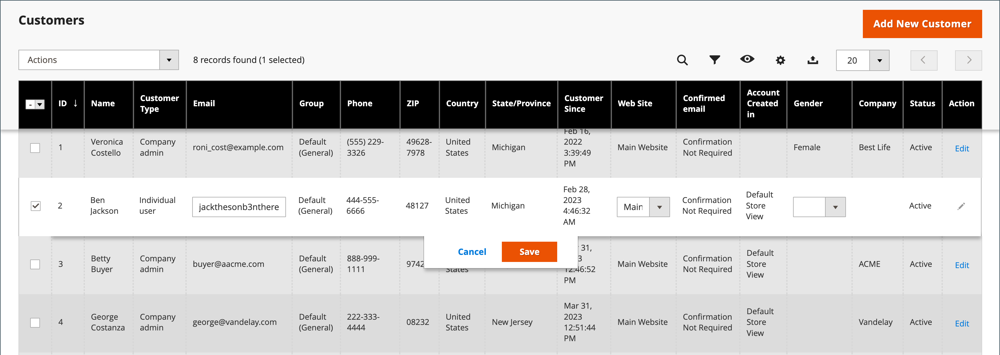

# Aggiornare un profilo cliente

Il pannello sinistro del _[!UICONTROL Customer Information]_La pagina include informazioni sull’attività del cliente, gli indirizzi, le statistiche sugli ordini, gli ordini recenti, il contenuto del carrello, le recensioni dei prodotti e gli abbonamenti alle newsletter.

{width="700" zoomable="yes"}

## Modificare un account cliente

Metodo 1: **_Modifica rapida_**

1. Nella prima colonna selezionare la casella di controllo del conto cliente da modificare.

1. Imposta il **[!UICONTROL Actions]** colonna a `Edit`.

   >[!INFO]
   >
   >Il valore di ogni valore che è possibile aggiornare viene visualizzato in una casella di testo. Dalla griglia è possibile modificare solo alcuni valori del record cliente selezionato.

   {width="700" zoomable="yes"}

1. Se necessario, aggiorna uno dei seguenti valori:

   * **[!UICONTROL Email]**
   * **[!UICONTROL Web Site]**
   * **[!UICONTROL Tax/VAT Number]**
   * **[!UICONTROL Gender]**

1. Clic **[!UICONTROL Save]**.

Metodo 2: **_Modifica completa_**

1. Nella griglia individuare il record cliente da modificare.

1. In _Azioni_ all’estrema destra, fai clic su **[!UICONTROL Edit]**.

1. Apportare le modifiche necessarie alle informazioni aziendali.

   >[!INFO]
   >
   >Per ulteriori informazioni, consulta [Aggiornare un profilo cliente](../customers/update-account.md).

1. Al termine, fai clic su **[!UICONTROL Save Customer]**.

>[!INFO]
>
>Se si desidera annullare tutte le modifiche prima di salvare, fare clic su **[!UICONTROL Reset]** nella barra dei pulsanti superiore per restituire tutte le modifiche all’ultima versione salvata.

## Informazioni cliente

### [!UICONTROL Customer View]

Il _Visualizzazione cliente_ scheda elenca informazioni sul cliente, include **[!UICONTROL Personal Information]**, **[!UICONTROL Reward Points Balance]**, e **[!UICONTROL Store Credit Balance]**.

### [!UICONTROL Account Information]

Il [Informazioni account](../customers/account-dashboard-account-information.md) Questa scheda fornisce informazioni dettagliate sul cliente, in cui un utente amministratore può modificare le informazioni personali, l’e-mail, l’assistenza per lo shopping remoto, la data di nascita e allegare il cliente al sito web o all’azienda.

### [!UICONTROL Addresses]

Il [Indirizzi](../customers/account-dashboard-address-book.md) La scheda contiene gli indirizzi predefiniti di fatturazione e spedizione del cliente ed eventuali indirizzi aggiuntivi utilizzati di frequente.

### [!UICONTROL Orders]

Il [Ordini](../stores-purchase/orders.md) grid contiene un elenco di tutti gli ordini cliente correnti, l&#39;amministratore può tracciarne l&#39;avanzamento.

### [!UICONTROL Returns]

{{ee-feature}}

Il [Restituisce](../stores-purchase/returns.md) Questa scheda elenca le richieste dei clienti attualmente restituite.

### [!UICONTROL Shopping cart]

Il [carrello](../stores-purchase/cart.md) Nella scheda sono visualizzati i prodotti attualmente presenti nel carrello, ma per qualche motivo l’acquisto non è stato completato.

### [!UICONTROL Wish List]

A [lista dei desideri](../stores-purchase/wishlists.md) visualizza un elenco di prodotti che un cliente può trasferire al carrello in un secondo momento.

### [!UICONTROL Gift Registry]

{{ee-feature}}

Il [Registro Regali](../merchandising-promotions/gift-registry-storefront.md) La sezione elenca i registri doni correnti del cliente e l&#39;evento associato.

### [!UICONTROL Store Credit]

{{ee-feature}}

Il [Credito store](../customers/store-credit.md) visualizza un importo che viene ripristinato in un conto cliente; l’amministratore può gestire questo valore.

### [!UICONTROL Newsletter]

Il [Newsletter](../merchandising-promotions/newsletters.md) Questa scheda mostra tutte le e-mail inviate al cliente corrente.

### [!UICONTROL Billing Agreements]

Il [Accordi di fatturazione](../stores-purchase/paypal-billing-agreements.md) La scheda elenca tutti gli accordi di fatturazione PayPal tra il negozio e il cliente.

### [!UICONTROL Product Reviews]

Il [Recensioni prodotti](../catalog/settings-advanced-product-reviews.md) Questa scheda mostra tutte le recensioni inviate dal cliente.

### [!UICONTROL Reward Points]

{{ee-feature}}

Il [Punti premio](../merchandising-promotions/rewards-loyalty.md) mostra il saldo corrente dei punti premio del cliente. Un utente amministratore può gestire questo valore.

## Barra dei pulsanti

| Pulsante | Descrizione |
|----------|--------------|
| **[!UICONTROL Back]** | Torna alla pagina Clienti senza salvare le modifiche. |
| **[!UICONTROL Login as Customer]** | Consente al commerciante di accedere come cliente. |
| **[!UICONTROL Delete Customer]** | Elimina l&#39;account cliente. |
| **[!UICONTROL Reset]** | Ripristina i valori precedenti delle modifiche non salvate nel modulo per il cliente. |
| **[!UICONTROL Create Order]** | [Crea un ordine](../stores-purchase/customer-account-create-order.md) associato al conto cliente. |
| **[!UICONTROL Reset Password]** | Reimposta la password del cliente. |
| **[!UICONTROL Force Sign-In]** | Cancella i token associati alla password del cliente e fornisce all&#39;amministratore l&#39;accesso all&#39;account. |
| **[!UICONTROL Manage Shopping Cart]** | Consente di accedere al carrello di un cliente. |
| **[!UICONTROL Save and Continue Edit]** | Salva le modifiche e mantiene aperto l&#39;account cliente. |
| **[!UICONTROL Save Customer]** | Salva le modifiche e chiude l&#39;account cliente. |

{style="table-layout:auto"}
