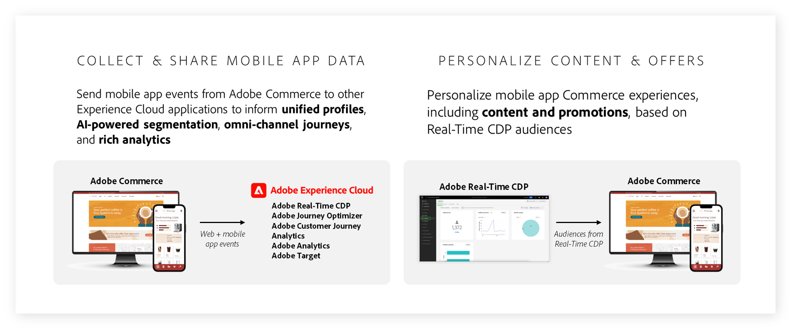

# Cos’è Adobe Commerce?

Adobe Commerce è una soluzione di e-commerce aziendale che offre esperienze di e-commerce superiori per i consumatori e gli acquirenti B2B a livello globale. Con migliaia di clienti e miliardi di valore lordo annuo di merce elaborato tramite la nostra piattaforma cloud, Adobe Commerce è in prima linea nello sviluppo delle esperienze di e-commerce più grandi e complesse a livello mondiale per rivenditori, marchi di consumatori, produttori e distributori all’ingrosso.

## I team di e-commerce devono affrontare sfide uniche

I team di e-commerce devono oggi offrire esperienze eccezionali ai loro clienti. Un’esperienza di e-commerce rapida, conveniente e personalizzata porta a un aumento delle vendite, a relazioni più profonde con i clienti e a efficienze operative per la tua azienda.

Sfortunatamente, creare e offrire esperienze di e-commerce eccezionali è più difficile che mai.

- **Il debito tecnico blocca l&#39;attività**: ambienti tecnici legacy e complessi che si estendono su più piattaforme e sono difficili da mantenere. [60%](https://engage.adobe.com/DigComRptWBR-register.html) di professionisti dell&#39;e-commerce dicono che faticano a mantenere e integrare la loro tecnologia.
- **I team devono fare di più con meno risorse**—Molti team di e-commerce devono affrontare aspettative di crescita elevate, ma spesso hanno difficoltà a ridefinire l’esperienza del cliente a causa di processi manuali, soluzioni eccessivamente tecniche e dati limitati. [56%](https://engage.adobe.com/DigComRptWBR-register.html) di professionisti dell&#39;e-commerce affermano di non disporre di finanziamenti adeguati.
- **Sovraccarico di dati**: i volumi di dati continuano a crescere in quantità, ma non si traducono in esperienze di qualità perché i dati sono intrappolati in vari sistemi, rendendo difficile stimolare l’attività e creare esperienze di impatto. [60%](https://engage.adobe.com/DigComRptWBR-register.html) dei professionisti dell’e-commerce dicono di non disporre dei dati corretti nei sistemi giusti.
- **I consumatori si aspettano di più**—Il numero di canali e modelli di business che le aziende devono supportare continua a moltiplicarsi, il che aumenta i costi e la complessità. [53%](https://www.bloomreach.com/en/news/2020/bloomreach-releases-new-global-research-study) dei consumatori non acquisteranno nuovamente dalla stessa società se hanno avuto una cattiva esperienza e [90%](https://www.prweb.com/releases/study-90-of-b2b-buyers-will-turn-to-a-competitor-if-a-suppliers-digital-channel-doesn-t-meet-their-needs-811395853.html) degli acquirenti B2B si rivolgono ad un concorrente se un fornitore non può soddisfare le loro esigenze digitali.

## La visione di Adobe Commerce è il commercio basato sull’esperienza

L’obiettivo di Adobe è fornire una piattaforma di e-commerce basata su dati e su tecnologia.

- [Basato sull’esperienza](#experience-led-commerce). Ad Adobe, crediamo che la crescita derivi dalle esperienze. Ecco perché ci concentriamo su come alimentare i più veloci storefront di e-commerce del mondo e su come consentire ai team di e-commerce di creare esperienze personalizzate su larga scala.

- [Basato su dati](#data-powered-commerce). Adobe Commerce offre la condivisione diretta dei dati nel tuo stack di tecnologia di marketing, consentendoti di mettere in funzione i dati di e-commerce di prime parti e personalizzando le esperienze in ogni punto di contatto e canale.

- [Abilitato alla tecnologia](#tech-enabled-commerce). Adobe Commerce è una piattaforma di e-commerce componibile progettata per lanciare funzioni di e-commerce più veloci, condividere facilmente i dati tra sistemi di terze parti e ridurre il costo di proprietà per integrazioni e personalizzazioni.

## Commerce basato su esperienze

Con l’avanzare del 2024, è fondamentale per i leader dell’e-commerce fornire ai loro acquirenti esperienze di e-commerce altamente performanti e personalizzate.

### Vetrina fulminea con Edge Delivery Services

Le ricerche hanno dimostrato che [64% degli acquirenti](https://techreport.com/statistics/website-load-time-statistics-data) andare sul sito di un concorrente per acquistare un articolo simile se la sua esperienza web è scarsa. Al contrario, per ogni miglioramento di 0,1 secondo nella velocità del sito, le aziende possono aspettarsi un [Aumento del 9,2% del valore medio dell&#39;ordine](https://techreport.com/statistics/website-load-time-statistics-data).

[Edge Delivery Services in Adobe Commerce](https://experienceleague.adobe.com/developer/commerce/storefront/) è un insieme di servizi componibili che incrementa il valore aziendale offrendo esperienze eccezionali, sia nella creazione di contenuti che nelle esperienze dei clienti. Combina funzionalità basate su business, come l’authoring di contenuti basati su documenti e i test A/B integrati, con componenti integrati Adobe Commerce e distribuzione di contenuti dalla rete Edge per vetrine ad altissima velocità (ad esempio, è necessario menzionare la distribuzione Edge).

Questa nuova vetrina ad alte prestazioni è già stata testata con successo da diversi commercianti Adobe Commerce, come [Maidenform](https://business.adobe.com/blog/perspectives/how-hanesbrands-and-adobe-built-one-of-the-fastest-ecommerce-websites-in-the-world), proprietà di HanesBrands. I risultati parlano da soli. Le pagine Maidenform forniscono in modo coerente punteggi di Google Lighthouse di [Risultati di 100 e Core Web Vitals](https://treo.sh/sitespeed/www.maidenform.com) molto al di sopra della media del settore.

{width=&quot;50%&quot; align=center}
{zoomable=&quot;yes&quot;}

>[!BEGINSHADEBOX]

Scopri in che modo HanesBrands e Adobe hanno sviluppato un’architettura edge ad alte prestazioni con funzionalità di condivisione e personalizzazione dei dati. [E-Comm Masterclass: Hanesbrand crea la vetrina più veloce del mondo](https://business.adobe.com/summit/2024/sessions/ecomm-masterclass-hanesbrands-creates-the-worlds-f-s435.html)

>[!ENDSHADEBOX]

Al centro di questa nuova vetrina basata sulle esperienze vi sono una serie di principi che si concentrano sulla fornitura di un’esperienza di e-commerce componibile, con una conversione migliorata, una riduzione dei costi e una maggiore velocità.

La conversione in Commerce è legata sia alla possibilità di connettere i clienti ai tuoi prodotti fuori dal sito, sia alla possibilità di personalizzare la loro esperienza sul sito, in modo efficiente ma mirato. Adottando i principi di core Web Vitals, Edge Delivery Service in Commerce guida entrambe le metriche.

Ciò significa che un sito più veloce e basato sull’esperienza occupa una posizione più elevata nei motori di ricerca, riducendo i costi SEO e incrementando il traffico organico e di parole chiave. Questo non solo aumenta il numero di visitatori, ma consente anche di collegare clienti e prodotti in modo più semplice che in passato, consentendo una più rapida individuazione, selezione e pagamento dei prodotti.

I partner possono inoltre beneficiare di costi inferiori per la creazione dei contenuti, in quanto i proprietari dei contenuti aziendali possono distribuire in modo rapido e semplice mentre i responsabili dell&#39;e-commerce offrono funzionalità Commerce integrate. Niente più ostacoli operativi per i team che collaborano!

Velocità per i team di creazione dei contenuti, velocità nella distribuzione dei contenuti ai clienti e velocità nell’esperienza dei clienti che vivono la nuova vetrina, basata sull’esperienza e dalle prestazioni elevate.

Tutto questo si ottiene tramite un’architettura componibile che unisce le funzionalità di CMS e pubblicazione ai componenti di rilascio di Adobe Commerce per creare una vetrina Commerce veramente flessibile. Un ottimo esempio di questo è il nuovo dropin di checkout in un unico passaggio, che consente di aggiungere un’esperienza di checkout fluida ai percorsi dei clienti in modalità plug-and-play.

>[!TIP]
>
>Se desideri iniziare a utilizzare il servizio di consegna Edge in Adobe Commerce, puoi vedere come si combina tutto [qui.](https://experienceleague.adobe.com/developer/commerce/storefront/)

### Integrazione con Adobe Experience Manager Assets

Adobe sta riunendo Adobe Experience Manager Assets con Adobe Commerce per potenziare le tue esperienze di e-commerce con risorse approvate in blocco sul marchio, sfruttando potenti funzionalità GenAI.

Questo consente alle organizzazioni di utilizzare i Cloud Service Experience Manager Assets come unica fonte di verità per la creazione e la gestione delle risorse e come DAM centrale che potenzia Adobe Commerce a nuovi livelli di scalabilità delle risorse.

Un nuovo servizio Motore di regole alimenta le risorse in Experience Manager Assets con i prodotti corrispondenti in Adobe Commerce, in base allo SKU, o altri attributi chiave basati sulla strategia Commerce. Gli aggiornamenti vengono condivisi automaticamente per garantire che nel sito siano attive le risorse di prodotto e le varianti di risorsa più recenti.

Crea vetrine per nuovi lanci di prodotti o campagne stagionali con maggiore velocità, generando milioni di varianti di prodotto per esperienze Commerce personalizzate utilizzando i servizi GenAI in Experience Manager Assets.

### Commerce B2B

Adobe Commerce fornisce da anni funzionalità di e-commerce B2B mission-critical, tra cui account aziendali, regole di approvazione degli acquisti, gestione dei preventivi e listini prezzi cliente. Ecco perché i leader dell’e-commerce B2B amano [Watsco](https://business.adobe.com/content/dam/dx/us/en/resources/ebooks/building-better-experiences/building-better-experiences-and-bigger-profits.pdf), [SealedAir](https://business.adobe.com/customer-success-stories/sealed-air-case-study.html), [Affitti Sunbelt](https://business.adobe.com/customer-success-stories/sunbelt-rentals-case-study.html), [Transcat](https://business.adobe.com/customer-success-stories/transcat-case-study.html), [FoodServiceDirect.com](https://business.adobe.com/customer-success-stories/foodservicedirect-case-study.html), e [Soluzioni Univar](https://business.adobe.com/summit/2023/sessions/debunking-top-b2b-commerce-myths-s517.html) alimentare i loro canali di e-commerce B2B globali su Adobe Commerce.

Adobe è entusiasta di condividere che le nuove funzioni di quotazione e gestione aziendale saranno disponibili più avanti nel 2024.

Le funzioni di gestione aziendale consentono alle aziende di configurare qualsiasi struttura aziendale dell’acquirente di cui hanno bisogno per supportare B2B2X, conglomerati o aziende globali utilizzando le nuove strutture di account padre/figlio di Adobe. Gli acquirenti possono anche passare da un account figlio all’altro per semplificare gli acquisti.

Basandosi sul potente strumento di quotazione integrato di Adobe Commerce, i venditori B2B possono acquisire più ricavi più rapidamente con i nuovi strumenti di richiesta di preventivo (RdO), tra cui proposte di preventivo, preventivi duplicati, preventivi frazionati, modelli di preventivo e accesso ai preventivi con più amministratori.

Entrambe le funzionalità saranno compatibili con l’architettura nativa della vetrina Adobe Commerce e con le implementazioni di e-commerce headless che utilizzano le API di GraphQL.

>[!TIP]
>Per ulteriori informazioni sulle funzionalità di Commerce B2B, consulta la documentazione:
>
>- [Guida utente di B2B per Adobe Commerce](https://experienceleague.adobe.com/en/docs/commerce-admin/b2b/guide-overview)
>- [Guida per gli sviluppatori di B2B per Adobe Commerce](https://developer.adobe.com/commerce/webapi/rest/b2b/)

### Servizi di pagamento per Adobe Commerce

[!BADGE Disponibile ora]{type=Informative tooltip="Disponibile ora"}

[Servizi di pagamento per Adobe Commerce](https://business.adobe.com/products/magento/payment-services.html) è un servizio SaaS che semplifica i pagamenti e aumenta le conversioni e i ricavi di vendita. Utilizzato da aziende come Toyota North America, supporta una serie di metodi di pagamento e funzionalità opzionali di protezione da frodi e abusi in diversi mercati. Consente agli esercenti di gestire in modo sicuro i pagamenti e i dati degli ordini in un’unica esperienza di amministrazione per incrementare l’efficienza.

L’ultima versione si basa su una serie di aggiornamenti del 2023 che hanno aggiunto Apple Pay, un’integrazione con Signifyd, il supporto internazionale per Regno Unito, Francia e Australia, la scalabilità dell’infrastruttura per il volume aziendale e la generazione di rapporti sulle transazioni. Le nuove funzionalità ampliano le opzioni di pagamento e semplificano l&#39;avvio, indipendentemente dalla tecnologia di vetrina utilizzata.

>[!TIP]
>
>Per scoprire come iniziare a utilizzare i servizi di pagamento, leggi [documentazione](https://experienceleague.adobe.com/en/docs/commerce-merchant-services/payment-services/guide-overview).

#### Supporto headless per servizi di pagamento

[!BADGE Disponibile ora]{type=Informative tooltip="Disponibile ora"}

Nell’ultima versione, Payment Services ora include il supporto GraphQL per consentire agli esercenti di accettare ed elaborare pagamenti su implementazioni headless in vetrina, come Adobe Experience Manager e altri front-end personalizzati.

Payment Services offre inoltre opzioni di prezzo adatte alle esigenze dell&#39;utente, tra cui Interchange++ per tassi di elaborazione dei pagamenti più competitivi e [onboarding self-service](https://experienceleague.adobe.com/en/docs/commerce-merchant-services/payment-services/get-started/production) servizi di pagamento Basic fornisce funzionalità di elaborazione dei pagamenti a quasi 200 regioni in tutto il mondo.

>[!TIP]
>
>Per scoprire come iniziare a utilizzare le API di Payment Services, leggi la sezione [documentazione](https://developer.adobe.com/commerce/webapi/graphql/payment-services/).

#### Servizi Google Pay for Payment

[!BADGE Disponibile ora]{type=Informative tooltip="Disponibile da 1 ora 2024"}

Adobe Commerce ora supporta Google Pay, un portafoglio digitale leader che dovrebbe raggiungere [36 milioni di consumatori](https://forecasts-na1.emarketer.com/591373e4aeb8830e3829e400/5efc402eac4d4d07841472f9?_gl=1*qmtm8x*_ga*OTEwMjg4NjExLjE3MDY2MzQ2MTk.*_ga_XXYLHB9SXG*MTcwNjk3NjkzNS44LjAuMTcwNjk3NjkzNS42MC4wLjA.*_gcl_au*MTkwNzgzOTY5OS4xNzA2NjM0NjE5LjQ3MzE4MjY5LjE3MDY3MTcyMjUuMTcwNjcxNzIyNQ..) consumatori a livello mondiale. L&#39;aggiunta di Google Pay completa il supporto per i più diffusi portafogli digitali, tra cui Apple Pay e PayPal.

Questi portafogli digitali forniscono ai clienti il metodo di pagamento giusto per loro, aumentando la fiducia nell&#39;acquisto e il completamento dell&#39;acquisto.

>[!TIP]
>
>Per informazioni su come configurare Google Pay, leggi la sezione [documentazione](https://experienceleague.adobe.com/en/docs/commerce-merchant-services/payment-services/payments-checkout/payments-options#google-pay-button).

### Personalizzazione basata sull’intelligenza artificiale con Live Search

[!BADGE Disponibile ora]{type=Informative tooltip="Disponibile ora"}

Le aziende cercano di personalizzare ogni parte del percorso di acquisto, dall’aiutare i clienti a trovare i prodotti giusti alla distribuzione di campagne, offerte e comunicazioni personalizzate su tutti i canali.

[Live Search, con tecnologia Adobe Sensei](https://business.adobe.com/products/magento/live-search.html), consente di personalizzare il modo in cui i clienti trovano esattamente ciò di cui hanno bisogno, in modo da poter aumentare i tassi di conversione. Infatti, i clienti di Live Search aumentano i tassi di conversione di una media del 7% dopo l’avvio di Live Search, con il 15% dei clienti che sperimentano un incremento di conversione superiore al 40%.

L’ultima versione di Live Search di Adobe è incentrata sulla semplificazione dell’utilizzo di queste funzioni e consente di personalizzare completamente l’esperienza di ricerca in base alle esigenze specifiche. Ora puoi applicare specifiche [Regole di riclassificazione IA](https://experienceleague.adobe.com/en/docs/commerce-merchant-services/live-search/live-search-admin/rules/rules-add) per le ricerche di volume più elevate, quindi integra tali regole con una regola di fallback predefinita per coprire la coda lunga di _tutte le altre query_.

Ad esempio, un merchandiser può impostare una regola in base alla quale qualsiasi query di ricerca contenente la frase &quot;dress&quot; deve essere ordinata in base al _elementi di tendenza_ algoritmo. Lo stesso merchandiser può quindi utilizzare _più acquistati_ per tutte le altre query di ricerca. Con questo aggiornamento, i brand possono mostrare i loro prodotti migliori per ogni ricerca, semplificando il merchandising personalizzato.

{align="center" zoomable="yes"}

Adobe ha inoltre introdotto nuove opzioni di personalizzazione per Live Search. Utilizzo di Live Search [Widget PLP](https://experienceleague.adobe.com/en/docs/commerce-merchant-services/live-search/live-search-storefront/plp-styling) e [Widget popover](https://experienceleague.adobe.com/en/docs/commerce-merchant-services/live-search/live-search-storefront/storefront-popover), puoi progettare le funzioni dell’interfaccia utente di Live Search, inclusi i campioni di colore, le opzioni di layout della pagina dei dettagli del prodotto, i pulsanti Aggiungi al carrello, i cursori di prezzo e altro ancora, utilizzando gli strumenti di configurazione del codice basso. L&#39;Adobe offre la massima flessibilità attraverso [apri archivio codice](https://experienceleague.adobe.com/en/docs/commerce-merchant-services/live-search/install), che funge da implementazione di riferimento delle best practice.

>[!TIP]
>
>Per scoprire come iniziare a utilizzare Live Search, leggi le [documentazione](https://experienceleague.adobe.com/en/docs/commerce-merchant-services/live-search/overview):

#### Dashboard di gestione dati

Adobe Commerce fornisce una serie di funzionalità SaaS (Software-as-a-Service) ad alte prestazioni per supportare la gestione del merchandising e dei cataloghi, tra cui Live Search, Product Recommendations e Catalog Service. Nell’ultima versione, Adobe fornisce una nuova [Dashboard di gestione dati](https://experienceleague.adobe.com/en/docs/commerce-admin/systems/data-transfer/data-dashboard) per fornire trasparenza completa sulla sincronizzazione del catalogo con Live Search, Product Recommendations e Catalog Service.

Questa nuova dashboard è accessibile direttamente dall’amministratore di Adobe Commerce ([!UICONTROL System] > [!UICONTROL Data Management Dashboard]) e ti consente di confermare che tutti gli aggiornamenti del catalogo vengano applicati ai vari servizi.

## Commerce basato su dati

### Integrazione tra Adobe Commerce e Adobe Experience Platform

[!BADGE Disponibile a giugno 2024]{type=Informative tooltip="Disponibile a giugno 2024"}

L’anno scorso, è stato rilasciato Adobe Commerce [Connessione dati](https://experienceleague.adobe.com/en/docs/commerce-merchant-services/data-connection/overview), che raccoglie, mappa e condivide automaticamente una serie di dati Commerce, inclusi i clic della vetrina, lo stato degli ordini del back-office e le informazioni sulla cronologia degli ordini. Oggi, i leader del commercio digitale utilizzano Data Connection per suddividere i silos di dati, creare profili cliente e tipi di pubblico unificati, personalizzare i percorsi dei clienti e potenziare le funzioni di analisi.

Nella prima metà di quest&#39;anno, Adobe condividerà ancora più dati, tra cui [Profili cliente Commerce](https://experienceleague.adobe.com/en/docs/commerce-admin/customers/customer-accounts/manage/update-account), il comportamento delle app mobili e gli attributi personalizzati per gli eventi di back-office per personalizzare campagne ed esperienze su larga scala.

Ad esempio, i clienti potranno utilizzare le registrazioni dei clienti in tempo reale di Commerce per attivare le campagne e-mail di benvenuto in [Adobe Journey Optimizer](https://experienceleague.adobe.com/en/docs/journey-optimizer/using/get-started/get-started).

{align="center" zoomable="yes"}

#### Abbandona le e-mail del carrello in Adobe Journey Optimizer utilizzando i dati di e-commerce

Informato da centinaia di implementazioni di Adobe Commerce insieme ad altre soluzioni Adobe Experience Cloud, Adobe sta lanciando [Playbook di casi d’uso](https://experienceleague.adobe.com/en/docs/journey-optimizer/using/get-started/playbooks), risorse di implementazione pronte all’uso che consentono ai clienti di sperimentare il time-to-value immediato.

Il playbook iniziale di Adobe Commerce consente ai clienti di avviare facilmente campagne cart abbandonate guidandole attraverso il processo di configurazione dei dati. Una volta connessi, i clienti possono lanciare rapidamente campagne, risparmiando tempo e contribuendo ad aumentare le vendite. Un rivenditore globale ha raggiunto una conversione 1,9x al clic, un maggior numero di persone alla settimana e un aumento dei ricavi a due cifre grazie al lancio di campagne di abbandono con Adobe Commerce e Adobe Journey Optimizer.

Adobe sta inoltre aggiungendo dashboard specifiche per Commerce in Adobe Experience Platform per aiutare gli esperti di marketing ad analizzare i dati Commerce e identificare opportunità di personalizzazione.

{zoomable=&quot;yes&quot;}

#### Attiva la personalizzazione utilizzando i tipi di pubblico da Adobe Real-time CDP

Lo scorso anno è stato lanciato anche Adobe Commerce [Audience Activation](https://experienceleague.adobe.com/en/docs/commerce-admin/customers/audience-activation), che sfrutta i profili cliente unificati e i tipi di pubblico di Real-Time CDP per personalizzare i percorsi di acquirenti. In particolare, [Adobe Real-Time CDP](https://experienceleague.adobe.com/en/docs/experience-platform/rtcdp/intro/rtcdp-intro/get-started) unisce i dati di Commerce con dati provenienti da altre origini per creare profili cliente dettagliati e segmenti di pubblico per il targeting di contenuti e offerte promozionali in Adobe Commerce.

Nella prima metà dell&#39;anno, l&#39;Adobe sta ampliando questi [Audience Activation](https://experienceleague.adobe.com/en/docs/commerce-admin/customers/audience-activation) funzionalità che consentono agli addetti al marketing e ai merchandising di utilizzare i tipi di pubblico definiti in Real-Time CDP di Adobe per personalizzare più aspetti dell’esperienza di acquisto di Adobe Commerce, tra cui [prodotti correlati](https://experienceleague.adobe.com/en/docs/commerce-admin/marketing/promotions/product-relationships/product-related-rules), [Promozioni](https://experienceleague.adobe.com/en/docs/commerce-admin/marketing/promotions/cart-rules/price-rules-cart), e [blocchi di contenuto](https://experienceleague.adobe.com/en/docs/commerce-admin/content-design/elements/dynamic-blocks/dynamic-blocks).

#### Tracciare e personalizzare l’e-commerce nelle app native per dispositivi mobili

Ad Adobe, puoi portare esperienze iper-personalizzate nell’app commerce per dispositivi mobili. Utilizzo di [Connessione dati](https://experienceleague.adobe.com/en/docs/commerce-merchant-services/data-connection/overview), puoi inviare gli eventi delle app mobili da Adobe Commerce ad altre applicazioni Adobe Experience Cloud, tra cui Adobe Real-Time CDP, Adobe Journey Optimizer, Customer Journey Analytics, Adobe Analytics e Adobe Target. Utilizzo di [Audience Activation](https://experienceleague.adobe.com/en/docs/commerce-admin/customers/audience-activation), puoi personalizzare l’esperienza dell’app, inclusi contenuti dinamici, promozioni e regole di prodotto correlate, in base ai tipi di pubblico creati e gestiti all’interno di Adobe Real-Time CDP.

>[!TIP]
>
>- Per informazioni su come iniziare a utilizzare Adobe Commerce Data Connection, consulta [documentazione](https://experienceleague.adobe.com/en/docs/commerce-merchant-services/data-connection/overview).
>- Per avviare il percorso di personalizzazione, controlla [documentazione sulla personalizzazione su larga scala](https://experienceleague.adobe.com/en/docs/commerce-admin/customers/customers-menu/personalize-scale).

Esplora il percorso di trasformazione digitale di Coca-Cola per creare esperienze di acquisto personalizzate e su larga scala utilizzando Data Connection to Adobe Journey Optimizer di Adobe Commerce e Real-time CDP. [Coca-Cola: come sbloccare i dati per creare esperienze Commerce incentrate sul consumatore](https://business.adobe.com/summit/2024/sessions/cocacola-unlocking-data-to-create-consumercentric-s434.html).

## Commerce con tecnologia

### Sviluppo componibile semplificato con App Builder

Adobe Commerce è una piattaforma di e-commerce componibile progettata per lanciare funzioni di e-commerce più veloci, condividere facilmente i dati tra sistemi di terze parti e ridurre il costo di proprietà per integrazioni e personalizzazioni.

Le tradizionali applicazioni componibili vengono create utilizzando integrazioni point-to-point tra più servizi. Questo approccio porta a un fragile livello di integrazione con un crescente debito tecnico. Adobe Commerce fornisce agli sviluppatori punti di estensione completi e una piattaforma estensibile per orchestrare API, eventi e dati, creando un’architettura flessibile e componibile. La piattaforma Adobe Commerce include:

- Completo [API](https://developer.adobe.com/commerce/webapi/) copertura
- [Webhook](https://developer.adobe.com/commerce/extensibility/webhooks/) per personalizzare i processi di e-commerce nativi
- [Interfaccia utente amministratore](https://developer.adobe.com/commerce/extensibility/admin-ui-sdk/) estensibilità
- Oltre 700 [Eventi](https://experienceleague.adobe.com/en/docs/commerce-learn/tutorials/adobe-developer-app-builder/io-events/getting-started-io-events)

### Miglioramenti SDK per webhook e interfaccia utente amministratore

[!BADGE Disponibile ora]{type=Informative tooltip="Disponibile ora"}

Con l’ultima versione, Adobe continua ad essere leader nella semplificazione dello sviluppo componibile per le aziende di e-commerce. Ora puoi [configurare i webhook tramite l’interfaccia utente di amministrazione](https://developer.adobe.com/commerce/extensibility/webhooks/admin-configuration/) rendendolo ancora più semplice estendere i processi di e-commerce nativi come il pagamento, l’aggiunta al carrello e altro ancora. I webhook possono ora essere attivati anche in modo condizionale. Ad esempio, puoi attivare un webhook di calcolo della spedizione per il processo di pagamento solo per codici ZIP specifici.

Gli sviluppatori ora dispongono di un controllo più granulare per estendere l’interfaccia utente amministratore, ad esempio per aggiungere [colonne](https://developer.adobe.com/commerce/extensibility/admin-ui-sdk/extension-points/product/grid-columns/), [pulsanti](https://developer.adobe.com/commerce/extensibility/admin-ui-sdk/extension-points/order/view-button/), e [azioni di massa](https://developer.adobe.com/commerce/extensibility/admin-ui-sdk/extension-points/order/mass-action/) ai pannelli di amministrazione esistenti.

Nel corso di quest’anno, Adobe aumenterà la disponibilità di API Mesh a più di 200 posizioni globali, riducendo la latenza di rete e garantendo tempi di elaborazione migliori, fornendo una migliore esperienza complessiva per gli acquirenti.

>[!TIP]
>
>Per scoprire come iniziare a utilizzare i webhook, leggi la [documentazione](https://developer.adobe.com/commerce/extensibility/webhooks/).

### Kit di avvio dell&#39;integrazione e integrazioni ERP predefinite

[!BADGE Disponibile a giugno 2024]{type=Informative tooltip="Disponibile a giugno 2024"}

L&#39;integrazione di una piattaforma di e-commerce con ERP, OMS o CRM è un requisito mission-critical. Le aziende possono spendere decine di migliaia di dollari per costruire queste integrazioni. Per ridurre i costi di integrazione con i sistemi di back office e migliorare l&#39;affidabilità delle connessioni in tempo reale, Adobe sta introducendo un kit di avvio all&#39;integrazione.

Il kit include integrazioni di riferimento per i dati di e-commerce di uso comune, inclusi ordini, prodotti e clienti. Include inoltre script di onboarding e un’architettura standardizzata che consente agli sviluppatori di sfruttare le best practice seguenti. Il kit di avvio (attualmente in versione beta) dovrebbe ridurre lo sforzo di integrazione fino al 50%.

Nel corso di quest’anno, Adobe rilascerà anche integrazioni predefinite per due ERP comuni utilizzando il kit di avvio dell’integrazione:

- [Microsoft Dynamics Finance e operazioni](https://www.microsoft.com/en-us/dynamics-365/products/finance)
- [SAP S/4HANA](https://www.sap.com/products/erp/s4hana.html)

Queste integrazioni di riferimento possono essere facilmente personalizzate dagli sviluppatori per soddisfare le esigenze dell’azienda, riducendo i tempi di commercializzazione e i costi delle integrazioni.

#### Subscription commerce gestito da Zuora

[!BADGE Disponibile ora]{type=Informative tooltip="Disponibile ora"}

Secondo la società di servizi finanziari UBS, l&#39;economia degli abbonamenti è sulla buona strada per raggiungere 1,5 trilioni di dollari, in crescita rispetto ai 650 miliardi di dollari del 2021. Sia i consumatori che le aziende stanno diventando più comodi nell&#39;acquistare prodotti e servizi in abbonamento grazie alla loro convenienza e valore.

Per consentire alle aziende di aggiungere flussi di entrate derivanti da abbonamenti alla propria attività e supportare i modelli di business ricorrenti per ricavi esistenti, Adobe Commerce ha collaborato con Zuora, la piattaforma di gestione degli abbonamenti leader del settore, per lanciare la [Gestione abbonamenti Zuora per Adobe Commerce](https://commercemarketplace.adobe.com/zuora-revenue-management-with-subcriptions.html) estensione.

Basato sul framework App Builder di Adobe, il [Estensione Zuora](https://commercemarketplace.adobe.com/zuora-revenue-management-with-subcriptions.html) ricevuto [Programma Adobe Commerce App Assurance](https://developer.adobe.com/commerce/marketplace/guides/sellers/assurance/) riconoscimento per le seguenti best practice di sviluppo semplificate e componibili, inclusa un’architettura front-end nativa per React e l’utilizzo di eventi Adobe I/O e Adobe API Mesh per limitare le personalizzazioni all’interno della piattaforma Adobe Commerce di base.

>[!TIP]
>
>Per informazioni su come iniziare a utilizzare l’estensione Zuora, leggi [documentazione](https://commercemarketplace.adobe.com/media/catalog/product/zuora-revenue-management-with-subcriptions-1-0-0-ece/installation_guides.pdf?1708112475).

### Soluzione compatibile con HIPAA di Adobe Commerce

Adobe ha una vasta esperienza nell’implementazione di servizi conformi agli standard HIPAA con clienti del settore sanitario di tutte le dimensioni. Da fornitori a fornitori a fornitori farmaceutici e tecnologici, Adobe definisce lo standard per la gestione responsabile dei dati dei consumatori. Questa esperienza si sta ora estendendo al mercato del commercio digitale sanitario in rapida crescita con una versione compatibile con HIPAA della piattaforma cloud Adobe Commerce.

L’offerta compatibile con HIPAA è disponibile per i clienti di Adobe Commerce Cloud e Managed Service. Include ulteriori controlli di sicurezza e privacy per garantire la protezione delle informazioni elettroniche sulla salute personale (ePHI) in modo che le organizzazioni del settore sanitario e delle scienze biologiche possano adempiere più facilmente ai propri obblighi di conformità. La soluzione supporta una serie di casi d&#39;uso, tra cui vendite online rapide e convenienti di copertura sanitaria, prescrizioni, dispositivi medici prescritti e forniture mediche. Adobe Commerce ora aderisce al [Adobe Experience Cloud per il settore medicale](https://business.adobe.com/solutions/industries/healthcare.html) una suite di soluzioni che consente ai clienti di fornire ai pazienti esperienze sicure ed eccezionali rispettando al contempo le preferenze dei consumatori.

>[!TIP]
>
>Ulteriori informazioni sull’idoneità all’HIPAA su Adobe Commerce, leggi la sezione [documentazione](https://experienceleague.adobe.com/en/docs/commerce-admin/start/compliance/hipaa-ready-service).

### Aggiornamento della piattaforma core per Adobe Commerce

Ultima versione di [Adobe Commerce](https://experienceleague.adobe.com/en/docs/commerce-operations/release/notes/adobe-commerce/2-4-7) è ora disponibile e include

- 30% di miglioramento nei tempi di risposta API di GraphQL con la nuova [Server applicazioni GraphQL](https://experienceleague.adobe.com/en/docs/commerce-operations/performance-best-practices/concepts/application-server).

- In blocco [importa](https://developer.adobe.com/commerce/webapi/rest/modules/import/) fino a 100.000 record al minuto in formato JSON.

- Supporto per regole di prezzo del carrello basate su coupon fino a 1 milione.

## Beta opportunità

Visita il [pagina sulla versione beta](https://experienceleague.adobe.com/en/docs/commerce-operations/release/beta) per un riepilogo dei programmi beta e di accesso anticipato, tra cui IBM Sterling Order Management, Data Connection to Adobe Experience Platform e il kit di avvio per l’integrazione di back-office ERP, CRM e PIM tramite App Builder.

## Contenuto on-demand da Adobe Summit

Adobe Summit mancante? L&#39;intera conferenza è ora on-demand!

Leggi le [riepilogo completo](https://experienceleague.adobe.com/en/docs/commerce-operations/events/summit/2024) informazioni su Adobe Commerce all’Adobe Summit, inclusa la roadmap di Adobe Commerce, presentazioni ai clienti on-demand e altro ancora.
