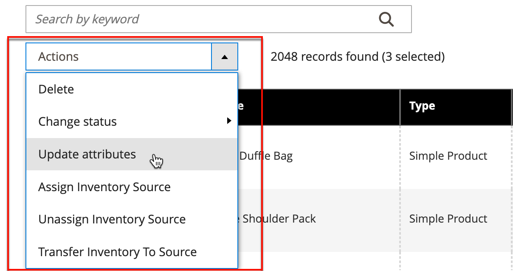
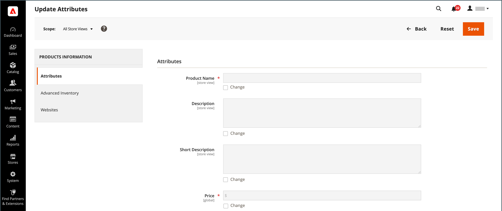

# Controllo Azioni

Quando si utilizza una raccolta di record nella griglia, è possibile utilizzare il controllo Actions per applicare un&#39;operazione a uno o più record. Il controllo Azioni elenca tutte le operazioni disponibili per il tipo specifico di dati. È ad esempio possibile utilizzare il controllo Azioni per aggiornare gli attributi dei prodotti selezionati e modificare lo stato da `Disabled` a `Enabled`o per eliminare record dal database.

È possibile apportare tutte le modifiche necessarie e quindi aggiornare i record in un singolo passaggio. È molto più efficiente che cambiare le impostazioni singolarmente per ciascun prodotto. L’applicazione delle modifiche a un batch di record è un’operazione asincrona, che viene eseguita in background in modo da poter continuare a lavorare in Admin senza attendere il completamento dell’operazione. Il sistema visualizza un messaggio al completamento dell&#39;operazione.

La selezione delle azioni disponibili varia in base all’elenco e, a seconda dell’azione selezionata, potrebbero essere visualizzate opzioni aggiuntive. Ad esempio, quando si modifica lo stato di un gruppo di record, _[!UICONTROL Status]_accanto al controllo Azioni con opzioni aggiuntive.

## Passaggio 1: selezionare i record

La casella di controllo nella prima colonna dell’elenco identifica ogni record che è una destinazione dell’azione. Il [controlli filtro](admin-grid-controls.md) può essere utilizzato per restringere l’elenco ai record sui quali desideri eseguire il targeting per l’azione.

1. Se necessario, impostare i filtri nella parte superiore di ogni colonna in modo da visualizzare solo i record che si desidera includere.

1. Selezionare la casella di controllo di ogni record che rappresenta la destinazione dell&#39;azione oppure utilizzare il selettore di colonna per scegliere una selezione collettiva.

{width="500"}

## Passaggio 2: applicare un&#39;azione ai record selezionati

1. Imposta il **[!UICONTROL Actions]** all&#39;operazione da applicare.

   **_Esempio:_** Aggiorna attributi

   - Nell&#39;elenco selezionare la casella di controllo di ogni record da aggiornare.

   - Imposta il **[!UICONTROL Actions]** controllo a `Update Attributes`.

     {width="450"}

   - Clic **[!UICONTROL Submit]**.

     La pagina Aggiorna attributi elenca tutti gli attributi disponibili, organizzati per gruppo nel pannello a sinistra.

     {width="700" zoomable="yes"}

   - Seleziona la **[!UICONTROL Change]** accanto a ciascun attributo e apporta le modifiche necessarie.

   - Clic **[!UICONTROL Save]** per aggiornare gli attributi per il gruppo di record selezionati.

1. Al termine, fai clic su **[!UICONTROL Submit]**.

## Azioni casella di controllo

| Azione | Descrizione |
|--- |--- |
| [!UICONTROL Select All] | Seleziona la casella di controllo di tutti i record dell&#39;elenco. |
| [!UICONTROL Unselect All] | Deseleziona la casella di controllo di tutti i record dell&#39;elenco. |
| [!UICONTROL Select All on This Page] | Seleziona la casella di controllo dei record visualizzati nella pagina corrente. |
| [!UICONTROL Deselect All on This Page] | Cancella la casella di controllo dei record visualizzati nella pagina corrente. |

{style="table-layout:auto"}
