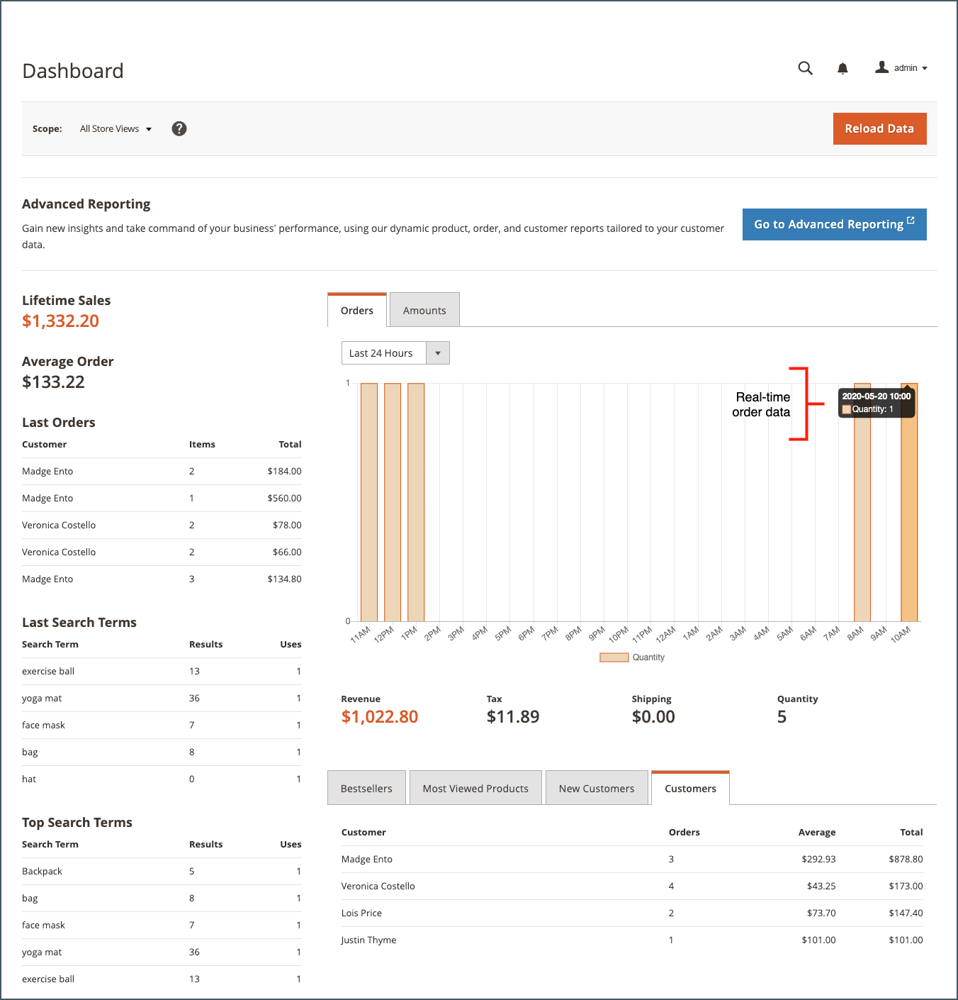
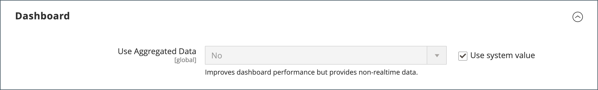

# Dashboard di amministrazione

La dashboard è in genere la prima pagina visualizzata quando si accede all&#39;_amministratore_ e può fornire una panoramica in tempo reale delle vendite e dell&#39;attività dei clienti. I dati del dashboard forniscono un’istantanea delle vendite a vita, dell’importo medio dell’ordine, degli ordini recenti e dei termini di ricerca. Il grafico mostra gli ordini completati e gli importi per l’intervallo di date selezionato e può essere generato da dati dinamici, dati in tempo reale o dati aggregati cronologici. Le schede in basso forniscono rapporti rapidi sui prodotti più venduti, sui prodotti più visualizzati, sui nuovi clienti e sui clienti che hanno acquistato di più.

Se si dispone di una quantità significativa di dati da elaborare, è possibile disattivare il grafico per migliorare le prestazioni. La dashboard nell’esempio seguente è configurata per utilizzare dati in tempo reale e mostra gli ordini completati per ora nelle ultime 24 ore. Il grafico viene aggiornato per ogni ordine completato.

{zoomable="yes"}

[Reporting avanzato](business-intelligence.md#advanced-reporting) visualizza un dashboard personalizzato basato sui dati relativi a prodotti, ordini e clienti.

{zoomable="yes"}

## Configurare il dashboard

1. Nella barra laterale _Admin_, vai a **[!UICONTROL Stores]** > _[!UICONTROL Settings]_>**[!UICONTROL Configuration]**e completa una delle seguenti impostazioni.

1. Al termine della configurazione, fare clic su **[!UICONTROL Save Config]**.

1. Dopo aver salvato le modifiche, fare clic su **[!UICONTROL Cache Management]** e aggiornare ogni cache non valida.

### Abilita grafici

Se la quantità di dati da elaborare è elevata, è possibile disattivare la visualizzazione del grafico per migliorare le prestazioni. Se non è abilitata, al posto del grafico viene visualizzato il messaggio &quot;Nessun dato trovato&quot;, anche se vengono ancora generati i totali di riepilogo riportati di seguito.

1. Nel pannello di navigazione a sinistra in **[!UICONTROL Advanced]**, scegli **[!UICONTROL Admin]**.

1. Se necessario, espandere la sezione **[!UICONTROL Dashboard]**.

   {width="600"}

1. Per modificare il valore predefinito, deselezionare la casella di controllo **[!UICONTROL Use system value]**.

1. Imposta **Abilita grafici** su `Yes`.

Per ulteriori informazioni sulle opzioni di configurazione dell&#39;amministratore, vedere la [Guida di riferimento alla configurazione](../configuration-reference/advanced/admin.md).

### Modificare la pagina di avvio

Il dashboard è la [pagina di avvio](../configuration-reference/advanced/admin.md) predefinita per l&#39;amministratore, anche se è possibile configurare una pagina di avvio diversa.

1. Se le opzioni di configurazione dell&#39;amministratore non sono già aperte, scegliere **[!UICONTROL Admin]** in _[!UICONTROL Advanced]_nel pannello di navigazione a sinistra.

1. Fare clic per espandere la sezione **Pagina di avvio**.

   {width="600"}

1. Deselezionare la casella di controllo **[!UICONTROL Use system value]** e scegliere la **Pagina di avvio** che si desidera visualizzare quando si accede all&#39;amministratore.

### Scegli le date di inizio

1. Nel pannello di navigazione a sinistra in **[!UICONTROL General]**, scegli **Rapporti**.

1. Nella pagina, espandere la sezione **[!UICONTROL Dashboard]**.

1. Deselezionare le caselle di controllo **[!UICONTROL Use system value]** per le impostazioni della data ed effettuare le seguenti operazioni:

   - Imposta **Inizio progressivo anno** su **Mese** e **Giorno**.

   - Imposta **Inizio mese corrente** su **Giorno**.

   {width="600"}

Per ulteriori informazioni sulle opzioni di configurazione [!UICONTROL Reports], vedere la [_Guida di riferimento alla configurazione_](../configuration-reference/general/reports.md).

### Configurare l’origine dati

Il grafico del dashboard può essere generato in tempo reale o utilizzando dati storici aggregati. Se le prestazioni rappresentano un problema, è possibile velocizzare le cose utilizzando dati aggregati.

1. Nel pannello di navigazione a sinistra, fai clic su per espandere **Vendite** e scegli **Vendite** di seguito.

1. Nella pagina, espandere la sezione **[!UICONTROL Dashboard]**.

   {width="600"}

1. Deselezionare la casella di controllo **[!UICONTROL Use system value]** e impostare **[!UICONTROL Use Aggregated Data]** su uno dei seguenti elementi:

   - Per i dati storici aggregati, scegliere `Yes`.
   - Per i dati in tempo reale, scegliere `No`.

## Sezioni del grafico

| Sezione | Descrizione |
|--- |--- |
| [!UICONTROL Orders] | In questa scheda viene visualizzato un grafico in tempo reale di tutti gli ordini completati per la visualizzazione del negozio corrente e per il periodo di tempo specificato. |
| [!UICONTROL Amounts] | In questa scheda viene visualizzato un grafico in tempo reale di tutti gli importi degli ordini completati per la visualizzazione del negozio corrente e per il periodo di tempo specificato. |
| [!UICONTROL Time Range] | Determina i dati rappresentati nel grafico e nei totali di riepilogo riportati di seguito. Opzioni: `Last 7 Days` / `Current Month` / `YTD` / `2YTD` |
| [!UICONTROL Summary Totals] | I totali di ricavi, imposte, spedizione e quantità sotto il grafico si basano sui dati del grafico e sull&#39;impostazione dell&#39;intervallo di tempo corrente. |

{style="table-layout:auto"}

## Dati snapshot

| Sezione | Descrizione |
|--- |--- |
| [!UICONTROL Lifetime Sales] | Totale aggregato delle vendite durante il ciclo di vita del negozio. |
| [!UICONTROL Average Order] | L&#39;importo medio dell&#39;ordine durante la durata del negozio. |
| [!UICONTROL Last Orders] | Riepilogo degli ultimi cinque ordini effettuati. |
| [!UICONTROL Last Search Terms] | Gli ultimi cinque termini di ricerca. |
| [!UICONTROL Top Search Terms] | I cinque termini di ricerca più comunemente utilizzati. |

{style="table-layout:auto"}

## Schede del rapporto

| Sezione | Descrizione |
|--- |--- |
| [!UICONTROL Bestsellers] | I cinque prodotti più venduti nel periodo di tempo specificato. |
| [!UICONTROL Most Viewed Products] | I cinque prodotti più visualizzati durante il periodo di tempo specificato. |
| [!UICONTROL New Customers] | Gli ultimi cinque clienti che si sono registrati per un account durante il periodo di tempo specificato. |
| [!UICONTROL Customers] | Gli ultimi cinque clienti con un ordine che ha completato l’elaborazione durante il periodo di tempo specificato. |

{style="table-layout:auto"}

## Pulsanti del dashboard

| Pulsante | Descrizione |
|--- |--- |
| [!UICONTROL Reload Data] | Aggiorna i dati del dashboard. |
| [!UICONTROL Go to Advanced Reporting] | Visualizza un dashboard personalizzato di grafici e rapporti dinamici in base ai dati di prodotto, ordine e cliente. Per un&#39;analisi più approfondita, vedere [Reporting avanzato](business-intelligence.md#advanced-reporting). |

{style="table-layout:auto"}
