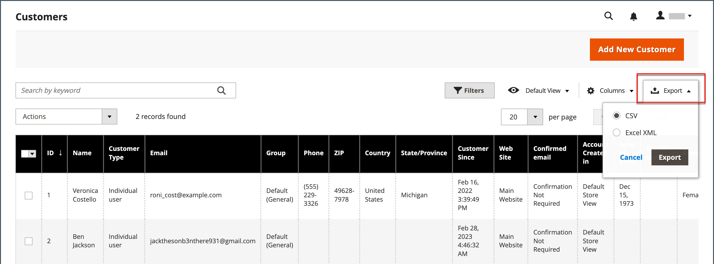

# Controlli griglia di amministrazione

Le pagine di amministrazione che gestiscono i dati visualizzano una raccolta di record in una griglia. I controlli nella parte superiore di ogni colonna possono essere utilizzati per ordinare i dati. L&#39;ordinamento corrente è indicato da una freccia crescente o decrescente nell&#39;intestazione della colonna. È possibile specificare le colonne da visualizzare nella griglia e trascinarle in posizioni diverse. Puoi anche salvare diverse disposizioni di colonna come viste, che possono essere utilizzate in un secondo momento. Il **[!UICONTROL Action]** nella colonna sono elencate le operazioni che è possibile applicare a un singolo record. Inoltre, è possibile esportare la data della visualizzazione corrente della maggior parte delle griglie in una [CSV](../systems/data-csv.md) o file XML.

{width="700" zoomable="yes"}

## Ordinare l’elenco

1. Fai clic su un’intestazione di colonna qualsiasi.

   La freccia indica che l&#39;ordine corrente è crescente o decrescente.

1. Utilizzare i controlli di impaginazione per visualizzare ulteriori pagine dell&#39;insieme.

   {width="300"}

## Impaginare l’elenco

1. Imposta il **[!UICONTROL Pagination]** al numero di record che si desidera visualizzare per pagina.

1. Clic **[!UICONTROL Next]** e **[!UICONTROL Previous]** a scorrere l&#39;elenco o immettere un valore specifico **[!UICONTROL Page Number]**.

## Filtrare l’elenco

1. Clic **[!UICONTROL Filters]**.

1. Completare tutti i filtri necessari per descrivere il record che si desidera trovare.

1. Clic **[!UICONTROL Apply Filters]**.

   {width="700" zoomable="yes"}

## Esporta dati

1. Selezionare i record da esportare.

   >[!NOTE]
   >
   >Impossibile esportare i dati di prodotto dalla griglia. Per ulteriori informazioni, consulta [Esporta](../systems/data-export.md).

1. Il giorno _Esporta_ () nell&#39;angolo superiore destro, scegliete uno dei seguenti formati di file:

   - `CSV`
   - `Excel XML`

   {width="700" zoomable="yes"}

1. Clic **[!UICONTROL Export]**.

1. Cerca il file scaricato dei dati esportati nel percorso utilizzato per i download dal browser.

## Layout griglia

La selezione delle colonne e il relativo ordine nella griglia possono essere modificati in base alle preferenze e salvati come _visualizza_. È possibile controllare gli attributi visualizzati nella griglia nella configurazione dei singoli attributi. La visualizzazione di molti attributi nella griglia del prodotto può influire sul tempo di caricamento e sulle prestazioni dell’amministratore.

{width="700" zoomable="yes"}

### Modificare la selezione delle colonne

1. Nell’angolo in alto a destra, fai clic su _Colonne_ ().

1. Modifica le selezioni delle colonne:

   - Selezionare la casella di controllo delle colonne che si desidera aggiungere alla griglia.
   - Deselezionare la casella di controllo delle colonne che si desidera rimuovere dalla griglia.
   - Per restituire la vista griglia di default, fate clic su **[!UICONTROL Reset]**.

Assicurati di scorrere verso il basso per visualizzare tutte le colonne disponibili.

### Spostare una colonna

1. Fai clic sull’intestazione della colonna e tieni premuto.

1. Trascinare la colonna nella nuova posizione e rilasciare.

### Salvare una vista griglia

1. Fai clic su _Visualizza_ ().

1. Clic **[!UICONTROL Save Current View]**.

1. Immetti un **[!UICONTROL name]** per la visualizzazione.

1. Per salvare tutte le modifiche, fare clic su _Freccia_ ().

   Il nome della vista viene ora visualizzato come vista corrente.

### Modificare la visualizzazione della griglia

1. Fai clic su _Visualizza_ ().

1. Effettuare una delle seguenti operazioni:

   - Per utilizzare una visualizzazione diversa, fare clic sul nome della visualizzazione.
   - Per modificare il nome di una visualizzazione, fare clic su _Modifica_ () e aggiorna il nome.
   - Per eliminare una vista, fare clic su _Modifica_ () e quindi fare clic sul pulsante _Elimina_ ().
