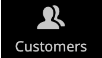

# Barra laterale amministrazione

La barra laterale a sinistra è il menu principale per lo store _Admin_ ed è progettata sia per i dispositivi desktop che per quelli mobili. Il menu a comparsa consente di accedere a tutti gli strumenti utilizzati per gestire quotidianamente il negozio.

| Icona menu | Collegamento | Descrizione |
| --------- | ---- | ----------- |
|  | **[Pagina di avvio amministratore](../configuration-reference/advanced/admin.md)** | Visualizza la pagina di avvio dell&#39;amministratore, che è il dashboard per impostazione predefinita. |
|  | **[[!UICONTROL Dashboard]](admin-dashboard.md)** | La dashboard offre una rapida panoramica dell’attività di vendita e dei clienti nel tuo negozio e in genere è la prima pagina visualizzata quando accedi all’amministratore. |
|  | **[[!UICONTROL Sales]](../stores-purchase/sales-menu.md)** | Nel menu [!UICONTROL Sales] è possibile trovare tutto ciò che riguarda le operazioni di elaborazione di ordini, fatture, spedizioni, note di accredito e transazioni. |
|  | **[[!UICONTROL Catalog]](../catalog/catalog-menu.md)** | Il menu [!UICONTROL Catalog] viene utilizzato per creare prodotti e definire categorie. |
|  | **[[!UICONTROL Customers]](../customers/customers-introduction.md)** | Nel menu [!UICONTROL Customers] puoi gestire gli account dei clienti e vedere quali clienti sono online al momento. |
|  | **[[!UICONTROL Marketing]](../merchandising-promotions/marketing-menu.md)** | Nel menu [!UICONTROL Marketing] è possibile impostare le regole di prezzo del catalogo e del carrello acquisti e i coupon. Le regole di prezzo attivano azioni quando viene soddisfatta una serie di condizioni specifiche. |
|  | **[[!UICONTROL Content]](../content-design/content-menu.md)** | Nel menu [!UICONTROL Content] puoi gestire gli elementi di contenuto e la progettazione dell&#39;archivio. Scopri come creare pagine, blocchi e app front-end e gestire la presentazione del tuo store. |
|  | **[[!UICONTROL Reports]](reports-menu.md)** | Il menu [!UICONTROL Reports] fornisce un&#39;ampia selezione di report che forniscono informazioni approfondite su ogni aspetto del tuo negozio, inclusi vendite, carrello acquisti, prodotti, clienti, tag, recensioni, termini di ricerca e monitoraggio delle prestazioni in tempo reale 24 ore su 24, 7 giorni su 7 e consigli da [Site-Wide Analysis Tool](https://experienceleague.adobe.com/en/docs/commerce-operations/tools/site-wide-analysis-tool/intro). |
|  | **[[!UICONTROL Stores]](../stores-purchase/stores-menu.md)** | Il menu [!UICONTROL Stores] include strumenti per configurare e gestire ogni aspetto del tuo Negozio, incluse impostazioni di installazione multisito, imposte, valuta, attributi di prodotto e gruppi di clienti. |
|  | **[[!UICONTROL System]](../systems/system-menu.md)** | Il menu [!UICONTROL System] include strumenti per gestire le operazioni di sistema, installare estensioni e gestire i servizi Web per l&#39;integrazione con altre applicazioni. |
|  | **[[!UICONTROL Find Partners & Extensions]](commerce-marketplace.md)** | [!DNL Commerce Marketplace] è il luogo in cui puoi trovare le soluzioni Adobe Commerce e di Magento Open Source per il tuo store. |

{style="table-layout:auto"}
