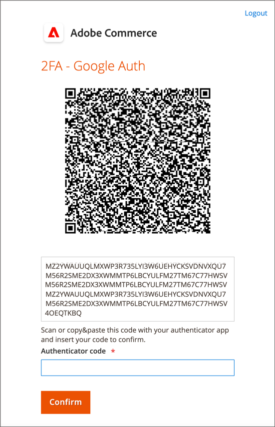
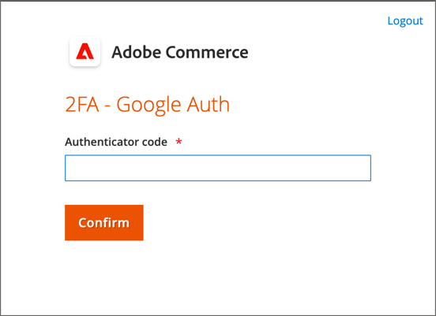
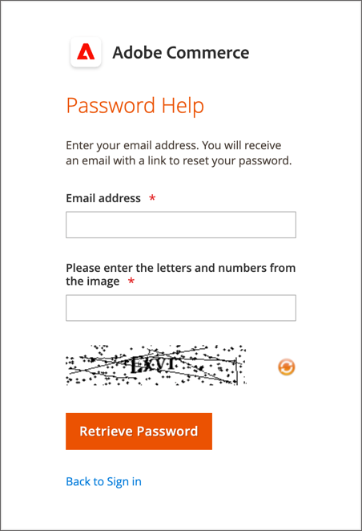

# Account amministratore

L&#39;account Admin primario è stato inizialmente configurato durante l&#39;installazione e potrebbe contenere informazioni iniziali sui segnaposto o dati di esempio. Il proprietario designato di questo account può personalizzare il nome utente e la password e aggiornare il nome, il cognome e l’indirizzo e-mail in qualsiasi momento. Questo account, un _utente privilegiato_ con tutte le autorizzazioni per impostazione predefinita, in genere crea gli account utente amministratore necessari per l&#39;azienda.

- Per informazioni sull&#39;aggiunta o la modifica di utenti, vedere [Creare un utente](../systems/permissions-users-all.md#create-a-user).

- Consulta [Autorizzazioni](../systems/permissions.md) e [Ruoli utente](../systems/permissions-user-roles.md) per informazioni sui ruoli amministratore e utente.

{{ims-admin-note}}

## Accesso amministratore

L&#39;[!DNL Commerce] _Amministratore_ è protetto da più livelli di misure di sicurezza per impedire l&#39;accesso non autorizzato ai dati dell&#39;archivio, dell&#39;ordine e del cliente. La prima volta che accedi a _Admin_, devi immettere il tuo nome utente e la tua password e configurare [autenticazione a due fattori](../systems/security-two-factor-authentication.md) (2FA).

A seconda della configurazione dell&#39;archivio, potrebbe essere necessario risolvere un problema di [CAPTCHA](../systems/security-google-recaptcha.md), ad esempio immettere una serie di caratteri di tastiera, risolvere un rompicapo o fare clic su una serie di immagini con un tema comune. Questi test sono progettati per identificare l’utente come utente umano, anziché come bot automatizzati.

Per ulteriore sicurezza, puoi determinare quali parti di _Admin_ ogni utente dispone di [autorizzazione](../systems/permissions.md) per accedere e anche limitare il numero di [tentativi di accesso](../configuration-reference/advanced/admin.md). Per impostazione predefinita, dopo sei tentativi l’account viene bloccato e l’utente deve attendere alcuni minuti prima di riprovare. [Gli account bloccati](../systems/permissions-users-all.md#locked-users) possono essere reimpostati anche da _Admin_.

>[!NOTE]
>
>La prima volta che accedi a _Admin_, ti viene richiesto di _Consentire la raccolta dati di utilizzo da parte dell&#39;amministratore_. Per ulteriori informazioni, vedere [Raccolta dati di utilizzo](admin.md#usage-data-collection).

{width="400"}

### Passaggio 1: configurare l’autenticazione a due fattori

Prima di poter accedere all&#39;_amministratore_ del tuo archivio, devi avere una soluzione di autenticazione a due fattori configurata e pronta per l&#39;uso. Per ulteriori informazioni sul processo di autenticazione utilizzato da ciascuna soluzione, vedere [Utilizzo dell&#39;autenticazione a due fattori](../systems/security-two-factor-authentication-use.md). Per impostazione predefinita, [!DNL Commerce] supporta [Google Authenticator](https://play.google.com/store/apps/details?id=com.google.android.apps.authenticator2&hl=en_US).

Chiedi all&#39;amministratore di sistema [!DNL Commerce] quali soluzioni 2FA sono supportate per lo store. Quindi, completare la configurazione della soluzione 2FA preferita seguendo le istruzioni del provider.

### Passaggio 2: accedere all’amministratore

1. Immettere l&#39;URL _Admin_ specificato durante l&#39;installazione di [!DNL Commerce].

   L&#39;URL predefinito di _Admin_ ha un aspetto simile a `https://www.yourdomain.com/your-custom-admin-domain`.

   >[!NOTE]
   >
   >Anche se questa documentazione utilizza `admin` come URL di base nella maggior parte degli esempi, è consigliabile scegliere un [URL personalizzato](../stores-purchase/store-urls.md) univoco e difficile da indovinare per l&#39;_amministratore_ dell&#39;archivio.

   È possibile aggiungere un segnalibro alla pagina o salvare un collegamento sul desktop per accedervi facilmente.

1. Immetti _Admin_ **[!UICONTROL Username]** e **[!UICONTROL Password]**.

1. (Facoltativo) Se per il tuo negozio è abilitato un CAPTCHA, segui le istruzioni visualizzate per risolvere il problema.

   Per ulteriori informazioni, vedere [CAPTCHA](../systems/security-captcha.md) e [reCAPTCHA](../systems/security-google-recaptcha.md).

1. Fare clic su **[!UICONTROL Sign in]**.

   Se è la prima volta che accedi a _Admin_ dall&#39;account, dovresti ricevere un&#39;e-mail con un collegamento alle istruzioni di configurazione.

### Passaggio 3: completare la configurazione 2FA

Nell&#39;esempio seguente viene illustrato come associare l&#39;account _Admin_ con Google Authenticator.

1. Quando viene visualizzato il codice QR, utilizza uno dei metodi seguenti per acquisire il codice e associare Google Authenticator all&#39;account _Admin_.

   {width="400"}

   - Acquisire codice QR con uno smartphone

     Sul tuo smartphone, avvia Google Authenticator. Tocca _segno più_ (+) nell&#39;angolo superiore destro dell&#39;app. Quindi, nella parte inferiore della schermata, tocca **[!UICONTROL Scan Barcode]** e scatta una foto del codice QR.

   - Acquisisci codice QR dal browser

     Se Google Authenticator è installato come estensione nel browser, fare clic sull&#39;icona **Authenticator** nella barra degli strumenti e acquisire la pagina.

   - Immetti manualmente il codice QR

     Copia la stringa di testo sotto il codice QR. Avvia Google Authenticator con lo smart phone o il browser in uso e fai clic sul segno più (+). Quindi, scegliere **[!UICONTROL Manual Entry]**. In **[!UICONTROL Account]**, immetti l&#39;indirizzo e-mail associato al tuo account _Admin_ e incolla la stringa del codice QR nel campo **[!UICONTROL Key]**.

1. Per accedere a _Admin_ con autenticazione a due fattori, immettere il codice a sei cifre generato da Google Authenticator nel campo **[!UICONTROL Authenticator code]** e quindi fare clic su **[!UICONTROL Confirm]**.

   {width="400"}

## Reimposta la password

Non è consentito riutilizzare le ultime quattro password assegnate all’account.

1. Immetti **[!UICONTROL Email Address]** associato all&#39;account _Amministratore_.

   {width="400"}

1. Fare clic su **[!UICONTROL Retrieve Password]**.

   Se all’indirizzo e-mail è associato un account, viene inviata un’e-mail per reimpostare la password.

   >[!NOTE]
   >
   >La password di _Admin_ deve contenere almeno sette caratteri (per impostazione predefinita) e includere sia lettere che numeri. La lunghezza minima della password può essere configurata nelle impostazioni di sicurezza dell’amministratore. Per informazioni sulle opzioni relative alle password, vedere [Configurazione della protezione _Amministratore_](../systems/security-admin.md).

## Esci dall’amministratore

1. Nell&#39;angolo superiore destro fare clic sull&#39;icona _Account_ ().

1. Fare clic su **[!UICONTROL Sign Out]**.

   {width="700" zoomable="yes"}

Nella pagina _[!UICONTROL Sign In]_&#x200B;viene visualizzato un messaggio di disconnessione. Esci da_ Amministratore _ogni volta che esci dal computer senza supervisione.

## Modifica informazioni account

1. Fai clic sull&#39;icona _Account_ ().

1. Fare clic su **[!UICONTROL Account Setting]**.

   {width="700" zoomable="yes"}

1. Apporta le modifiche necessarie alle informazioni del tuo account.

   Se modifichi le credenziali di accesso, assicurati di memorizzarle in un percorso sicuro.

1. Immettere la password dell&#39;account corrente.

1. Fare clic su **[!UICONTROL Save Account]**.

## Consenti più accessi amministratore

L’amministratore consente di gestire gli ordini, i clienti, i prodotti, le funzionalità di spedizione e di pagamento. Come best practice per la sicurezza, la configurazione predefinita prevede di non consentire più accessi per un account utente amministratore. Tuttavia, puoi modificare questa impostazione per consentire agli utenti amministratori di accedere da più dispositivi per adattarsi ai flussi di lavoro aziendali.

1. Nella barra laterale _Admin_, passa a **[!UICONTROL Stores]** > _[!UICONTROL Settings]_>**[!UICONTROL Configuration]**.

1. Nel pannello di navigazione a sinistra, espandi **[!UICONTROL Advanced]** e scegli **[!UICONTROL Admin]**.

1. Espandere  nella sezione **[!UICONTROL Security]**.

1. Per **Condivisione account amministratore**, selezionare `Yes`.

   {width="700" zoomable="yes"}

1. Fare clic su **[!UICONTROL Save Config]**.

## Imposta i nomi di accesso degli utenti amministratori con distinzione tra maiuscole e minuscole

1. Nella barra laterale _Admin_, passa a **[!UICONTROL Stores]** > _[!UICONTROL Settings]_>**[!UICONTROL Configuration]**.

1. Nel pannello di navigazione a sinistra, espandi **[!UICONTROL Advanced]** e scegli **[!UICONTROL Admin]**.

1. Espandere  nella sezione **[!UICONTROL Security]**.

1. Imposta il campo **[!UICONTROL Login is Case Sensitive]** su `Yes`.

1. Fare clic su **[!UICONTROL Save Config]**.

## Mantenere un accesso sicuro all’amministratore

Per garantire la sicurezza dell’amministratore, esegui controlli regolari su utenti e ruoli con accesso come amministratore.

Inoltre, è consigliabile [aggiornare la configurazione dell&#39;URL di base dell&#39;amministratore](https://experienceleague.adobe.com/en/docs/commerce-admin/config/advanced/admin#admin-base-url) per cambiare l&#39;endpoint predefinito `/admin` in un percorso personalizzato. La configurazione di un percorso personalizzato offre i seguenti vantaggi in termini di sicurezza:

**Sicurezza avanzata**: il percorso predefinito &quot;admin&quot; è ampiamente noto e spesso è indirizzato a utenti malintenzionati che tentano attacchi di forza bruta. Modificandolo in un valore univoco personalizzato, si riduce in modo significativo il rischio di tentativi di accesso non autorizzati.

**Vulnerabilità ridotta**: i bot automatizzati eseguono spesso la ricerca di percorsi comuni come &quot;admin&quot; per sfruttare le vulnerabilità. Un percorso personalizzato rende più difficile per questi bot individuare la pagina di accesso dell’amministratore, riducendo in tal modo la probabilità di attacchi.

**Privacy migliorata**: un percorso di amministrazione personalizzato aggiunge un ulteriore livello di oscurità, rendendo più difficile per i potenziali aggressori identificare e indirizzare la pagina di accesso dell&#39;amministratore.

**Conformità alle best practice**: le seguenti best practice per la sicurezza, come la personalizzazione del percorso di amministrazione, dimostrano un approccio proattivo alla protezione dei dati dei clienti e dei siti di e-commerce.

>[!NOTE]
>
>Se si sospetta una violazione, assicurarsi di rimuovere tutti gli utenti Admin sconosciuti e reimpostare tutte le password Admin e rivedere il [piano di azione per la sicurezza](https://experienceleague.adobe.com/en/docs/commerce-admin/systems/security/security) per ulteriori passaggi.
