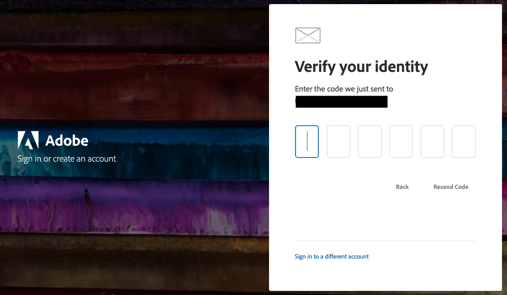

# Accedi al tuo account [!DNL Commerce]

Un account [!DNL Commerce] è il punto di accesso centrale per la gestione dei servizi Adobe Commerce per i progetti Adobe Commerce implementati nell&#39;infrastruttura cloud o on-premise. Dalla dashboard dell’account puoi visualizzare gli abbonamenti, gestire le chiavi API dei servizi Commerce, esaminare le informazioni sulla fatturazione cronologiche e collaborare con altri utenti dell’organizzazione.

Se devi [inviare il tuo primo ticket](https://experienceleague.adobe.com/en/docs/commerce-knowledge-base/kb/help-center-guide/magento-help-center-user-guide#support-case) o gestire la tua relazione con Adobe Commerce, invece di lavorare in una vetrina specifica, inizia creando o accedendo al tuo account [!DNL Commerce].

Se devi [inviare il tuo primo ticket di supporto](https://experienceleague.adobe.com/en/docs/commerce-knowledge-base/kb/help-center-guide/magento-help-center-user-guide#support-case) o gestire la tua relazione con Adobe Commerce all&#39;esterno di una vetrina specifica, inizia creando o accedendo al tuo account [!DNL Commerce].

Puoi accedere al tuo account [!DNL Commerce] dal sito Web [!DNL Commerce]. Dal dashboard account, puoi visualizzare le informazioni relative ai prodotti e ai servizi acquistati e fornire [Accesso condiviso](https://experienceleague.adobe.com/en/docs/support-resources/adobe-support-tools-guide/adobe-commerce-support/adobe-commerce-help-center-user-guide#provide-shared-access) ad altri utenti. Alcune informazioni, come le chiavi API dei servizi Commerce, sono visibili solo ai proprietari delle licenze.

>[!NOTE]
>
>Nella sezione **[!UICONTROL Billing History]** della pagina dell&#39;account [!DNL Commerce] vengono visualizzate solo le fatture create prima dell&#39;aggiornamento del sistema di fatturazione.
>
>Se le fatture più recenti non sono elencate, sono state trasferite al nuovo sistema e non sono accessibili da questa pagina.

![Il tuo account [!DNL Commerce]](./assets/home-acct.png){width="700"}

L&#39;account di accesso [!DNL Commerce] è separato dall&#39;account di accesso amministratore dello store. In genere si utilizzano credenziali diverse per ogni sistema e l&#39;accesso a ogni sistema viene gestito in modo indipendente.

Tuttavia, un utente che desidera semplificare l&#39;accesso ad Adobe Commerce e ai prodotti Adobe Business può configurare il proprio Adobe ID per l&#39;accesso all&#39;amministratore dello store: [Configurare l&#39;integrazione dell&#39;amministratore Commerce con Adobe ID](https://experienceleague.adobe.com/en/docs/commerce-admin/start/admin/ims/adobe-ims-config) nella *Guida all&#39;integrazione IMS per Commerce*.

>[!NOTE]
>
>Dopo aver creato l&#39;account, si consiglia di utilizzare l&#39;autenticazione a due fattori (TFA) per [proteggere l&#39;account](commerce-account-secure.md).

## Accedi al tuo account [!DNL Commerce]

Per accedere all&#39;account [!DNL Commerce] è necessario un Adobe ID. Se disponi di un account [!DNL Commerce] esistente ma non hai effettuato l’accesso da agosto 2022, devi creare un Adobe ID durante il processo di accesso. Devi completare questo passaggio prima di accedere al tuo account.

>[!WARNING]
>
>Se non riesci a trovare l&#39;organizzazione Commerce quando invii un [caso di supporto](https://experienceleague.adobe.com/en/docs/support-resources/adobe-support-tools-guide/adobe-commerce-support/adobe-commerce-help-center-user-guide#support-case) di Adobe Commerce, in genere significa che il proprietario dell&#39;account non ha creato un Adobe ID o che esiste un Adobe ID ma non è collegato all&#39;account Commerce.

1. Passare al sito [[!DNL Commerce]](https://account.magento.com/customer/account/login/).

1. Fare clic su **[!UICONTROL Sign in with Adobe ID]**.

   {width="700"}

1. Immetti il tuo indirizzo e-mail e fai clic su **[!UICONTROL Continue]**.

   >[!TIP]
   >
   >Se hai utilizzato un indirizzo e-mail associato a un MAGEID di un account Commerce esistente, la procedura di accesso lo collega automaticamente al tuo Adobe ID.

## Crea un account [!DNL Commerce]

Chiunque può creare un account [!DNL Commerce] gratuito. L’indirizzo e-mail utilizzato può essere associato a un solo account Commerce.

>[!NOTE]
>
>Utilizza un Adobe ID per creare e accedere a un account Commerce.
>- Se non disponi di un account Commerce, puoi crearne uno durante la procedura di abbonamento.
>- Se disponi già di un account Commerce ma non di un account Adobe ID, vedi [accedi a un account Commerce](#log-in-to-your-dnl-commerce-account).

1. Vai al [[!DNL Commerce] sito](https://account.magento.com/customer/account/login/).

1. Fare clic su **[!UICONTROL Sign in with Adobe ID]**.

1. Se non si dispone di un Adobe ID, fare clic su **[!UICONTROL Create an account]**. In caso contrario, andare al passaggio 7.

   {width="700"}

1. Completa il modulo di iscrizione.

   {width="700"}

1. Fare clic su **[!UICONTROL Create account]**.

1. Immetti il codice di verifica inviato al tuo indirizzo e-mail.

   {width="700"}

1. Dopo aver creato e verificato il tuo Adobe ID, torna a https://account.magento.com/. Verrà generato un ID immagine, che verrà collegato automaticamente al tuo Adobe ID.

## Reimposta la password

1. Vai al [[!DNL Commerce] sito](https://account.magento.com/customer/account/login/).

1. Fare clic su **[!UICONTROL Sign in with Adobe ID]**.

1. Fare clic su **[!UICONTROL Get help signing in]**.

   {width="700"}

1. Fare clic su **[!UICONTROL Reset your password]**.

   {width="700"}

1. Inserisci il tuo indirizzo e-mail.

1. Fare clic su **[!UICONTROL Continue]**.

## Accesso condiviso al tuo account Commerce

L’accesso condiviso ti consente di concedere a utenti affidabili, come colleghi, partner o amministratori, l’autorizzazione per gestire la tua relazione Adobe Commerce per tuo conto senza dover utilizzare l’accesso personale. Ciò include la possibilità per gli altri utenti di aprire e tenere traccia dei casi di supporto.

Consulta la sezione [Condividere un account Commerce](https://experienceleague.adobe.com/en/docs/commerce-admin/start/commerce-account/commerce-account-share?lang=en) della Guida introduttiva di Adobe Commerce per i passaggi dettagliati sulla configurazione di un account condiviso.

Per istruzioni dettagliate sull&#39;invio di un caso di supporto di Commerce, vedere la [Guida utente di Adobe Commerce Help Center](https://experienceleague.adobe.com/en/docs/support-resources/adobe-support-tools-guide/adobe-commerce-support/adobe-commerce-help-center-user-guide#support-case).
