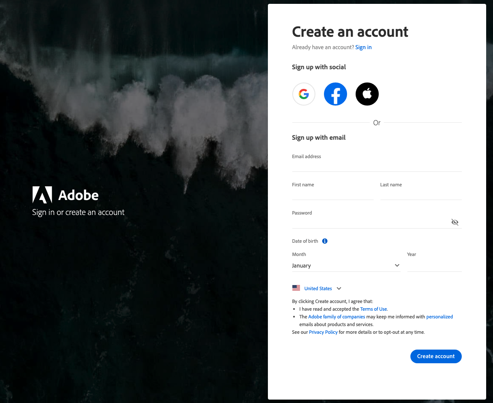

# Accedi al tuo account [!DNL Commerce]

È possibile accedere al proprio account dal sito Web [!DNL Commerce]. Dal dashboard dell&#39;account [!DNL Commerce] è possibile trovare informazioni relative ai prodotti e ai servizi acquistati, nonché le informazioni di contatto e di fatturazione. Alcune informazioni sono visibili solo ai proprietari delle licenze.

È possibile accedere al proprio account dal sito Web [!DNL Commerce]. La dashboard dell’account mostra i prodotti, i servizi e i dettagli di contatto o fatturazione acquistati. Alcune informazioni sono visibili solo ai proprietari delle licenze.

![Il tuo account [!DNL Commerce]](./assets/home-acct.png){width="700"}

L&#39;account di accesso [!DNL Commerce] è separato dall&#39;account di accesso amministratore dello store. In genere si utilizzano credenziali diverse per ogni sistema e l&#39;accesso a ogni sistema viene gestito in modo indipendente.

Tuttavia, un utente che desidera semplificare l&#39;accesso ai prodotti aziendali Adobe Commerce e Adobe potrà configurare il proprio Adobe ID per l&#39;accesso all&#39;amministratore dello store: [Configurare l&#39;integrazione dell&#39;amministratore Commerce con Adobe ID](https://experienceleague.adobe.com/en/docs/commerce-admin/start/admin/ims/adobe-ims-config)

Gli accessi a Commerce e all’amministrazione dello store sono separati, con credenziali diverse e un accesso gestito in modo indipendente. Tuttavia, puoi semplificare l’accesso configurando l’Adobe ID per accedere all’amministratore del negozio. Consulta [Configurare l&#39;integrazione dell&#39;amministratore di Commerce con Adobe ID] nella *Guida all&#39;integrazione IMS per Commerce*.

>[!NOTE]
>
>Dopo aver creato l&#39;account, si consiglia di utilizzare l&#39;autenticazione a due fattori (TFA) per [proteggere l&#39;account](commerce-account-secure.md).

## Accedi al tuo account [!DNL Commerce]

Per accedere a un account Commerce è necessario disporre di un Adobe ID. Se disponi già di un account Commerce ma non di un account Adobe ID, puoi crearne uno durante il processo di accesso.

>[!WARNING]
>
>Utilizza l’indirizzo e-mail associato al MAGEID del tuo account Commerce esistente per creare Adobe ID. L’utilizzo di un indirizzo e-mail diverso crea un nuovo MAGEID.

1. Vai al [[!DNL Commerce] sito](https://account.magento.com/customer/account/login/).

1. Fare clic su **[!UICONTROL Sign in with Adobe ID]**.

   {width="700"}

1. Immetti il tuo indirizzo e-mail e fai clic su **[!UICONTROL Continue]**.

   >[!TIP]
   >
   >Se hai utilizzato un indirizzo e-mail associato a un MAGEID di un account Commerce esistente, la procedura di accesso lo collega automaticamente al tuo Adobe ID.

## Crea un account [!DNL Commerce]

Chiunque può creare un account [!DNL Commerce] gratuito. L’indirizzo e-mail utilizzato può essere associato a un solo account Commerce.

>[!NOTE]
>
>Utilizza un Adobe ID per creare e accedere a un account Commerce.
>- Se non disponi di un account Commerce, puoi crearne uno durante la procedura di abbonamento.
>- Se disponi già di un account Commerce ma non di un account Adobe ID, vedi [accedi a un account Commerce](#log-in-to-your-dnl-commerce-account).

1. Vai al [[!DNL Commerce] sito](https://account.magento.com/customer/account/login/).

1. Fare clic su **[!UICONTROL Sign in with Adobe ID]**.

1. Se non si dispone di un Adobe ID, fare clic su **[!UICONTROL Create an account]**. In caso contrario, andare al passaggio 7.

   {width="700"}

1. Completa il modulo di iscrizione.

   {width="700"}

1. Fare clic su **[!UICONTROL Create account]**.

1. Immetti il codice di verifica inviato al tuo indirizzo e-mail.

   {width="700"}

1. Dopo aver creato e verificato il tuo Adobe ID, torna a https://account.magento.com/. Verrà generato un ID immagine, che verrà collegato automaticamente al tuo Adobe ID.

## Reimposta la password

1. Vai al [[!DNL Commerce] sito](https://account.magento.com/customer/account/login/).

1. Fare clic su **[!UICONTROL Sign in with Adobe ID]**.

1. Fare clic su **[!UICONTROL Get help signing in]**.

   {width="700"}

1. Fare clic su **[!UICONTROL Reset your password]**.

   {width="700"}

1. Inserisci il tuo indirizzo e-mail.

1. Fare clic su **[!UICONTROL Continue]**.
