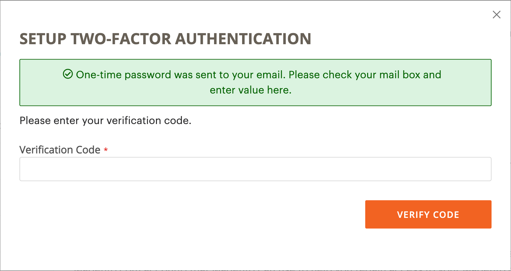
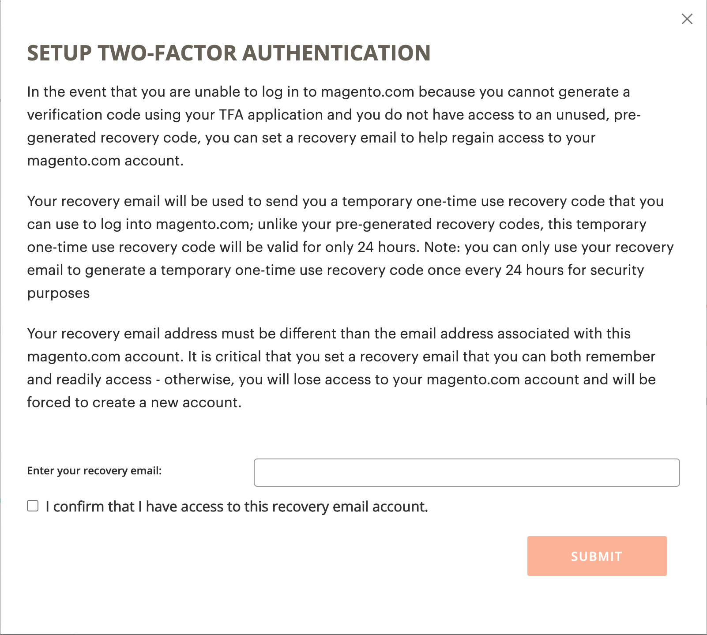
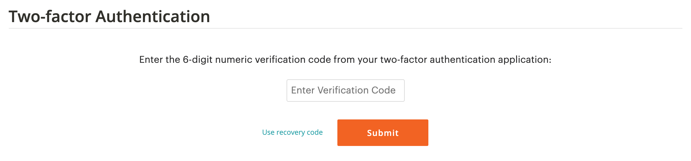

# Proteggi il tuo account [!DNL Commerce]

L&#39;autenticazione a due fattori (TFA o 2FA) è un ulteriore livello di sicurezza per proteggere meglio l&#39;account [!DNL Commerce] da accessi non autorizzati. Per completare il processo di accesso, TFA richiede un fattore _second_ oltre alle credenziali standard di nome utente e password. Questo secondo fattore assume la forma di codici di verifica temporanei generati continuamente da un&#39;applicazione TFA installata sul tuo dispositivo mobile e abbinati al tuo account [!DNL Commerce].

Con TFA abilitato, il tuo account è più sicuro. Un utente non autorizzato non può effettuare l’accesso a meno che non disponga sia delle credenziali del nome utente e della password (primo fattore) che di un codice di verifica valido dell’applicazione TFA sul tuo dispositivo personale (secondo fattore).

>[!NOTE]
>
>L&#39;autenticazione a due fattori che protegge _Admin_ dell&#39;archivio dispone di una configurazione separata. Per ulteriori informazioni, vedere [Autenticazione a due fattori](../systems/security-two-factor-authentication.md).

## Prima di iniziare

Per usare TFA, devi avere un’applicazione TFA installata sul tuo dispositivo personale (come smartphone, tablet, computer). Ne sono disponibili molte, ma alcune opzioni popolari e gratuite includono:

- Autenticatore Google (iOS, Android™, BlackBerry®)

- Authy (iOS, Android™)

- Microsoft® Authenticator (iOS, Android™, Windows Phone)

## Abilita autenticazione a due fattori

1. Accedi al tuo [[!DNL Commerce] account][1]{:target=&quot;_blank&quot;}.

1. Nel riquadro di spostamento a sinistra, selezionare **[!UICONTROL Account Settings]**, quindi selezionare **[!UICONTROL Two-factor Authentication]**.

   {width="600" zoomable="yes"}

1. Selezionare **[!UICONTROL Enable]** per avviare il processo di configurazione dell&#39;autenticazione a due fattori.

1. Immetti il **[!UICONTROL Verification Code]** inviato al tuo indirizzo e-mail e seleziona **[!UICONTROL Verify Code]** per continuare.

   {width="400"}

1. Aprire l&#39;applicazione di autenticazione a due fattori scaricata e installata sul dispositivo personale.

1. Nel modulo [!UICONTROL SETUP TWO-FACTOR AUTHENTICATION], utilizza **[!UICONTROL Setup Code]** per aggiungere Adobe Commerce all&#39;applicazione TFA.

   {width="400"}

   Puoi aggiungere il codice scansionando il codice QR utilizzando l’applicazione TFA o immettendolo manualmente. Questo codice associa l&#39;applicazione TFA all&#39;account [!DNL Commerce] e consente alle autorizzazioni di generare l&#39;app TFA per generare i codici di verifica per l&#39;accesso sicuro all&#39;account.

1. Completa la configurazione.

   - Nel modulo [!UICONTROL SETUP TWO FACTOR-AUTHENTICATION] immettere il codice di verifica dell&#39;applicazione di autenticazione a due fattori.

   - Selezionare **[!UICONTROL Verify Code]**.

   >[!NOTE]
   >
   >Per motivi di sicurezza, i codici di verifica nell&#39;applicazione TFA scadono e vengono rigenerati continuamente. **_Usa sempre_** il codice attualmente visualizzato.

1. Salva **[!UICONTROL Recovery Codes]** presentato in un luogo sicuro e accessibile.

   {width="400"}

   Se non è possibile fornire un codice di verifica quando si accede all&#39;account [!DNL Commerce], è necessario utilizzare un codice di ripristino per recuperare l&#39;accesso all&#39;account.

   Ogni codice di ripristino può essere utilizzato una sola volta, ma è possibile [generarne](#generate-new-recovery-codes) di nuovi. I codici di ripristino fanno distinzione tra maiuscole e minuscole.

1. Selezionare la casella di controllo di conferma e selezionare **[!UICONTROL Submit]** per continuare.

1. Per garantire il ripristino dell&#39;accesso all&#39;account, immettere **[!UICONTROL Recovery Email]**.

   Questo indirizzo e-mail è necessario se non è possibile generare un codice di verifica dall&#39;applicazione di autenticazione a due fattori e non si dispone dell&#39;accesso a un codice di ripristino pregenerato inutilizzato.

   Una volta ogni 24 ore, è possibile generare e inviare un codice di ripristino temporaneo all&#39;indirizzo e-mail di ripristino designato. Utilizzare questo codice per recuperare l&#39;accesso all&#39;account.

   >[!IMPORTANT]
   >
   >Mantenere l&#39;accesso all&#39;account di posta elettronica di ripristino. In caso contrario, non è possibile utilizzare codici di recupero temporanei inviati a tale account.

   {width="400"}

1. Selezionare la casella di controllo di conferma e selezionare **[!UICONTROL Submit]** per completare il processo di configurazione dell&#39;autenticazione a due fattori.

   - Viene inviata una notifica all&#39;indirizzo di posta elettronica associato al tuo account [!DNL Commerce] per confermare che hai abilitato correttamente l&#39;autenticazione a due fattori.

   - Viene inviata una notifica all’account e-mail di ripristino per confermare la configurazione.

>[!TIP]
>
>Se perdi il tuo dispositivo personale o ne ottieni uno nuovo, puoi [modificare l&#39;app di autenticazione a due fattori](#change-your-two-factor-authentication-application) e generare nuovi codici di ripristino.

## Accedi utilizzando un codice di verifica

1. Vai all&#39;account di accesso [!DNL Commerce] [account][1]{:target=&quot;_blank&quot;}.

1. Immettere le credenziali di nome utente e password, quindi selezionare **[!UICONTROL Login]**.

1. Immetti **[!UICONTROL Verification Code]** visualizzato nell&#39;applicazione di autenticazione a due fattori quando richiesto.

   {width="600"}

1. Selezionare **[!UICONTROL Submit]** per completare il processo di accesso.

## Accedi utilizzando un codice di ripristino

1. Vai all&#39;account di accesso [!DNL Commerce] [account][1]{:target=&quot;_blank&quot;}.

1. Immettere le credenziali di nome utente e password, quindi selezionare **[!UICONTROL Login]**.

1. Selezionare **[!UICONTROL Use recovery code]** per ignorare il prompt del codice di verifica.

1. Quando richiesto, immetti un **[!UICONTROL Recovery Code]** non utilizzato.

   {width="600"}

1. Selezionare **[!UICONTROL Submit]** per completare il processo di accesso.

## Accedi utilizzando l’e-mail di ripristino

1. Accedi al tuo [[!DNL Commerce] account][1]{:target=&quot;_blank&quot;}.

1. Immettere le credenziali di nome utente e password, quindi selezionare **[!UICONTROL Login]**.

1. Selezionare **[!UICONTROL Use recovery code]** per ignorare il prompt del codice di verifica.

1. Per ottenere un codice di ripristino temporaneo tramite e-mail, selezionare il collegamento **[!UICONTROL recovery email]**.

   {width="600"}

1. Aprire l&#39;account di posta elettronica di recupero per ottenere il codice temporaneo, quindi immettere il codice nei campi designati.

1. Selezionare **[!UICONTROL Submit]** per completare il processo di accesso.

Dopo aver utilizzato un codice di ripristino temporaneo per accedere all&#39;account, [genera nuovi codici di ripristino](#generate-new-recovery-codes) e salvali per evitare ulteriori problemi di accesso all&#39;account.

## Visualizza i codici di ripristino

1. Vai all&#39;account di accesso [!DNL Commerce] [account][1]{:target=&quot;_blank&quot;}.

1. Immettere le credenziali di nome utente e password, quindi selezionare **[!UICONTROL Login]**.

1. Completa il processo di accesso utilizzando uno dei metodi di autenticazione a due fattori descritti in precedenza.

1. Nel riquadro di spostamento a sinistra, selezionare **[!UICONTROL Account Settings]**, quindi selezionare **[!UICONTROL Two-factor Authentication]**.

   {width="600" zoomable="yes"}

1. Per visualizzare i codici di ripristino pregenerati, selezionare **Visualizza codici di ripristino**.

1. Immetti il **[!UICONTROL Verification Code]** inviato al tuo indirizzo e-mail e seleziona **[!UICONTROL Verify Code]** per continuare.

   {width="400"}

1. Salvare i **codici di ripristino** presentati in un luogo sicuro e accessibile.

   Se non è possibile fornire un codice di verifica per accedere all&#39;account [!DNL Commerce], l&#39;unico modo per recuperare l&#39;accesso all&#39;account è utilizzare un codice di ripristino.

   Ogni codice di ripristino è monouso, ma è sempre possibile [generarne](#generate-new-recovery-codes) di nuovi. I codici di ripristino fanno distinzione tra maiuscole e minuscole.

   {width="400"}

1. Selezionare la casella di controllo di conferma e selezionare **[!UICONTROL Submit]** per chiudere la finestra di dialogo.

## Genera nuovi codici di ripristino

1. Vai all&#39;account di accesso [!DNL Commerce] [account][1]{:target=&quot;_blank&quot;}.

1. Immettere le credenziali di nome utente e password, quindi selezionare **[!UICONTROL Login]**.

1. Completa il processo di accesso utilizzando uno dei metodi di autenticazione a due fattori descritti in precedenza.

1. Nel riquadro di spostamento a sinistra, selezionare **[!UICONTROL Account Settings]**, quindi selezionare **[!UICONTROL Two-factor Authentication]**.

1. Per generare nuovi codici di ripristino pregenerati, selezionare **Genera nuovi codici di ripristino**.

1. Immetti il **[!UICONTROL Verification Code]** inviato al tuo indirizzo e-mail e seleziona **[!UICONTROL Verify Code]** per continuare.

1. Salvare i **codici di ripristino** presentati in un luogo sicuro e accessibile.

   Se non è possibile fornire un codice di verifica quando si accede all&#39;account [!DNL Commerce], l&#39;unico modo per recuperare l&#39;accesso all&#39;account è utilizzare un codice di ripristino.

   Tutti i codici di ripristino generati in precedenza vengono ora resi non validi e devono essere eliminati (solo il set corrente di codici di ripristino generati è funzionante). I codici di ripristino fanno distinzione tra maiuscole e minuscole.

1. Selezionare la casella di controllo di conferma e selezionare **[!UICONTROL Submit]** per chiudere la finestra di dialogo.

## Cambia l’e-mail di ripristino

1. Vai all&#39;account di accesso [!DNL Commerce] [account][1]{:target=&quot;_blank&quot;}.

1. Immettere le credenziali di nome utente e password, quindi selezionare **[!UICONTROL Login]**.

1. Completa il processo di accesso utilizzando uno dei metodi di autenticazione a due fattori descritti in precedenza.

1. Nel riquadro di spostamento a sinistra, selezionare **[!UICONTROL Account Settings]**, quindi selezionare **[!UICONTROL Two-factor Authentication]**.

1. Selezionare **Modifica e-mail di ripristino** per modificare l&#39;e-mail di ripristino nel file per l&#39;account.

1. Immetti il **[!UICONTROL Verification Code]** inviato al tuo indirizzo e-mail e seleziona **[!UICONTROL Verify Code]** per continuare.

1. Per assicurarsi di poter recuperare l&#39;accesso al tuo account, immetti un **Email di ripristino**.

   Questo indirizzo e-mail è necessario se non è possibile generare un codice di verifica dall&#39;applicazione di autenticazione a due fattori e non si dispone dell&#39;accesso a un codice di ripristino pregenerato inutilizzato.

   Una volta ogni 24 ore, è possibile generare e inviare un codice di ripristino temporaneo all&#39;indirizzo e-mail di ripristino designato. Puoi utilizzare questo codice per recuperare l’accesso all’account.

   >[!IMPORTANT]
   >
   >Mantenere l&#39;accesso all&#39;account di posta elettronica di ripristino. In caso contrario, non è possibile utilizzare codici di recupero temporanei inviati a tale account.

1. Selezionare la casella di controllo di conferma e selezionare **[!UICONTROL Submit]** per chiudere la finestra di dialogo.

   Il sistema invia una notifica e-mail all’e-mail di ripristino designata per confermare che un particolare indirizzo e-mail è in archivio come e-mail di ripristino per la ricezione di codici di ripristino temporanei.

## Modificare l&#39;applicazione di autenticazione a due fattori

1. Vai all&#39;account di accesso [!DNL Commerce] [account][1]{:target=&quot;_blank&quot;}.

1. Immettere le credenziali di nome utente e password, quindi selezionare **[!UICONTROL Login]**.

1. Completa il processo di accesso utilizzando uno dei metodi di autenticazione a due fattori descritti in precedenza.

1. Nel riquadro di spostamento a sinistra, selezionare **[!UICONTROL Account Settings]**, quindi selezionare **[!UICONTROL Two-factor Authentication]**.

1. Seleziona **Cambia applicazione TFA** per utilizzare un&#39;altra applicazione TFA con il tuo account magento.com.

1. Immetti il **[!UICONTROL Verification Code]** inviato al tuo indirizzo e-mail e seleziona **[!UICONTROL Verify Code]** per continuare.

1. Apri l’applicazione di autenticazione a due fattori sul tuo dispositivo personale.

1. Immetti il **codice di installazione** nell&#39;applicazione di autenticazione a due fattori.

   Puoi aggiungere il codice scansionando il codice QR utilizzando l’applicazione TFA o immettendolo manualmente. Questo codice associa l&#39;applicazione TFA all&#39;account [!DNL Commerce] e consente all&#39;app TFA di generare i codici di verifica per l&#39;accesso sicuro all&#39;account.

   >[!NOTE]
   >
   >Per motivi di sicurezza, i codici di verifica nell&#39;applicazione TFA scadono e vengono rigenerati continuamente. **_Usa sempre_** il codice attualmente visualizzato.

1. Con la tua applicazione TFA ora associata al tuo account [!DNL Commerce], immetti il **[!UICONTROL Verification Code]** visualizzato nell&#39;applicazione TFA e seleziona **[!UICONTROL Verify Code]** per continuare.

1. Salvare i **codici di ripristino** presentati in un luogo sicuro e accessibile.

   Se non è possibile fornire un codice di verifica quando si accede all&#39;account [!DNL Commerce], l&#39;unico modo per recuperare l&#39;accesso all&#39;account consiste nell&#39;utilizzare un codice di recupero.

   Ogni codice di ripristino è monouso, ma è sempre possibile [generarne](#generate-new-recovery-codes) di nuovi. I codici di ripristino fanno distinzione tra maiuscole e minuscole. I codici di ripristino fanno distinzione tra maiuscole e minuscole.

1. Selezionare la casella di controllo per confermare e selezionare **[!UICONTROL Submit]** per continuare.

1. Per assicurarsi di poter recuperare l&#39;accesso al tuo account, immetti un **Email di ripristino**.

   Questo indirizzo e-mail è necessario se non è possibile generare un codice di verifica dall&#39;applicazione di autenticazione a due fattori e non si dispone dell&#39;accesso a un codice di ripristino pregenerato inutilizzato.

   Una volta ogni 24 ore, è possibile generare e inviare un codice di ripristino temporaneo all&#39;indirizzo e-mail di ripristino designato. Utilizzare questo codice per recuperare l&#39;accesso all&#39;account.

   >[!IMPORTANT]
   >
   >Mantenere l&#39;accesso all&#39;account di posta elettronica di ripristino. In caso contrario, non è possibile utilizzare codici di recupero temporanei inviati a tale account.

1. Selezionare la casella di controllo di conferma e selezionare **[!UICONTROL Submit]** per completare il processo di configurazione dell&#39;autenticazione a due fattori.

   Viene inviata una notifica e-mail all’e-mail di recupero designata per confermare che un particolare indirizzo e-mail sia in archivio come e-mail di recupero per la ricezione di un codice di recupero temporaneo.

## Disattiva l&#39;autenticazione a due fattori

>[!IMPORTANT]
>
>Se i criteri di sicurezza organizzativi richiedono l’autenticazione a più fattori sugli account Adobe Commerce, non è possibile disabilitare l’autenticazione a due fattori.

1. Vai all&#39;account di accesso [!DNL Commerce] [account][1]{:target=&quot;_blank&quot;}.

1. Immettere le credenziali di nome utente e password, quindi selezionare **[!UICONTROL Login]**.

1. Completa il processo di accesso utilizzando uno dei metodi di autenticazione a due fattori descritti in precedenza.

1. Nel riquadro di spostamento a sinistra, selezionare **[!UICONTROL Account Settings]** e selezionare **[!UICONTROL Two-factor Authentication]**.

1. Selezionare **[!UICONTROL Disable]** per avviare il processo di disattivazione TFA.

1. Immetti il **[!UICONTROL Verification Code]** inviato al tuo indirizzo e-mail e seleziona **[!UICONTROL Verify Code]** per continuare.

1. Selezionare la casella di controllo di conferma e selezionare **[!UICONTROL Submit]** per completare la disattivazione per l&#39;autenticazione a due fattori.

   Il sistema invia una conferma e-mail che indica che TFA è stato disabilitato sul tuo account [!DNL Commerce].

   {width="400"}

[1]: https://account.magento.com/customer/account/login
