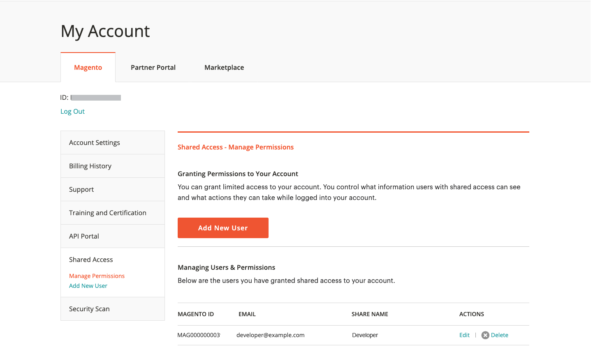

# Condividi un account [!DNL Commerce]

L&#39;account [!DNL Commerce] contiene informazioni che è possibile rendere disponibili a dipendenti e provider di servizi attendibili che aiutano a gestire il sito. In qualità di titolare dell&#39;account principale, hai l&#39;autorità di concedere accesso limitato ad altri titolari di account [!DNL Commerce]. L&#39;accesso condiviso può essere revocato, ma non può essere trasferito da un utente all&#39;altro.

Il team di supporto [!DNL Commerce] non ha accesso all&#39;account e non può impostare l&#39;accesso condiviso per te. Solo il titolare dell’account principale con le autorizzazioni appropriate può impostare l’accesso condiviso. Quando si condivide l&#39;accesso all&#39;account, tutte le informazioni riservate, ad esempio la cronologia di fatturazione o le informazioni sulla carta di credito, rimangono protette e non sono mai disponibili per altri utenti.

>[!NOTE]
>
>Tutte le azioni intraprese dagli utenti con accesso condiviso sono di esclusiva responsabilità del titolare del conto principale. Adobe non è responsabile di alcuna azione eseguita dagli utenti che hanno accesso condiviso al tuo account.

{width="600" zoomable="yes"}

## Configurare un account condiviso

1. Prima di iniziare, ottenere le seguenti informazioni dall&#39;account [!DNL Commerce] del **nuovo beneficiario dell&#39;accesso condiviso**:

   - L&#39;utente deve essersi già registrato per un account all&#39;indirizzo account.adobe.com e aver effettuato l&#39;accesso tramite account.magento.com.
   - `MAGE ID/Account ID (MAG00XXXXXXX)` è visualizzato nell&#39;angolo superiore sinistro della scheda _[!UICONTROL Magento]_, appena sopra il collegamento **Disconnetti**.
   - Indirizzo `Email` associato all&#39;account.

1. Accedi al tuo [[!DNL Commerce] account](commerce-account-create.md).

1. Nel pannello di navigazione a sinistra, fare clic su **[!UICONTROL Shared Access]**.

1. Fare clic su **[!UICONTROL Add New User]**.

   {width="600" zoomable="yes"}

1. In [!UICONTROL _New User Information]_ eseguire le operazioni seguenti:

   - Immettere **[!UICONTROL Account ID]** dall&#39;account [!DNL Commerce] del nuovo utente.
   - Immettere l&#39;indirizzo **[!UICONTROL Email]** associato all&#39;account [!DNL Commerce] del nuovo utente.

   {width="600"}

1. In _[!UICONTROL Shared Information]_eseguire le operazioni seguenti:

   - Per identificare l&#39;account condiviso, immettere un **[!UICONTROL Share Name]**. Questo nome è un riferimento interno ed è visibile solo a te e alla persona con cui condividi l’account.

     Si consiglia di utilizzare il nome dell&#39;organizzazione come [!UICONTROL Share Name]. Non utilizzare un nome che inizia con `CLOUD SHARED ACCESS FROM MAG XYX`.
   - Se si desidera condividere le proprie informazioni personali con il nuovo utente, immettere **[!UICONTROL Your Email]** e **[!UICONTROL Your Phone]**.

1. In _[!UICONTROL Grant Account Permissions]_selezionare la casella di controllo di ogni prodotto e servizio [!DNL Commerce] che si desidera condividere.

   {width="600"}

1. Fare clic su **[!UICONTROL Create Shared Access]**.

   Le informazioni sul nuovo utente vengono visualizzate nella sezione _[!UICONTROL Manage Permissions]_della pagina Accesso condiviso e al nuovo utente viene inviato un invito e-mail con le istruzioni per l&#39;accesso all&#39;account condiviso.

   {width="600" zoomable="yes"}

>[!NOTE]
>
>Non è necessario condividere l&#39;accesso a _[!UICONTROL Security Tool]_. Qualsiasi utente con un ID MAGE può impostare lo strumento Security Scan con il proprio account. Hanno solo bisogno dei privilegi necessari per apportare modifiche al sito e verificare la proprietà del dominio utilizzando uno dei [metodi richiesti](https://experienceleague.adobe.com/en/docs/commerce-admin/systems/security/security-scan)).

## Accedere a un account condiviso

Le seguenti istruzioni sono scritte dal punto di vista di un utente condiviso che riceve un invito a un account condiviso.

1. Quando ricevi un invito a un account condiviso, segui le istruzioni riportate nell&#39;e-mail per accedere al tuo account [!DNL Commerce].

   Il pannello di navigazione sinistro del tuo account ha una nuova scheda _[!UICONTROL Shared with me]_. Il controllo_[!UICONTROL Switch Accounts]_ nell&#39;angolo superiore destro include opzioni per `My Account` e il nome dell&#39;account condiviso.

   {width="600" zoomable="yes"}

1. Per accedere all&#39;account condiviso, impostare **[!UICONTROL Switch Accounts]** sul nome dell&#39;account condiviso.

   {width="600" zoomable="yes"}

   L&#39;account condiviso visualizza un messaggio di benvenuto e informazioni di contatto. Il pannello di navigazione a sinistra include solo gli elementi per i quali disponi dell’autorizzazione all’uso.

1. Per connettere l&#39;account condiviso all&#39;Help Center, fare clic su **[!UICONTROL Support]** nel pannello di navigazione a sinistra dell&#39;account condiviso.

   {width="600" zoomable="yes"}

   È possibile utilizzare il [Centro assistenza Adobe Commerce](https://experienceleague.adobe.com/en/docs/commerce-knowledge-base/kb/overview.html) dell&#39;account condiviso per cercare articoli e informazioni sulla risoluzione dei problemi, trovare patch per i problemi noti e creare ticket di supporto.

   >[!NOTE]
   >
   >Dopo aver ricevuto l&#39;accesso condiviso, l&#39;utente deve accedere al proprio [[!DNL Commerce] account](https://account.magento.com/customer/account/login), passare a _Accesso condiviso_ e fare clic sulla scheda **[!UICONTROL Support]**. Questa azione è necessaria solo la prima volta per assicurarsi che la Knowledge Base [Adobe Commerce Support](https://experienceleague.adobe.com/en/docs/commerce-knowledge-base/kb/overview.html) sia configurata correttamente tramite la chiamata `SSO`.

1. Per tornare al tuo account, fai clic su **Indietro** nei controlli del browser e imposta **[!UICONTROL Switch Accounts]** su `My Account`.

## Revoca dell&#39;accesso condiviso

1. Accedi al tuo account Commerce.

1. Nel pannello di navigazione a sinistra, fare clic su **[!UICONTROL Shared Access]**.

1. Trovare l&#39;account da revocare in _[!UICONTROL Managing Users & Permissions]_e fare clic su **[!UICONTROL Delete]**.

   >[!NOTE]
   >
   > Se **[!UICONTROL Delete]** non è visualizzato, verificare se **[!UICONTROL Share Name]** inizia con `Cloud Shared Access from MAG XYZ`. Impossibile eliminare account con il [modello di denominazione](https://experienceleague.adobe.com/en/docs/commerce-knowledge-base/kb/help-center-guide/magento-help-center-user-guide#remove-cloud-shared-access-users).
   > 
   > In tal caso, chiedere al proprietario dell&#39;account di modificare l&#39;account di Accesso condiviso per annullare le autorizzazioni dell&#39;account. Dopo tale aggiornamento, l’utente non può accedere ad alcuna risorsa dell’account.
   >
   > Inoltre, assicurati che gli utenti vengano rimossi dal progetto in modo che non ricevano più le notifiche e-mail: [Gli ex membri del team ricevono le e-mail di notifica cloud di Adobe Commerce](https://experienceleague.adobe.com/en/docs/commerce-knowledge-base/kb/troubleshooting/miscellaneous/former-teammembers-receive-cloud-notification-emails.html)

1. Quando viene richiesto di confermare, fare clic su **[!UICONTROL Delete User]**.

>[!NOTE]
>
>Non puoi eliminare utenti con il nome di condivisione di _Cloud Shared Access da MAG[XYZ]_ in questa interfaccia. Vedi [Come eliminare gli utenti a cui è stato concesso l&#39;accesso condiviso tramite un progetto Cloud?](https://experienceleague.adobe.com/en/docs/commerce-knowledge-base/kb/help-center-guide/magento-help-center-user-guide.html?lang=en#remove-cloud-shared-access-users).
