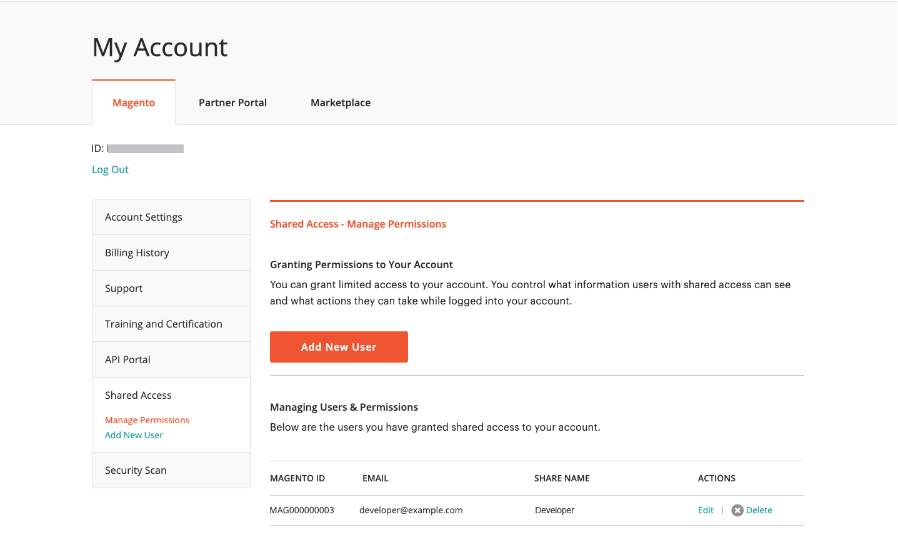
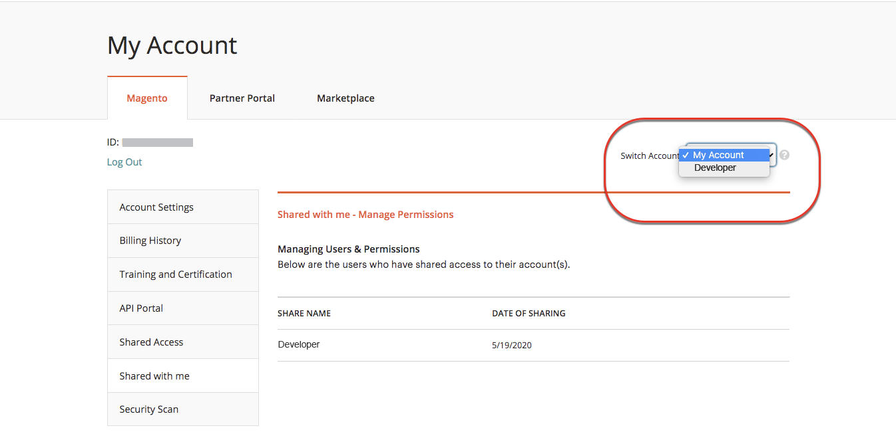
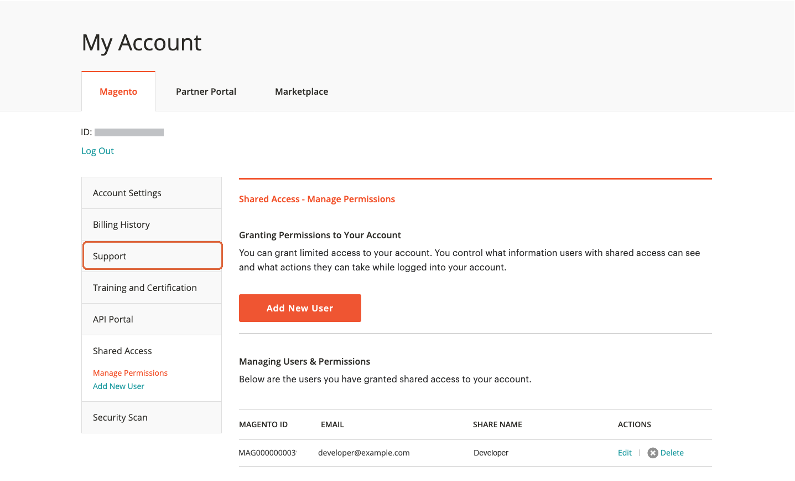

# Condividi un account [!DNL Commerce]

L&#39;account [!DNL Commerce] contiene informazioni che è possibile rendere disponibili a dipendenti e provider di servizi attendibili che aiutano a gestire il sito. Quando si condivide l&#39;accesso all&#39;account, tutte le informazioni riservate, ad esempio la cronologia di fatturazione o le informazioni sulla carta di credito, rimangono protette e non sono mai disponibili per altri utenti.

Il titolare dell&#39;account principale ha l&#39;autorità di concedere accesso limitato ad altri titolari di account [!DNL Commerce]. L&#39;accesso condiviso può essere revocato, ma non trasferito. Per ``Cloud Shared Access from MAG[XYZ]`` voci, il record utente **non può essere eliminato qui**, ma l&#39;accesso **può ancora essere revocato**.

Solo il titolare dell’account principale con le autorizzazioni appropriate può concedere formalmente l’accesso condiviso. Se il titolare dell&#39;account principale non ha più accesso o ha lasciato la società, il cliente deve utilizzare il [processo di trasferimento account di Commerce](https://experienceleague.adobe.com/it/docs/commerce-admin/start/commerce-account/commerce-account-transfer) per spostare la proprietà in un nuovo contatto. Anche se il team di supporto Commerce può rappresentare il cliente in scenari limitati, il cliente deve configurare l’accesso condiviso per ridurre i rischi per la sicurezza e la responsabilità.

{width="600" zoomable="yes"}

La sezione Cronologia fatturazione mostra solo le fatture precedenti create prima di una modifica al nostro sistema di fatturazione. If you don’t see any newer invoices listed, those invoices have been transitioned to the new system and are not accessible from this view.

>[!IMPORTANT]
>
>All actions taken by users with shared access are the sole responsibility of the primary account holder. Adobe is not responsible for any actions taken by users who have shared access to your account.

## Set up a shared account

1. Prima di iniziare, ottenere le seguenti informazioni dall&#39;account [!DNL Commerce] del **nuovo beneficiario dell&#39;accesso condiviso**:

   - L&#39;utente deve essersi già registrato per un account all&#39;indirizzo account.adobe.com e aver effettuato l&#39;accesso tramite account.magento.com. Per ulteriori dettagli, vedere [Creare un account Commerce](https://experienceleague.adobe.com/it/docs/commerce-admin/start/commerce-account/commerce-account-create#create-a-commerce-account).
   - The `MAGE ID/Account ID (MAG00XXXXXXX)` is displayed in the upper-left corner of the _[!UICONTROL Magento]_&#x200B;tab, just above the **Log Out**&#x200B;link.
   - The `Email` address that is associated with the account.

1. Log in to your [[!DNL Commerce] account](commerce-account-create.md).

1. In the left navigation panel, click **[!UICONTROL Shared Access]**.

1. Fare clic su **[!UICONTROL Add New User]**.

   {width="600" zoomable="yes"}

1. In [!UICONTROL _New User Information]_ eseguire le operazioni seguenti:

   - Immettere **[!UICONTROL Account ID]** dall&#39;account [!DNL Commerce] del nuovo utente.
   - Immettere l&#39;indirizzo **[!UICONTROL Email]** associato all&#39;account [!DNL Commerce] del nuovo utente.

   {width="600"}

1. In _[!UICONTROL Shared Information]_&#x200B;eseguire le operazioni seguenti:

   - Per identificare l&#39;account condiviso, immettere un **[!UICONTROL Share Name]**. Questo nome è un riferimento interno ed è visibile solo a te e alla persona con cui condividi l’account.

     Si consiglia di utilizzare il nome dell&#39;organizzazione come [!UICONTROL Share Name]. Non utilizzare un nome che inizia con `CLOUD SHARED ACCESS FROM MAG XYX`.
   - Se si desidera condividere le proprie informazioni personali con il nuovo utente, immettere **[!UICONTROL Your Email]** e **[!UICONTROL Your Phone]**.

1. In _[!UICONTROL Grant Account Permissions]_&#x200B;selezionare la casella di controllo di ogni prodotto e servizio [!DNL Commerce] che si desidera condividere.

   {width="600"}

1. Fare clic su **[!UICONTROL Create Shared Access]**.

   The new user information appears in the _[!UICONTROL Manage Permissions]_&#x200B;section of the Shared Access page, and an email invitation with instructions to access the shared account is sent to the new user.

   {width="600" zoomable="yes"}

>[!NOTE]
>
>Non è necessario condividere l&#39;accesso a _[!UICONTROL Security Tool]_. Qualsiasi utente con un ID MAGE può impostare lo strumento Security Scan con il proprio account. Hanno solo bisogno dei privilegi necessari per apportare modifiche al sito e verificare la proprietà del dominio utilizzando uno dei [metodi richiesti](https://experienceleague.adobe.com/it/docs/commerce-admin/systems/security/security-scan)).

## Access a shared account

Le seguenti istruzioni sono scritte dal punto di vista di un utente condiviso che riceve un invito a un account condiviso.

1. Quando ricevi un invito a un account condiviso, segui le istruzioni riportate nell&#39;e-mail per accedere al tuo account [!DNL Commerce].

   Il pannello di navigazione sinistro del tuo account ha una nuova scheda _[!UICONTROL Shared with me]_. Il controllo&#x200B;_[!UICONTROL Switch Accounts]_ nell&#39;angolo superiore destro include opzioni per `My Account` e il nome dell&#39;account condiviso.

   {width="600" zoomable="yes"}

   >[!NOTE]
   >
   >   Se il controllo _[!UICONTROL Switch Accounts]_&#x200B;non viene visualizzato, contattare il titolare dell&#39;account principale e confermare che le [informazioni sull&#39;account](#set-up-a-shared-account) sono corrette.

1. Per accedere all&#39;account condiviso, impostare **[!UICONTROL Switch Accounts]** sul nome dell&#39;account condiviso.

   {width="600" zoomable="yes"}

   L&#39;account condiviso visualizza un messaggio di benvenuto e informazioni di contatto. Il pannello di navigazione a sinistra include solo gli elementi per i quali disponi dell’autorizzazione all’uso.

1. Per connettere l&#39;account condiviso all&#39;Help Center, fare clic su **[!UICONTROL Support]** nel pannello di navigazione a sinistra dell&#39;account condiviso.

   {width="600" zoomable="yes"}

   You can use the [Adobe Commerce Help Center](https://experienceleague.adobe.com/it/docs/commerce-knowledge-base/kb/overview) from the shared account to search for articles and troubleshooting information, find patches for known issues, and create support tickets.

   >[!NOTE]
   >
   >After receiving shared access, to [submit a Support case](https://experienceleague.adobe.com/it/docs/commerce-knowledge-base/kb/help-center-guide/magento-help-center-user-guide#support-case) on Experience League, make sure that you first select the Organization name that ends in &quot;([!DNL Commerce])&quot; in the left column.

1. To return to your own account, click **Back** in your browser controls and set **[!UICONTROL Switch Accounts]** to `My Account`.

## Revoke shared access

1. Accedi al tuo account Commerce.

1. In the left navigation panel, click **[!UICONTROL Shared Access]**.

1. Find the account to be revoked under _[!UICONTROL Managing Users & Permissions]_&#x200B;and click **[!UICONTROL Delete]**.

   >[!NOTE]
   >
   > If  **[!UICONTROL Delete]** is not displayed, check whether the **[!UICONTROL Share Name]** contains the naming pattern  `Cloud Shared Access from MAG0XYZ`. If the account has that [naming pattern and cannot be deleted](https://experienceleague.adobe.com/it/docs/commerce-knowledge-base/kb/help-center-guide/magento-help-center-user-guide#remove-cloud-shared-access-users), this is because the Shared Access was created by an API, and not directly from the [Commerce account](https://account.magento.com/).
   > 
   > If it cannot be deleted, simply have the Account Owner modify the Shared Access account and under Grant Account Permissions, uncheck every item. After that update, the user will no longer be able to access any account resources.
   > 
   >
   > Inoltre, assicurati che gli utenti vengano rimossi dal progetto in modo che non ricevano più le notifiche e-mail: [Gli ex membri del team ricevono le e-mail di notifica cloud di Adobe Commerce](https://experienceleague.adobe.com/it/docs/commerce-knowledge-base/kb/troubleshooting/miscellaneous/former-teammembers-receive-cloud-notification-emails)

1. Quando viene richiesto di confermare, fare clic su **[!UICONTROL Delete User]**.

>[!NOTE]
>
>Non puoi eliminare utenti con il nome di condivisione di _Cloud Shared Access da MAG[XYZ]_ in questa interfaccia. Vedi [Come eliminare gli utenti a cui è stato concesso l&#39;accesso condiviso tramite un progetto Cloud?](https://experienceleague.adobe.com/it/docs/commerce-knowledge-base/kb/help-center-guide/magento-help-center-user-guide#remove-cloud-shared-access-users).

## Lettura correlata

[Risoluzione dei problemi di accesso condiviso](https://experienceleague.adobe.com/it/docs/commerce-knowledge-base/kb/troubleshooting/miscellaneous/shared-access-troubleshooting)

