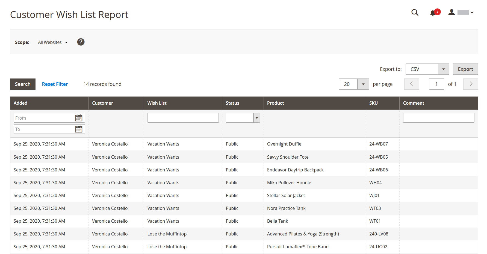

# Rapporti sui clienti

I rapporti dei clienti forniscono informazioni approfondite sull’attività del cliente in un determinato periodo di tempo o intervallo di date.

## [!UICONTROL Order Total Report]

[!UICONTROL Order Total Report] mostra gli ordini cliente per un intervallo di tempo o un intervallo di date specificato. Il rapporto include il numero di ordini per cliente, l&#39;importo medio degli ordini e l&#39;importo totale.

Nella barra laterale _Admin_, passa a **[!UICONTROL Reports]** > _[!UICONTROL Customers]_>**[!UICONTROL Order Total]**.

{width="600"}

### Controlli Workspace

| Controllo | Descrizione |
|--- |--- |
| [!UICONTROL From / To] | Consente di definire una ricerca per gli ordini in base alla data di inizio e di fine. |
| [!UICONTROL Show By] | Definisce la granularità della suddivisione del record dell’ordine. Opzioni: `Month` / `Day` / `Year` |
| [!UICONTROL Refresh] | Aggiorna la griglia ai filtri specificati. |
| [!UICONTROL Export] | Esporta i record selezionati come file CSV o XML di Excel. |
| [!UICONTROL Scope] | Utilizzato per impostare il sito o il negozio per cui viene generato il rapporto. |

{style="table-layout:auto"}

### Descrizioni delle colonne

| Colonna | Descrizione |
|--- |--- |
| [!UICONTROL Interval] | Intervallo totale dell&#39;ordine, da `Month` / `Day` / `Year`. |
| [!UICONTROL Customer] | Il nome del cliente che ha effettuato l’ordine. |
| [!UICONTROL Orders] | Numero di ordini per l&#39;intervallo specificato. |
| [!UICONTROL Average] | Importo medio dell&#39;ordine. Questo importo viene sempre calcolato per i prezzi dei prodotti **IVA esclusa** anche se i prezzi dei prodotti del catalogo, il subtotale dell&#39;ordine e il totale dell&#39;ordine includono l&#39;imposta. Di conseguenza, l&#39;importo visualizzato nel rapporto è diverso da quello visualizzato nei dettagli dell&#39;ordine nei casi in cui i totali dell&#39;ordine includono le imposte. |
| [!UICONTROL Total] | Somma di tutti gli ordini del periodo. Questo importo viene sempre calcolato per i prezzi dei prodotti **IVA esclusa** anche se i prezzi dei prodotti del catalogo, il subtotale dell&#39;ordine e il totale dell&#39;ordine includono l&#39;imposta. Di conseguenza, il totale visualizzato nel rapporto è diverso dall&#39;importo visualizzato nei dettagli dell&#39;ordine nei casi in cui i totali dell&#39;ordine includono le imposte. |

{style="table-layout:auto"}

## [!UICONTROL Order Count Report]

[!UICONTROL Order Count Report] mostra il numero di ordini per cliente per un intervallo di tempo o un intervallo di date specificato. Il rapporto include il numero di ordini per cliente, l&#39;importo medio degli ordini e l&#39;importo totale.

Nella barra laterale _Admin_, passa a **[!UICONTROL Reports]** > _[!UICONTROL Customers]_>**[!UICONTROL Order Count]**.

{width="600"}

### Controlli Workspace

| Controllo | Descrizione |
|--- |--- |
| [!UICONTROL From / To] | Consente di definire una ricerca per gli ordini in base alla data di inizio e di fine. |
| [!UICONTROL Show By] | Definisce la granularità della suddivisione del record dell’ordine. Opzioni: `Month` / `Day` / `Year` |
| [!UICONTROL Refresh] | Aggiorna la griglia ai filtri specificati. |
| [!UICONTROL Export] | Esporta i record selezionati come file CSV o XML di Excel. |
| [!UICONTROL Scope] | Utilizzato per impostare il sito o il negozio per cui viene generato il rapporto. |

{style="table-layout:auto"}

### Descrizioni delle colonne

| Colonna | Descrizione |
|--- |--- |
| [!UICONTROL Interval] | Intervallo di conteggio degli ordini, da `Month` / `Day` / `Year`. |
| [!UICONTROL Customer] | Il cliente che ha effettuato l’ordine. |
| [!UICONTROL Orders] | Numero di ordini per l&#39;intervallo specificato. |
| [!UICONTROL Average] | Importo medio dell&#39;ordine. Questo importo viene sempre calcolato per i prezzi dei prodotti **IVA esclusa** anche se i prezzi dei prodotti del catalogo, il subtotale dell&#39;ordine e il totale dell&#39;ordine includono l&#39;imposta. Di conseguenza, l&#39;importo visualizzato nel rapporto è diverso da quello visualizzato nei dettagli dell&#39;ordine nei casi in cui i totali dell&#39;ordine includono le imposte. |
| [!UICONTROL Total] | Somma di tutti gli ordini del periodo. Questo importo viene sempre calcolato per i prezzi dei prodotti **IVA esclusa** anche se i prezzi dei prodotti del catalogo, il subtotale dell&#39;ordine e il totale dell&#39;ordine includono l&#39;imposta. Di conseguenza, il totale visualizzato nel rapporto è diverso dall&#39;importo visualizzato nei dettagli dell&#39;ordine nei casi in cui i totali dell&#39;ordine includono i task. |

{style="table-layout:auto"}

## [!UICONTROL New Accounts Report]

[!UICONTROL New Accounts Report] mostra il numero di nuovi account cliente aperti durante un intervallo di tempo o un intervallo di date specificato.

Nella barra laterale _Admin_, passa a **[!UICONTROL Reports]** > _[!UICONTROL Customers]_>**[!UICONTROL New]**.

{width="600"}

### Controlli Workspace

| Controllo | Descrizione |
|--- |--- |
| [!UICONTROL From / To] | Utilizzato per definire una ricerca per i nuovi account in base alla data di inizio e di fine. |
| [!UICONTROL Show By] | Definisce la granularità della suddivisione del record dell’ordine. Opzioni: Mese / Giorno / Anno |
| [!UICONTROL Refresh] | Aggiorna la griglia ai filtri specificati. |
| [!UICONTROL Export] | Esporta i record selezionati come file CSV o XML di Excel. |
| [!UICONTROL Scope] | Utilizzato per impostare il sito o il negozio per cui viene generato il rapporto. |

{style="table-layout:auto"}

### Descrizioni delle colonne

| Colonna | Descrizione |
|--- |--- |
| [!UICONTROL Interval] | Intervallo di creazione nuovo account, per mese/giorno/anno. |
| [!UICONTROL New Accounts] | Il numero di nuovi account creati in un determinato intervallo. |

{style="table-layout:auto"}

## [!UICONTROL Customer Wish List Report]

 (solo Adobe Commerce)

[!UICONTROL Customer Wish List Report] fornisce informazioni sulle liste dei desideri del cliente.

Nella barra laterale _Admin_, passa a **[!UICONTROL Reports]** > _[!UICONTROL Customers]_>**[!UICONTROL Wish Lists]**.

{width="600"}

### Controlli Workspace

| Controllo | Descrizione |
|--- |--- |
| [!UICONTROL Scope] | Utilizzato per impostare il sito o il negozio per cui viene generato il rapporto. |
| [!UICONTROL Search] | Avvia una ricerca in base ai parametri specificati. |
| [!UICONTROL Reset Filter] | Avvia il ripristino di tutti i parametri di ricerca. |
| [!UICONTROL Per Page] | Imposta il numero di record visualizzati in una singola pagina. |
| [!UICONTROL Export] | Esporta i record selezionati come file CSV o XML di Excel. |
| [!UICONTROL From / To] | Utilizzato per definire una ricerca per gli elenchi di desideri in base alla data di inizio e di fine. |
| [!UICONTROL Wishlist] | Avvia una ricerca nella lista dei desideri per nome. |
| [!UICONTROL Status] | Stato della lista dei desideri. Opzioni: `Private` / `Public` |
| [!UICONTROL Comment] | Avvia una ricerca per testo nei commenti della lista dei desideri. |

{style="table-layout:auto"}

### Descrizioni delle colonne

| Colonna | Descrizione |
|--- |--- |
| [!UICONTROL Added] | Data di creazione della lista dei desideri. |
| [!UICONTROL Customer] | Nome e cognome del cliente che ha creato la lista dei desideri. |
| [!UICONTROL Wishlist] | Nome della lista dei desideri. |
| [!UICONTROL Status] | Stato della lista dei desideri. Opzioni: `Private` / `Public` |
| [!UICONTROL Product] | Nome del prodotto aggiunto alla lista dei desideri. |
| [!UICONTROL SKU] | SKU del prodotto aggiunto alla lista dei desideri. |
| [!UICONTROL Comment] | Testo del commento immesso al momento della creazione della lista dei desideri. |

{style="table-layout:auto"}

## [!UICONTROL Customer Segment Report]

 (solo Adobe Commerce)

[!UICONTROL Customer Segment Report] fornisce informazioni sul numero di clienti in ciascun segmento.

Nella barra laterale _Admin_, passa a **[!UICONTROL Reports]** > _[!UICONTROL Customers]_>**[!UICONTROL Segments]**.

{width="600"}

### Controlli Workspace

| Controllo | Descrizione |
|--- |--- |
| [!UICONTROL Search] | Avvia una ricerca in base ai parametri specificati. |
| [!UICONTROL Reset Filter] | Avvia il ripristino di tutti i parametri di ricerca. |
| [!UICONTROL Action] | Avvia la visualizzazione dei segmenti per parametri. Opzioni: `Action` / `View Combined Report` |
| [!UICONTROL Per Page] | Imposta il numero di record visualizzati in una singola pagina. |

{style="table-layout:auto"}

### Descrizioni delle colonne

| Colonna | Descrizione |
|--- |--- |
| [!UICONTROL ID] | Un identificatore numerico univoco assegnato a ciascun segmento. |
| [!UICONTROL Segment] | Nome del segmento. |
| [!UICONTROL Status] | Stato del segmento. Opzioni: `Active` / `Inactive` |
| [!UICONTROL Website] | Sito web a cui è assegnato il segmento. |
| [!UICONTROL Customers] | Numero di clienti assegnati al segmento. |

{style="table-layout:auto"}
