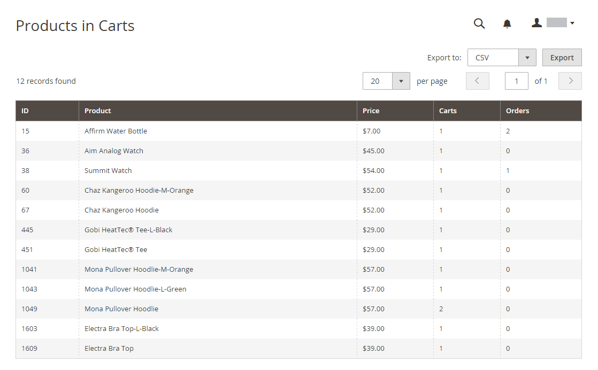

# Rapporti di marketing

I rapporti di marketing forniscono informazioni sullo stato dei carrelli, sull’utilizzo dei termini di ricerca e sulla trasmissione delle newsletter.

## [!UICONTROL Products in Cart]

Il report [!UICONTROL Products in Cart] fornisce un elenco di tutti i prodotti attualmente presenti nei carrelli. Include il nome e il prezzo di ogni articolo, il numero di carrelli con l&#39;articolo e il numero di volte in cui ogni articolo è stato ordinato.

{width="600"}

## [!UICONTROL Search Terms Report]

[!BADGE Solo PaaS]{type=Informative url="https://experienceleague.adobe.com/it/docs/commerce/user-guides/product-solutions" tooltip="Applicabile solo ai progetti Adobe Commerce on Cloud (infrastruttura PaaS gestita da Adobe) e ai progetti on-premise."}

Il report [Termini di ricerca](../catalog/search-terms.md#search-terms-report) mostra ciò che i clienti cercano in ogni visualizzazione dello store. Il rapporto include il numero di elementi corrispondenti trovati nel catalogo e quante volte il termine di ricerca è stato utilizzato.

{width="600"}

## [!UICONTROL Abandoned Carts]

Il report [!UICONTROL Abandoned Carts] elenca tutti i clienti registrati che hanno abbandonato i carrelli che non sono ancora scaduti. Il rapporto include il nome e l’indirizzo e-mail del cliente, il numero di prodotti nel carrello e il subtotale, la data di creazione e la data dell’ultimo aggiornamento.

{width="600"}

## [!UICONTROL Newsletter Problems Report]

[!BADGE Solo PaaS]{type=Informative url="https://experienceleague.adobe.com/it/docs/commerce/user-guides/product-solutions" tooltip="Applicabile solo ai progetti Adobe Commerce on Cloud (infrastruttura PaaS gestita da Adobe) e ai progetti on-premise."}

[!UICONTROL Newsletter Problems Report] include informazioni su eventuali code di newsletter non trasmesse correttamente. Il report include il nome di ciascun abbonato, la data della coda e l&#39;oggetto, nonché le informazioni sull&#39;errore.

{width="600"}
