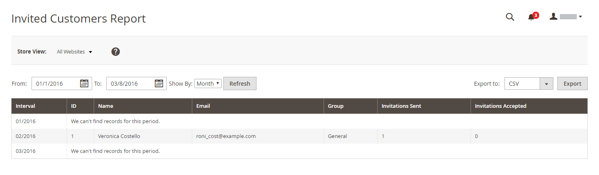

# Rapporti Vendite private

{{ee-feature}}

I rapporti sulle vendite private forniscono informazioni su [eventi e vendite private](../merchandising-promotions/events-private-sales.md).

## [!UICONTROL Invitations Report]

Il [!UICONTROL Invitations Report] mostra il numero di [inviti](../merchandising-promotions/invitations.md) inviato durante il periodo di tempo specificato e il numero accettato ed eliminato.

Il giorno _Amministratore_ barra laterale, vai a **[!UICONTROL Reports]** > _[!UICONTROL Private Sales]_>**[!UICONTROL Invitations]**.

{width="600"}

## [!UICONTROL Invited Customers Report]

Il [!UICONTROL Invited Customers Report] mostra tutti i clienti a cui sono stati inviati inviti per una vendita o un evento privato. Include il nome e l’indirizzo e-mail, il gruppo di clienti, il numero di inviti inviati e il numero accettato.

Il giorno _Amministratore_ barra laterale, vai a **[!UICONTROL Reports]** > _[!UICONTROL Private Sales]_>**[!UICONTROL Invited Customers]**.

{width="600"}

## [!UICONTROL Conversion Rate Report]

Il [!UICONTROL Conversion Rate Report] mostra il numero di inviti inviati e accettati, il numero di inviti che hanno portato a un acquisto e il tasso di conversione in percentuale.

Il giorno _Amministratore_ barra laterale, vai a **[!UICONTROL Reports]** > _[!UICONTROL Private Sales]_>**[!UICONTROL Conversions]**.

{width="600"}
