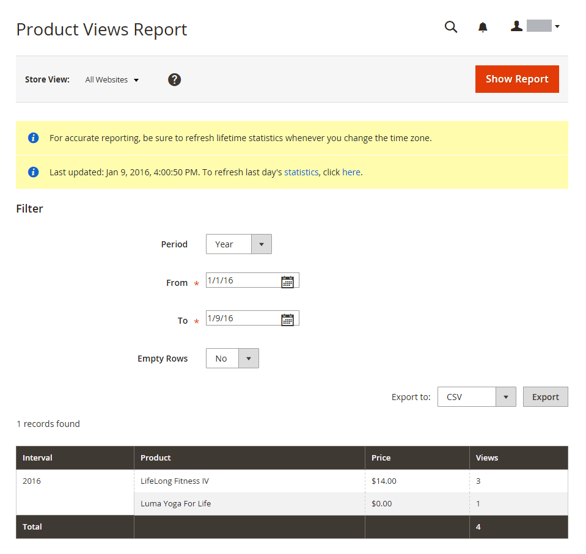

# Rapporti sui prodotti

I rapporti sui prodotti forniscono informazioni su insight relative ai prodotti visualizzati e ordinati, ai bestseller, ai livelli di magazzino e ai download.

## [!UICONTROL Product Views Report]

[!UICONTROL Product Views Report] mostra i prodotti visualizzati durante un intervallo di tempo o di date. Il rapporto include il nome del prodotto, il prezzo e il numero di visualizzazioni.

Nella barra laterale _Admin_, passa a **[!UICONTROL Reports]** > _[!UICONTROL Products]_>**[!UICONTROL Views]**.

{width="600"}

## [!UICONTROL Bestsellers Report]

[!UICONTROL Bestsellers Report] mostra le cinque più vendute durante un intervallo di tempo o di date. Il rapporto include il nome del prodotto, il prezzo e la quantità ordinata.

Nella barra laterale _Admin_, passa a **[!UICONTROL Reports]** > _[!UICONTROL Products]_>**[!UICONTROL Bestsellers]**.

{width="600"}

## [!UICONTROL Low Stock Report]

[!UICONTROL Low Stock Report] elenca tutti i prodotti con livelli di azioni all&#39;interno di un intervallo specificato. Se [[!DNL Inventory Management]](../inventory-management/introduction.md) è abilitato, il rapporto include gli importi delle scorte in esaurimento per origine con il codice di origine elencato.

Nella barra laterale _Admin_, passa a **[!UICONTROL Reports]** > _[!UICONTROL Products]_>**[!UICONTROL Low Stock]**.

{width="600"}

## [!UICONTROL Ordered Products Report]

[!UICONTROL Ordered Products Report] elenca tutti i prodotti ordinati per un intervallo di tempo o un intervallo di date specificato. Il rapporto include il nome del prodotto e la quantità ordinata.

Nella barra laterale _Admin_, passa a **[!UICONTROL Reports]** > _[!UICONTROL Products]_>**[!UICONTROL Ordered]**.

{width="600"}

## [!UICONTROL Downloads Report]

[!UICONTROL Downloads Report] elenca tutti i download durante l&#39;intervallo di tempo o l&#39;intervallo di date specificato. Il rapporto include il nome del prodotto, il collegamento per il download e lo SKU, con il numero di acquisti e download.

Nella barra laterale _Admin_, passa a **[!UICONTROL Reports]** > _[!UICONTROL Products]_>**[!UICONTROL Downloaded]**.

{width="600"}
