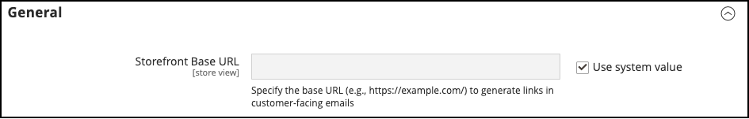

# Dettagli store

Le informazioni di base per il negozio includono il nome e l&#39;indirizzo del negozio, il numero di telefono e l&#39;indirizzo di posta elettronica visualizzati nei messaggi di posta elettronica, nelle fatture e in altre comunicazioni inviate ai clienti.

{width="900" zoomable="yes"}

## [!UICONTROL Store Information]

La sezione _[!UICONTROL Store Information]_&#x200B;fornisce le informazioni di base visualizzate nei documenti di vendita e in altre comunicazioni.

1. Nella barra laterale _Admin_, passa a **[!UICONTROL Stores]** > _[!UICONTROL Settings]_>**[!UICONTROL Configuration]**.

1. In **[!UICONTROL General]** nel pannello di navigazione a sinistra, scegli **[!UICONTROL General]**.

1. Espandere  nella sezione **[!UICONTROL Store Information]**.

   {width="700"}

1. Imposta le opzioni in base ai dettagli del tuo Negozio:

   - Immettere **[!UICONTROL Store Name]** da utilizzare in tutte le comunicazioni.

   - Immettere **[!UICONTROL Store Phone Number]**, formattato come si desidera che venga visualizzato.

   - Per **[!UICONTROL Store Hours of Operation]**, immetti gli orari in cui il tuo Negozio è aperto per lavoro. Esempio: `Mon - Fri, 9-5, Sat 9-noon PST`.

   - Selezionare **[!UICONTROL Country]** dove si trova l&#39;azienda.

   - Selezionare **[!UICONTROL Region/State]** con il paese.

   - Immettere **[!UICONTROL Store Address]**. Se l&#39;indirizzo è lungo, continuare l&#39;indirizzo in **Indirizzo archivio riga 2**.

   - Se applicabile, immettere **[!UICONTROL VAT Number]** dell&#39;archivio.

     Per verificare il numero, fare clic sul pulsante **[!UICONTROL Validate VAT Number]**. Per ulteriori informazioni, consulta [Convalida ID IVA](../stores-purchase/vat.md#vat-id-validation).

1. Al termine, fare clic su **[!UICONTROL Save Config]**.

Per ulteriori informazioni sulle opzioni di configurazione delle informazioni di archiviazione, vedere la [_Guida di riferimento alla configurazione_](../configuration-reference/general/general.md#store-information).

## [!UICONTROL Locale Options]

Le impostazioni internazionali determinano il numero di impostazioni utilizzate nell&#39;archivio. Alcuni sono:

- Lingua
- Paese
- Aliquota fiscale
- Valuta
- Prezzo
- Formato numero

L&#39;impostazione locale determina il fuso orario e la lingua utilizzati per ciascun archivio e identifica i giorni della settimana lavorativa nell&#39;area.

1. Nella barra laterale _Admin_, passa a **[!UICONTROL Stores]** > _[!UICONTROL Settings]_>**[!UICONTROL Configuration]**.

1. Nel pannello di navigazione a sinistra in **[!UICONTROL General]**, scegli **[!UICONTROL General]**.

1. Espandere  nella sezione **[!UICONTROL Locale Options]**.

   {width="700"}

1. Seleziona **[!UICONTROL Timezone]** dall&#39;elenco.

1. Imposta **[!UICONTROL Locale]** sulla lingua dell&#39;archivio.

1. Impostare **[!UICONTROL Weight Unit]** sull&#39;unità di misura utilizzata in genere per le spedizioni dalle impostazioni locali.

1. Imposta **[!UICONTROL First Day of the Week]** sul giorno considerato come il primo giorno della settimana nella tua area.

1. Nell&#39;elenco **[!UICONTROL Weekend Days]** selezionare i giorni che cadono in un weekend nella propria area.

   Per selezionare più giorni, tenere premuto Ctrl (PC) o Comando (Mac) e fare clic su ogni elemento.

1. Al termine, fare clic su **[!UICONTROL Save Config]**.

Per ulteriori informazioni sulle opzioni di configurazione delle impostazioni locali, vedere la [Guida di riferimento alla configurazione](../configuration-reference/general/general.md#locale-options).

## [!UICONTROL State Options]

In molti paesi, lo stato, la provincia o la regione è una parte obbligatoria di un indirizzo postale. Le informazioni vengono utilizzate per le informazioni relative alla spedizione e alla fatturazione, per il calcolo delle aliquote e così via. Per i paesi in cui lo stato non è obbligatorio, il campo può essere omesso completamente dall’indirizzo o incluso come campo facoltativo.

Poiché i formati di indirizzo standard variano da un paese all&#39;altro, è possibile modificare anche il modello utilizzato per formattare l&#39;indirizzo per fatture, documenti di trasporto ed etichette di spedizione.

1. Nella barra laterale _Admin_, passa a **[!UICONTROL Stores]** > _[!UICONTROL Settings]_>**[!UICONTROL Configuration]**.

1. In **[!UICONTROL General]** nel pannello di navigazione a sinistra, scegli **[!UICONTROL General]**.

1. Espandere  nella sezione **[!UICONTROL State Options]**.

   {width="700"}

1. Utilizzare l&#39;elenco **[!UICONTROL State is required for]** per selezionare ogni paese in cui Area geografica/Stato è una voce obbligatoria.

1. Imposta **[!UICONTROL Allow to Choose State if it is Optional for Country]** su uno dei seguenti:

   `Yes` - Nei paesi in cui il campo Stato non è obbligatorio, include il campo Stato come voce facoltativa.

   `No` - Nei paesi in cui il campo Stato non è obbligatorio, omette il campo Stato.

1. Al termine, fare clic su **[!UICONTROL Save Config]**.

Per ulteriori informazioni sulle opzioni di configurazione dello stato, vedere la [Guida di riferimento alla configurazione](../configuration-reference/general/general.md#state-options).

## [!UICONTROL Country Options]

Le opzioni per paese identificano il paese in cui è situata la tua azienda e i paesi da cui accetti il pagamento.

### Imposta le opzioni paese per il tuo store

1. Nella barra laterale _Admin_, passa a **[!UICONTROL Stores]** > _[!UICONTROL Settings]_>**[!UICONTROL Configuration]**.

1. Nel pannello di navigazione a sinistra in **[!UICONTROL General]**, scegli **[!UICONTROL General]**.

1. Espandere  nella sezione **[!UICONTROL Country Options]**.

   >[!NOTE]
   >
   >Se necessario, deselezionare la casella di controllo **[!UICONTROL Use system value]** per ogni impostazione che si desidera modificare.

   {width="700"}

1. Scegli **[!UICONTROL Default Country]** dove si trova la tua azienda.

1. Nell&#39;elenco **[!UICONTROL Allow Countries]** selezionare ogni paese dal quale si accettano gli ordini.

   Per impostazione predefinita, vengono selezionati tutti i paesi dell’elenco. Per selezionare più paesi, tenere premuto il tasto Ctrl (PC) o il tasto Comando (Mac) e fare clic su ogni elemento.

1. Utilizzare l&#39;elenco **[!UICONTROL Zip/Postal Code is Optional for]** per selezionare ogni paese in cui si svolgono attività commerciali che non richiedono l&#39;inclusione di un CAP nell&#39;indirizzo stradale.

1. Nell&#39;elenco **[!UICONTROL European Union Countries]**, selezionare ogni paese nell&#39;UE in cui si svolge l&#39;attività commerciale.

   Per impostazione predefinita, vengono selezionati tutti i paesi dell&#39;UE. Per selezionare i paesi desiderati, tenere premuto il tasto Ctrl (PC) o Comando (Mac) e fare clic su ogni elemento.

1. Nell&#39;elenco **[!UICONTROL Top Destinations]** selezionare i paesi principali di destinazione per le vendite.

1. Al termine, fare clic su **[!UICONTROL Save Config]**.

### Impostare le opzioni paese per un metodo di consegna specifico

È inoltre possibile configurare la spedizione a paesi specifici per ogni [metodo di consegna](../stores-purchase/delivery.md) disponibile (UPS, FedEx e così via).

1. Nella barra laterale _Admin_, passa a **[!UICONTROL Stores]** > _[!UICONTROL Settings]_>**[!UICONTROL Configuration]**.

1. Nel pannello di navigazione a sinistra, espandi **[!UICONTROL Sales]** e scegli **[!UICONTROL Delivery Methods]**.

1. Selezionare il vettore di spedizione a cui si desidera applicare paesi specifici.

1. Per **[!UICONTROL Ship to Applicable Countries]**, deselezionare la casella di controllo **[!UICONTROL Use system value]** e selezionare l&#39;opzione **[!UICONTROL Specific Countries]**.

1. Nell&#39;elenco **[!UICONTROL Top Destinations]** selezionare i paesi principali di destinazione per la spedizione.

   {width="700"}

1. Al termine, fare clic su **[!UICONTROL Save Config]**.

### Risorse per la risoluzione dei problemi

Per informazioni sulla risoluzione dei problemi di configurazione del paese, vedere i seguenti articoli della Knowledge Base di supporto di [!DNL Commerce]:

- [Come aggiungere un paese](https://experienceleague.adobe.com/docs/commerce-knowledge-base/kb/how-to/how-to-add-a-new-country-to-magento-2.html?lang=it)

## [!UICONTROL Merchant Location]

[!BADGE Solo PaaS]{type=Informative url="https://experienceleague.adobe.com/it/docs/commerce/user-guides/product-solutions" tooltip="Applicabile solo ai progetti Adobe Commerce on Cloud (infrastruttura PaaS gestita da Adobe) e ai progetti on-premise."}

L&#39;impostazione dell&#39;ubicazione esercente viene utilizzata per configurare [metodi di pagamento](../stores-purchase/payments.md). Se non è presente alcun valore per questa impostazione, verrà utilizzata l&#39;impostazione [Paese predefinito](#uicontrol-country-options).

1. Nella barra laterale _Admin_, passa a **[!UICONTROL Stores]** > _[!UICONTROL Settings]_>**[!UICONTROL Configuration]**.

1. Nel pannello di navigazione a sinistra, espandi **[!UICONTROL Sales]** e scegli **[!UICONTROL Payment Methods]**.

1. Espandi il  nella sezione **Posizione esercente** e scegli il tuo **[!UICONTROL Merchant Country]**.

   {width="600"}

1. Al termine, fare clic su **[!UICONTROL Save Config]**.

Per ulteriori informazioni sulle opzioni di configurazione dei metodi di pagamento, vedere la [Guida di riferimento alla configurazione](../configuration-reference/sales/payment-methods.md).

## Valuta

Impostazione valuta: definisce la [valuta](../stores-purchase/currency-configuration.md) di base ed eventuali altre valute accettate come pagamento. Stabilisce inoltre la connessione e la pianificazione di importazione utilizzate per aggiornare automaticamente i tassi di valuta.

Simboli di valuta: definisce i [simboli di valuta](../stores-purchase/currency-configuration.md#step-5-customize-currency-symbols-optional) visualizzati nei prezzi dei prodotti e nei documenti di vendita, ad esempio ordini e fatture. [!DNL Commerce] supporta le valute di oltre 200 paesi in tutto il mondo.

Aggiornamento dei tassi di cambio: i tassi di cambio possono essere [aggiornati](../stores-purchase/currency-update.md) manualmente o importati nell&#39;archivio in base alle esigenze o a una pianificazione predefinita.

Selettore valuta: se sono disponibili più valute, il [selettore valuta](../stores-purchase/currency.md) è disponibile nell&#39;intestazione dell&#39;archivio.

## [!UICONTROL Store Email Addresses]

Puoi avere fino a cinque indirizzi e-mail diversi per rappresentare funzioni o reparti distinti per ogni negozio o visualizzazione. Oltre alle seguenti identità e-mail predefinite, puoi impostare alcune identità personalizzate in base alle tue esigenze.

- Contatto generale
- Rappresentante commerciale
- Assistenza clienti

Ogni identità e il relativo indirizzo e-mail associato possono essere associati a specifici messaggi e-mail automatizzati e vengono visualizzati come mittente dei messaggi e-mail inviati dal tuo archivio.

### Passaggio 1: configurare gli indirizzi e-mail per il dominio

Prima di poter configurare gli indirizzi e-mail per lo store, ciascuno di essi deve essere configurato come indirizzo e-mail valido per il dominio. Per creare ogni indirizzo e-mail necessario, segui le istruzioni dell’amministratore del server o del provider di hosting e-mail.

### Passaggio 2: impostare l’URL di base per i collegamenti generati

[!BADGE Solo SaaS]{type=Positive url="https://experienceleague.adobe.com/it/docs/commerce/user-guides/product-solutions" tooltip="Applicabile solo ai progetti Adobe Commerce as a Cloud Service (infrastruttura SaaS gestita da Adobe)."}

Alcune e-mail rivolte ai clienti includono collegamenti allo store, ad esempio quelle che aiutano i clienti a reimpostare le password. Per garantire il funzionamento dei collegamenti alla vetrina, è necessario definire l&#39;URL di base della vetrina.

1. Nella barra laterale _Admin_, passa a **[!UICONTROL Stores]** > _[!UICONTROL Settings]_>**[!UICONTROL Configuration]**.

1. In **[!UICONTROL General]** nel pannello di navigazione a sinistra, scegli **[!UICONTROL Store Email Addresses]**.

1. Nella sezione **[!UICONTROL General]** del campo **[!UICONTROL Storefront Base URL]** immettere l&#39;URL principale per l&#39;archivio, ad esempio `https://www.example.com/`. L’URL deve terminare con una barra.

   {width="600"}

### Passaggio 3: configurare gli indirizzi e-mail per il negozio

1. Nella barra laterale _Admin_, passa a **[!UICONTROL Stores]** > _[!UICONTROL Settings]_>**[!UICONTROL Configuration]**.

1. In **[!UICONTROL General]** nel pannello di navigazione a sinistra, scegli **[!UICONTROL Store Email Addresses]**.

1. Espandere  nella sezione **[!UICONTROL General Contact]** ed effettuare le seguenti operazioni:

   {width="600"}

   - Per **[!UICONTROL Sender Name]**, immettere il nome della persona associata all&#39;identità del contatto generale da visualizzare come mittente di qualsiasi messaggio di posta elettronica.

   - Per **[!UICONTROL Sender Email]**, immetti l&#39;indirizzo e-mail associato.

1. Ripeti questa procedura per ogni indirizzo e-mail del negozio che intendi utilizzare.

1. Al termine, fare clic su **[!UICONTROL Save Config]**.

### Passaggio 4: aggiornare la configurazione dell’e-mail di vendita

Se utilizzi indirizzi e-mail personalizzati, assicurati di aggiornare la configurazione di eventuali messaggi e-mail correlati, in modo che l’identità corretta venga visualizzata come mittente.

1. Nel pannello di navigazione a sinistra, espandi **[!UICONTROL Sales]** e scegli **[!UICONTROL Sales Emails]**.

   La pagina include una sezione separata per ciascuno dei seguenti elementi:

   - Commenti ordine e ordine
   - Commenti su fatture e fatture
   - Commenti spedizione
   - Commenti per nota di credito e nota di credito
   - RMA, autorizzazione RMA, commenti dell&#39;amministratore RMA e commenti del cliente RMA  (solo Adobe Commerce)

1. A partire da **[!UICONTROL Order]**, espandere la sezione per ogni messaggio e verificare che sia selezionato il mittente corretto.

   {width="600"}

1. Al termine, fare clic su **[!UICONTROL Save Config]**.

Per ulteriori informazioni sulle opzioni di configurazione delle e-mail di vendita, vedere la [_Guida di riferimento alla configurazione_](../configuration-reference/sales/sales-emails.md).

## Modulo Contattaci

Il link _Contattaci_ nel piè di pagina del negozio è un modo semplice per i clienti di tenersi in contatto con te. I clienti possono completare il modulo per inviare un messaggio al tuo negozio. Un&#39;installazione standard di [!DNL Commerce] visualizza il modulo predefinito _Contattaci_. Dopo aver inviato il modulo, viene visualizzato un messaggio di ringraziamento

È importante comprendere che il modulo Contattaci predefinito viene renderizzato direttamente dal codice anziché da una pagina CMS.

{width="700"}

Il piè di pagina del Negozio include un collegamento alla pagina Contattaci disponibile in tutto il negozio.

{width="700"}

I dati di esempio di Luma includono informazioni aggiuntive sulla pagina Contattaci che mostrano come personalizzare la pagina per il tuo store.

{width="700"}

### Configurare il modulo per i contatti

1. Nella barra laterale _Admin_, passa a **[!UICONTROL Stores]** > _[!UICONTROL Settings]_>**[!UICONTROL Configuration]**.

1. Nel pannello di navigazione a sinistra in **[!UICONTROL General]**, scegli **[!UICONTROL Contacts]**.

1. Espandere  della sezione **[!UICONTROL Contact Us]** e impostare **[!UICONTROL Enable Contact Us]** su `Yes`.

   {width="600"}

1. Espandere  nella sezione **[!UICONTROL Email Options]** e impostare le opzioni di contatto per l&#39;e-mail:

   {width="600"}

   - Per **[!UICONTROL Send Emails to]**, immettere l&#39;indirizzo di posta elettronica a cui vengono inviati i messaggi del modulo Contattaci.

   - Impostare **[!UICONTROL Email Sender]** sull&#39;identità dell&#39;archivio che verrà visualizzata come mittente del messaggio dal modulo Contattaci. Ad esempio: E-mail personalizzata 2.

   - Impostare **[!UICONTROL Email Template]** sul modello utilizzato per i messaggi inviati dal modulo Contattaci.

1. Al termine, fare clic su **[!UICONTROL Save Config]**.

### Personalizzare il contenuto

Puoi personalizzare il contenuto del modulo _Contattaci_ in base alle esigenze del tuo archivio e ai criteri del servizio clienti.

### Metodo 1: utilizzo dei dati di esempio

I dati di esempio Luma includono un blocco _Contact Us Info_ che può essere personalizzato per il tuo archivio. Il `contact-us-info` [blocco](../content-design/blocks.md) può essere facilmente modificato per aggiungere il tuo contenuto alla pagina Contattaci.

1. Nella barra laterale _Admin_, passa a **[!UICONTROL Content]** > _[!UICONTROL Elements]_>**[!UICONTROL Blocks]**.

1. Trova il blocco **[!UICONTROL Contact Us Info]** nell&#39;elenco e apri in modalità **[!UICONTROL Edit]**.

   {width="700"}

1. Nella parte inferiore della pagina del blocco, fare clic su **[!UICONTROL Edit with Page Builder]**.

   {width="700"}

   >[!NOTE]
   >
   >Se hai [[!DNL Page Builder] disabilitato](../page-builder/setup.md#disable-dnl-page-builder), puoi utilizzare l&#39;editor [barra degli strumenti](../content-design/editor.md) per formattare il testo e aggiungere [immagini](../content-design/editor-insert-image.md) e [collegamenti](../content-design/editor-insert-link.md).

1. Passa il puntatore del mouse sul contenitore HTML per visualizzare la casella degli strumenti e scegli l&#39;icona _Impostazioni_ (  ).

1. Modificare il codice HTML in base alle informazioni di contatto per il tuo Negozio e fare clic su **[!UICONTROL Save]**.

   {width="700"}

1. Uscire dalla fase [!DNL Page Builder] e fare clic su **[!UICONTROL Save Block]**.

### Metodo 2: senza dati campione

>[!IMPORTANT]
>
>A partire dalla versione 2.4.0, il modulo di contatto non può più richiamare all’interno di un blocco CMS o di una pagina CMS. Tutte le personalizzazioni del modulo del contatto devono essere eseguite utilizzando modelli XML layout o modelli di tema personalizzati.

Per impostazione predefinita, gli acquirenti accedono al modulo del contatto utilizzando il _collegamento di contatto_ nel piè di pagina delle pagine della vetrina. Per ulteriori informazioni sulla personalizzazione della pagina dei contatti, consultare la [Guida per gli sviluppatori di FrontEnd][theme-guide].

[theme-guide]: https://developer.adobe.com/commerce/frontend-core/guide/themes/
