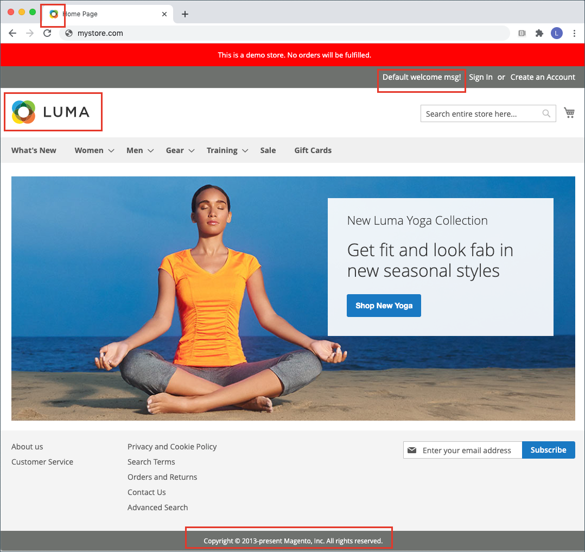
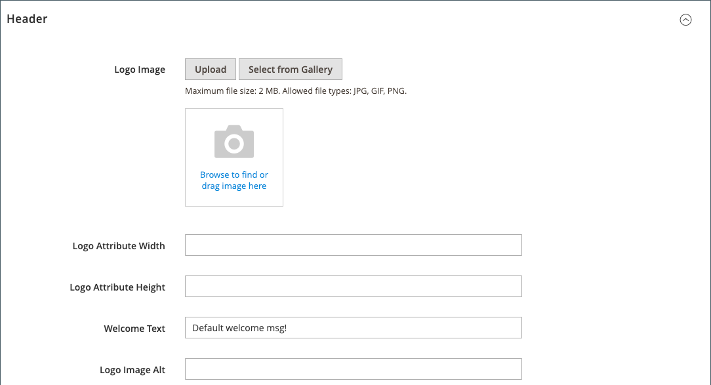
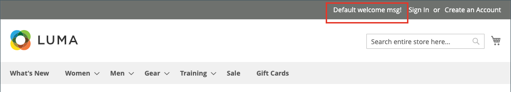
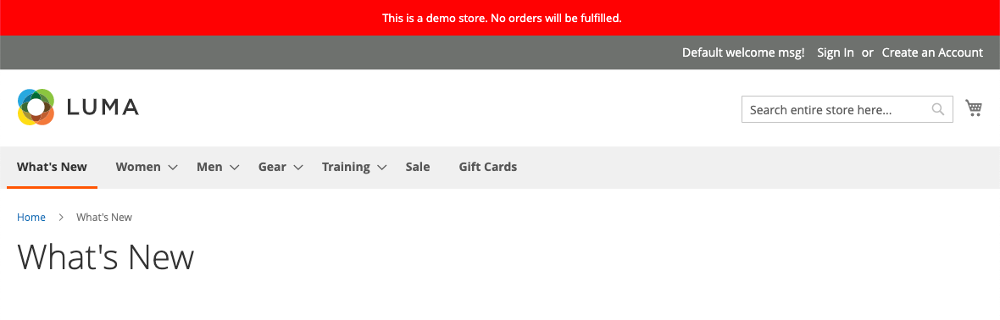

# Branding vetrina

Una delle prime cose da fare è [cambiare il logo](#upload-your-logo) nell&#39;intestazione e [caricare un favicon](#add-a-favicon) per il browser. Quindi, devi [aggiungere il messaggio di benvenuto](#change-the-welcome-message) e [aggiornare l&#39;avviso di copyright](#change-the-copyright-notice) nel piè di pagina. Queste attività sono alcuni semplici elementi di progettazione di cui puoi occuparti immediatamente. Mentre il tuo archivio è in fase di sviluppo, puoi [attivare l&#39;avviso di dimostrazione dello store](#set-the-store-demo-notice), quindi rimuoverlo quando sei pronto per l&#39;avvio.

{width="600" zoomable="yes"}

## Carica il logo

Le dimensioni e la posizione del logo nell&#39;intestazione sono determinate dal tema del negozio. Il logo può essere salvato come file GIF, PNG o JPG JPEG e caricato dall&#39;amministratore del negozio.

{width="600"}

L&#39;immagine del logo risiede nella seguente posizione sul server. Qualsiasi file di immagine con il nome `logo.svg` viene utilizzato come logo del tema predefinito.

Percorso completo - `app/design/frontend/[vendor]/[theme]/web/images/logo.svg`

Percorso relativo - `images/logo.svg`

Se non conosci le dimensioni del logo o di altre immagini utilizzate nel tema, apri la pagina in un browser, fai clic con il pulsante destro del mouse sull’immagine e controlla l’elemento.

>[!NOTE]
>
>Oltre al logo nell&#39;intestazione, il logo verrà visualizzato anche nei [modelli di posta elettronica](../systems/email-templates.md#prepare-your-email-logo) e nelle [fatture PDF](../stores-purchase/sales-documents.md) e in altri documenti di vendita. I logo utilizzati per i modelli e le fatture e-mail hanno requisiti di dimensione diversi e devono essere caricati separatamente.

Formati di file logo supportati:

| Formato file | Descrizione |
|--- |--- |
| PNG | (Portable Network Graphics) Questa nuova alternativa al formato GIF supporta fino a 16 milioni di colori (24 bit). Il formato di compressione senza perdita di dati produce un&#39;immagine bitmap di alta qualità con testo nitido, ma con dimensioni di file maggiori rispetto ad alcuni formati. Il formato PNG supporta livelli trasparenti ed è progettato per la visualizzazione e lo streaming online. |
| GIF | (Graphics Interchange Format) Formato bitmap ampiamente supportato e meno recente, limitato a 256 colori (8 bit). Il formato GIF supporta l&#39;animazione semplice e i livelli trasparenti. |
| JPG-JPEG | (Joint Photographic Expert Group) Formato bitmap compresso utilizzato dalla maggior parte delle fotocamere digitali. La compressione con perdita di dati causa una perdita di dati, che a volte può essere rilevata come punti sfocati nel testo. |

{style="table-layout:auto"}

1. Nella barra laterale _Admin_, passa a **[!UICONTROL Content]** > _[!UICONTROL Design]_>**[!UICONTROL Configuration]**.

   {width="700"}

1. Individuare la visualizzazione archivio da configurare e fare clic su **[!UICONTROL Edit]** nella colonna _[!UICONTROL Action]_.

1. Espandere  nella sezione **[!UICONTROL Header]**.

   {width="600"}

1. Per caricare un nuovo logo, fare clic su **[!UICONTROL Upload]** e scegliere il file dal sistema.

1. Immettere **[!UICONTROL Logo Image Width]** e **[!UICONTROL Logo Image Height]** in pixel.

1. Per **[!UICONTROL Logo Image Alt]**, immettere il testo che si desidera visualizzare quando qualcuno passa il puntatore sull&#39;immagine.

1. Al termine, fare clic su **[!UICONTROL Save Configuration]**.

## Aggiungi un favicon

_Favicon_ è l&#39;abbreviazione di _icona preferita_ e fa riferimento all&#39;icona piccola nella scheda di ogni pagina del browser. A seconda del browser, il favicon viene visualizzato anche nella barra degli indirizzi, immediatamente prima dell’URL.

Un favicon è generalmente di dimensioni pari a 16 x 16 pixel o 32 x 32 pixel. [!DNL Commerce] accetta i tipi di file ICO, PNG, APNG, GIF e JPG JPEG, anche se non tutti i browser supportano questi formati. Il formato di file più ampiamente supportato da utilizzare per un favicon è ICO. È possibile utilizzare altri tipi di file immagine, ma il formato potrebbe non essere supportato da tutti i browser. Ci sono molti strumenti gratuiti disponibili online che è possibile utilizzare per generare un&#39;immagine ICO o convertire un&#39;immagine in quel formato.

{width="600"}

[!DNL Commerce] supporta i seguenti formati di file come favicon:

| Formato file | Descrizione |
|--- |--- |
| ICO | Questo formato di file immagine è progettato per le immagini delle icone dei computer di piccole dimensioni. Utilizzato principalmente in Microsoft® Windows OS, il formato ICO può contenere immagini fino a 256 x 256 pixel e 16 milioni di colori (24 bit) con 8 bit di trasparenza. |
| PNG | (Portable Network Graphics) Questa nuova alternativa al formato GIF supporta fino a 16 milioni di colori (24 bit). Il formato di compressione senza perdita di dati produce un&#39;immagine bitmap di alta qualità con testo nitido, ma con dimensioni di file maggiori rispetto ad alcuni formati. Il formato PNG supporta livelli trasparenti ed è progettato per la visualizzazione e lo streaming online. |
| APNG | (Animated Portable Network Graphics) Formato di file simile a PNG che supporta l&#39;animazione semplice. |
| GIF | (Graphics Interchange Format) Formato bitmap ampiamente supportato e meno recente, limitato a 256 colori (8 bit). Il formato GIF supporta l&#39;animazione semplice e i livelli trasparenti. |
| JPG-JPEG | (Joint Photographic Expert Group) Formato bitmap compresso utilizzato dalla maggior parte delle fotocamere digitali. La compressione con perdita di dati causa una perdita di dati, che a volte può essere rilevata come punti sfocati nel testo. |

{style="table-layout:auto"}

### Passaggio 1: creare un favicon

1. Utilizzando l&#39;editor di immagini desiderato, creare un&#39;immagine grafica del logo 16 x 16 o 32 x 32.

1. (Facoltativo) Utilizzare uno degli strumenti in linea disponibili per convertire il file nel formato ico e salvarlo nel computer.

### Passaggio 2: Carica il favicon nel tuo negozio

1. Nella barra laterale _Admin_, passa a **[!UICONTROL Content]** > _[!UICONTROL Design]_>**[!UICONTROL Configuration]**.

1. Nella griglia individuare la visualizzazione archivio che si desidera configurare e fare clic su **[!UICONTROL Edit]** nella colonna _[!UICONTROL Action]_.

1. In _[!UICONTROL Other Settings]_, espandere  la sezione **[!UICONTROL HTML Head]**.

   {width="600"}

1. Se vuoi rimuovere il favicon corrente, fai clic sull&#39;icona _Elimina_ () nell&#39;angolo inferiore sinistro dell&#39;immagine.

1. Fare clic su **[!UICONTROL Upload]** e aprire il file favicon preparato.

   {width="400"}

1. Al termine, fare clic su **[!UICONTROL Save Configuration]**.

### Passaggio 3: aggiornare la cache

1. Quando viene richiesto di aggiornare la cache, fare clic sul collegamento **[!UICONTROL Cache Management]** nel messaggio nella parte superiore dell&#39;area di lavoro.

1. Nell&#39;elenco selezionare la casella di controllo **[!UICONTROL Page Cache]** contrassegnata come `Invalidated`.

1. Impostare **[!UICONTROL Actions]** su `Refresh` e fare clic su **[!UICONTROL Submit]**.

1. Per visualizzare la nuova favicon, torna alla vetrina e aggiorna il browser.

## Modificare il messaggio di benvenuto

Il messaggio di benvenuto nell’intestazione si espande per includere il nome del cliente che ha effettuato l’accesso. Prima di avviare lo store, assicurati di modificare il testo predefinito di _Benvenuto_ per ogni visualizzazione dello store.

{width="600"}

1. Nella barra laterale _Admin_, passa a **[!UICONTROL Content]** > _[!UICONTROL Design]_>**[!UICONTROL Configuration]**.

1. Nella griglia individuare la visualizzazione archivio che si desidera configurare e fare clic su **[!UICONTROL Edit]** nella colonna _[!UICONTROL Action]_.

1. In _[!UICONTROL Other Settings]_, espandere  la sezione **[!UICONTROL Header]**.

1. Per **[!UICONTROL Welcome Text]**, immettere il testo del messaggio di benvenuto che si desidera visualizzare nell&#39;intestazione dello store.

   {width="600"}

1. Al termine, fare clic su **[!UICONTROL Save Configuration]**.

1. Quando viene richiesto di aggiornare la cache delle pagine, fare clic sul collegamento **[!UICONTROL Cache Management]** nella parte superiore dell&#39;area di lavoro e seguire le istruzioni per aggiornare la cache.

## Modificare l&#39;avviso di copyright

Il Negozio visualizza un avviso di copyright nel piè di pagina di ogni pagina. Come best practice, l’avviso di copyright deve includere l’anno in corso e identificare l’azienda come proprietaria legale del contenuto sul sito.

{width="600"}

Il codice di carattere `&copy;` viene utilizzato per inserire il simbolo di copyright, come illustrato negli esempi seguenti:

- Esempio di formato lungo

  `Copyright &copy; 2013-present Luma, Inc. All rights reserved.`

- Esempio di formato breve

  `&copy; 2021 Luma, Inc. All rights reserved.`

**_Per aggiornare l&#39;avviso di copyright:_**

1. Nella barra laterale _Admin_, passa a **[!UICONTROL Content]** > _[!UICONTROL Design]_>**[!UICONTROL Configuration]**.

1. Nella griglia individuare la visualizzazione archivio che si desidera configurare e fare clic su **[!UICONTROL Edit]** nella colonna _[!UICONTROL Action]_.

1. In _Altre impostazioni_, espandere la sezione **[!UICONTROL Footer]**.

   {width="600"}

1. Per **[!UICONTROL Copyright]**, immettere l&#39;avviso di copyright che si desidera visualizzare nel piè di pagina di ogni pagina.

   Utilizzare il codice carattere `&copy;` per inserire un simbolo di copyright.

1. Al termine, fare clic su **[!UICONTROL Save Configuration]**.

## Impostare l&#39;avviso di Store Demand

Se il tuo negozio è online, ma è ancora in costruzione, puoi visualizzare un avviso di dimostrazione del negozio nella parte superiore della pagina per informare le persone che il negozio non è ancora aperto per gli affari. Quando sei pronto a _andare in diretta_, rimuovi semplicemente il messaggio. È simile a capovolgere il segno appeso nella finestra da _Chiuso_ a _Aperto_. Il formato dell’avviso demo è determinato dal tema del negozio.

{width="600"}

1. Nella barra laterale _Admin_, passa a **[!UICONTROL Content]** > _[!UICONTROL Design]_>**[!UICONTROL Configuration]**.

1. Nella griglia individuare la visualizzazione archivio che si desidera configurare e fare clic su **[!UICONTROL Edit]** nella colonna _[!UICONTROL Action]_.

1. In _[!UICONTROL Other Settings]_, espandere  la sezione **[!UICONTROL HTML Head]**.

   {width="600"}

1. Scorri verso il basso e imposta **[!UICONTROL Display Demo Store Notice]** in base alle tue preferenze.

1. Al termine, fare clic su **[!UICONTROL Save Configuration]**.

1. Se viene richiesto di aggiornare la cache, fare clic su **[!UICONTROL Cache Management]** nel messaggio di sistema e seguire le istruzioni per aggiornare la cache.
