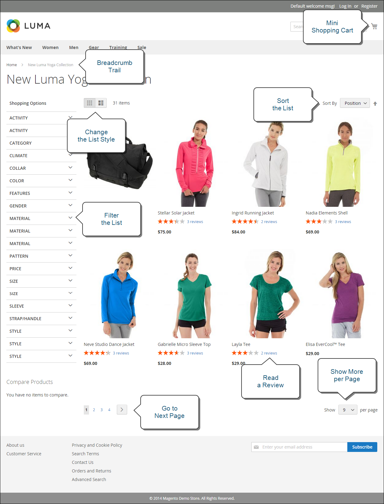
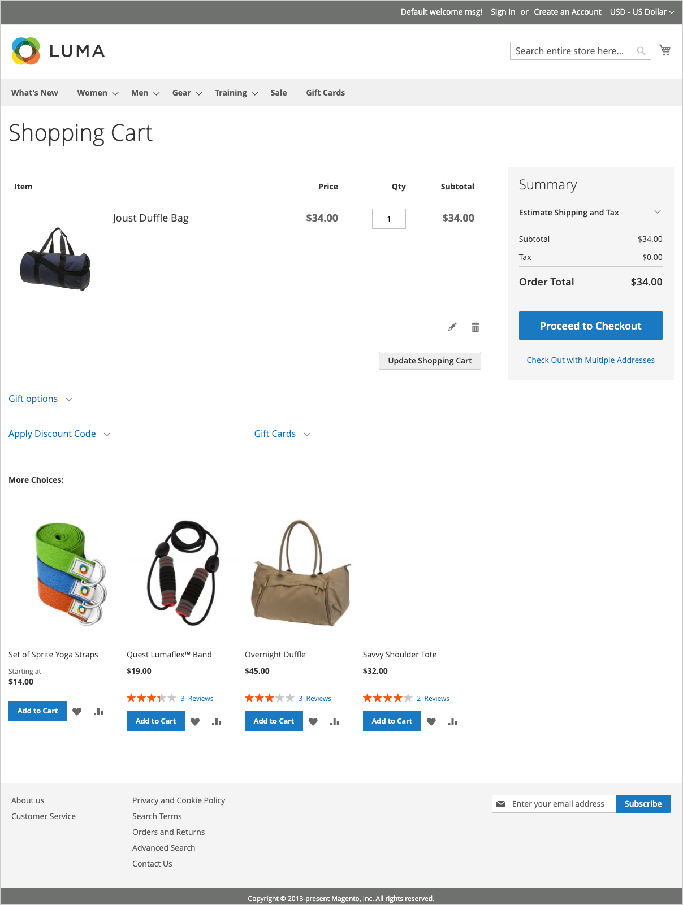
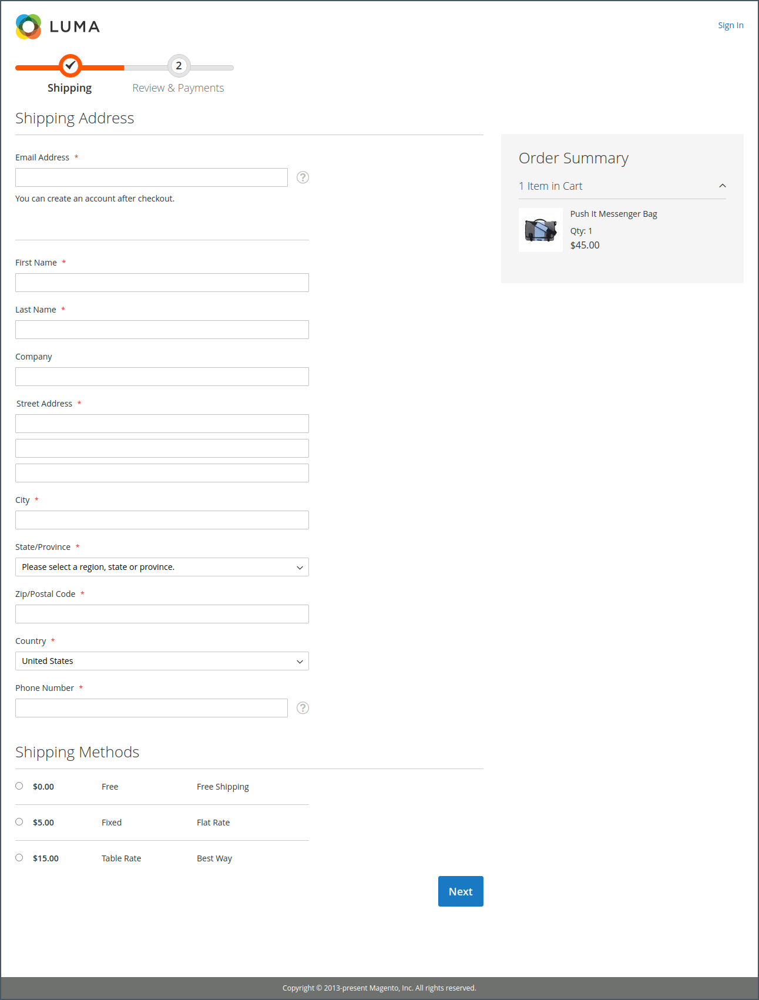

# Che cos&#39;è la vetrina?

All’interno dell’implementazione di Adobe Commerce o Magento Open Source, la vetrina è la parte esterna dello store che si rivolge al pubblico. Fornisce i contenuti e i componenti funzionali utilizzati dai clienti per effettuare acquisti e acquisti.

Il percorso che i clienti portano a una vendita è a volte chiamato _percorso di acquisto_ e la vetrina include i componenti necessari ai clienti per completare questo percorso. Le sezioni seguenti forniscono una panoramica dei tipi di pagina di base che forniscono valore strategico, ovvero i luoghi che i clienti visitano solitamente durante gli acquisti nel negozio. Esaminandole, è possibile prendere in considerazione diverse funzioni del punto vendita che possono essere utilizzate in ogni fase del percorso di clienti.

## Commerce Storefront

Con l&#39;introduzione di [!DNL **Commerce Storefront con tecnologia Edge Delivery Services**], Adobe offre una vetrina affidabile, scalabile e ad alte prestazioni che sfrutta la tecnologia all&#39;avanguardia per offrire velocità ed esperienza utente superiori.

- **Prestazioni migliorate**: l&#39;hosting delle vetrine su Edge Delivery Services garantisce tempi di caricamento più rapidi e prestazioni del sito migliorate, il che può portare a tassi di conversione più elevati e classificazioni SEO migliori.

- **Scalabilità**: l&#39;architettura supporta la scalabilità diretta per gestire un traffico maggiore e cataloghi di prodotti più grandi senza compromettere le prestazioni.

- **Flessibilità**: la vetrina è altamente personalizzabile e consente alle aziende di adattare l&#39;esperienza di acquisto alle proprie esigenze specifiche.

- **Esperienza utente migliorata**: funzionalità quali il caching avanzato, gli aggiornamenti in tempo reale e la distribuzione di contenuti personalizzati contribuiscono a un&#39;esperienza di acquisto più fluida e coinvolgente.

### Funzioni principali

Commerce Storefront con tecnologia Edge Delivery Services offre diverse funzioni chiave che vanno a vantaggio sia dei commercianti che degli sviluppatori. Queste funzionalità consentono alle aziende di creare esperienze di acquisto coinvolgenti, mantenendo al contempo la flessibilità necessaria per personalizzare e scalare le vetrine in base alle esigenze.

Per informazioni e indicazioni più dettagliate sulla configurazione e l&#39;ottimizzazione dello store Commerce, consulta la [documentazione dello store Adobe Commerce](https://experienceleague.adobe.com/en/docs/commerce).

>[!BEGINTABS]

>[!TAB Commercianti]

Commerce Storefront con tecnologia Edge Delivery Services offre un&#39;esperienza di authoring intuitiva basata su documenti che semplifica la creazione e la gestione dei contenuti da parte dei commercianti. Utilizzando strumenti familiari come Microsoft Word o Google Docs, i commercianti possono creare contenuti avanzati mantenendo il controllo della versione e collaborando con i membri del gruppo.

- **Creazione semplificata di contenuti**: consente di creare e modificare i contenuti utilizzando strumenti di creazione basati su documenti, come Microsoft Word o Google Docs.
- **Anteprima in tempo reale**: prima di pubblicare le modifiche, visualizzale immediatamente con le funzionalità di anteprima in tempo reale.
- **Controllo versione**: tieni traccia delle modifiche al contenuto e ripristina facilmente le versioni precedenti.
- **Flusso di lavoro collaborativo**: più membri del team possono lavorare sui contenuti contemporaneamente con i processi di revisione incorporati.
- **Riutilizzo del contenuto**: crea blocchi di contenuto che possono essere riutilizzati in più pagine per mantenere la coerenza.

>[!TAB Sviluppatori]

L’implementazione headless consente agli sviluppatori di separare il livello di presentazione front-end dalla funzionalità di e-commerce back-end, consentendo di creare vetrine flessibili e personalizzate basate su tecnologie moderne e allo stesso tempo di sfruttare i solidi servizi back-end di Commerce.

- **Architettura API-first**: crea esperienze front-end personalizzate utilizzando framework moderni e sfruttando i servizi back-end di Commerce.
- **Componenti componibili**: crea e distribuisci componenti modulari e riutilizzabili che possono essere assemblati in layout di pagina diversi.
- **Piattaforma estensibile**: aggiungi funzionalità personalizzate tramite API e webhook senza modificare il codice di base.
- **Strumenti di sviluppo moderni**: utilizza strumenti e flussi di lavoro di sviluppo standard per velocizzare l&#39;implementazione e la distribuzione.

>[!ENDTABS]

>[!NOTE]
>
>Mentre Commerce Storefront offre numerosi vantaggi, Adobe continua a supportare la vetrina originale basata su Luma. Le aziende che attualmente utilizzano Luma possono continuare a operare senza interruzioni e hanno la possibilità di passare alla nuova vetrina al proprio ritmo. Le sezioni rimanenti di questa pagina si basano su esempi Luma.

## Home page

Lo sapevi che la maggior parte delle persone passa solo pochi secondi su una pagina prima di decidere di rimanere o andare altrove? Non è molto tempo per fare un&#39;impressione. Gli studi dimostrano che le persone amano anche le fotografie, specialmente di altre persone. Indipendentemente dal design scelto, tutto ciò che si trova nella pagina principale dovrebbe far avanzare i visitatori verso la fase successiva del processo di vendita. L&#39;idea è quella di guidare la loro attenzione in un flusso coeso da un punto di interesse all&#39;altro.

{width="700"}

## Pagina catalogo

Gli elenchi delle pagine del catalogo hanno in genere piccole immagini di prodotto e brevi descrizioni e possono essere formattati come elenco o griglia. Puoi aggiungere blocchi, video e descrizioni ricche di parole chiave, nonché creare design speciali per una promozione o una stagione. Puoi creare una categoria speciale per presentare uno stile di vita o un marchio che è una raccolta curata di prodotti di categorie diverse.

La descrizione iniziale del prodotto solitamente fornisce ai clienti informazioni sufficienti per meritare un’occhiata più da vicino. Le persone che sanno quello che vogliono possono aggiungere il prodotto ai loro carrelli e andare. I clienti che effettuano acquisti mentre accedono ai loro account godono di un’esperienza di acquisto personalizzata.

{width="700"}

## Risultati di ricerca

Lo sapevi che le persone che utilizzano la ricerca hanno quasi il doppio delle probabilità di effettuare un acquisto rispetto alle persone che si affidano esclusivamente alla navigazione? Potresti considerare questi acquirenti come _pre-qualificati_.

### [!DNL Live Search]

Con [[!DNL Live Search]](https://experienceleague.adobe.com/en/docs/commerce/live-search/overview) per Adobe Commerce, il tuo store offre un&#39;esperienza di ricerca rapida, super-rilevante e intuitiva ed è disponibile gratuitamente per Adobe Commerce.

{width="700"}

### Ricerca nel catalogo standard

Con [ricerca catalogo standard](../catalog/search.md), lo store include una casella di ricerca nell&#39;angolo superiore destro e un collegamento a Ricerca avanzata nel piè di pagina. Tutti i termini di ricerca inviati dagli acquirenti vengono salvati, in modo da poter vedere esattamente ciò che stanno cercando. È possibile offrire suggerimenti e immettere sinonimi e errori ortografici comuni. Quindi, visualizza una pagina specifica quando viene inserito un termine di ricerca.

{width="700"}

## Pagina prodotto

La pagina dei prodotti è piena di novità. La prima cosa che colpisce il vostro sguardo sulla pagina del prodotto è l&#39;immagine principale con uno zoom ad alta risoluzione e la galleria di miniature. Oltre al prezzo e alla disponibilità, è disponibile una sezione a schede con ulteriori informazioni e un elenco dei prodotti correlati.

{width="700"}

## Carrello

Il carrello mostra il totale dell’ordine, compresi eventuali coupon di sconto, la spedizione stimata e le imposte. Queste caratteristiche lo rendono un ottimo posto per visualizzare badge di fiducia e sigilli. Puoi anche utilizzare la pagina del carrello come opportunità per un’offerta finale. Ad esempio, puoi impostare articoli di cross-selling che appaiono come opzioni di acquisto impulsive quando nel carrello sono presenti prodotti specifici.

{width="700"}

## Pagina cassa

Il processo di pagamento è costituito da due passaggi:

1. Informazioni spedizione

   La prima fase del processo di pagamento consiste nel completare le informazioni relative all&#39;indirizzo di spedizione e nel scegliere il metodo di spedizione. Se il cliente dispone di un account, l&#39;indirizzo di spedizione viene inserito automaticamente, ma può essere modificato se necessario.
Se un cliente guest immette un indirizzo e-mail riconosciuto come registrato in precedenza, viene visualizzato il prompt di accesso se il campo [!UICONTROL Enable Guest Checkout Login] nella configurazione dell&#39;archivio è impostato su `Yes` (vedere [[!UICONTROL Checkout Options]](../configuration-reference/sales/checkout.md#checkout-options) nella _Guida di riferimento alla configurazione_). Tuttavia, questa impostazione può esporre le informazioni del cliente a utenti non autenticati.

   {width="700"}

1. Verifica e informazioni sul pagamento

   La seconda fase del processo di pagamento prevede che il cliente scelga il metodo di pagamento e applichi facoltativamente un codice sconto.

   >[!NOTE]
   >
   >Sebbene [!DNL Commerce] consenta la configurazione di più codici coupon, un cliente può applicare al carrello un solo codice coupon. Per ulteriori informazioni, vedere [Codici coupon](../merchandising-promotions/price-rules-cart-coupon.md#coupon-codes).

   {width="700"}

La barra di avanzamento nella parte superiore della pagina segue ogni passaggio del processo di pagamento e il _Riepilogo ordine_ mostra le informazioni immesse fino a questo momento.

>[!NOTE]
>
>L’eccezione a un’estrazione in due fasi si applica ai prodotti virtuali e/o scaricabili. Se nel carrello sono presenti solo questi tipi di prodotti, il pagamento viene trasformato automaticamente in una procedura in un unico passaggio, perché le informazioni di spedizione non sono necessarie.
