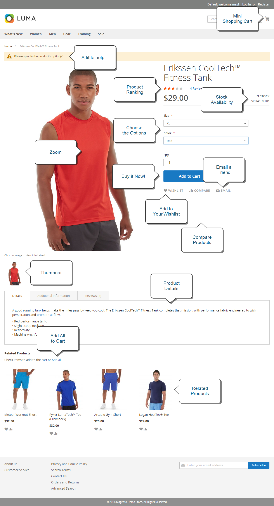

# Che cos&#39;è la vetrina?

All’interno dell’implementazione di Adobe Commerce o del Magento Open Source, la vetrina è la parte esterna dello store che si rivolge al pubblico. Fornisce i contenuti e i componenti funzionali utilizzati dai clienti per effettuare acquisti e acquisti.

Il percorso seguito dai clienti per una vendita è talvolta denominato _percorso di acquisto_, e la vetrina include i componenti necessari ai clienti per completare questo percorso. Le sezioni seguenti forniscono una panoramica dei tipi di pagina di base che forniscono valore strategico, ovvero i luoghi che i clienti visitano solitamente durante gli acquisti nel negozio. Esaminandole, è possibile prendere in considerazione diverse funzioni del punto vendita che possono essere utilizzate in ogni fase del percorso di clienti.

## Home page

Lo sapevi che la maggior parte delle persone passa solo pochi secondi su una pagina prima di decidere di rimanere o andare altrove? Non è molto tempo per fare un&#39;impressione. Gli studi dimostrano che le persone amano anche le fotografie, specialmente di altre persone. Indipendentemente dal design scelto, tutto ciò che si trova nella pagina principale dovrebbe far avanzare i visitatori verso la fase successiva del processo di vendita. L&#39;idea è quella di guidare la loro attenzione in un flusso coeso da un punto di interesse all&#39;altro.

{width="700"}

## Pagina catalogo

Gli elenchi delle pagine del catalogo hanno in genere piccole immagini di prodotto e brevi descrizioni e possono essere formattati come elenco o griglia. Puoi aggiungere blocchi, video e descrizioni ricche di parole chiave, nonché creare design speciali per una promozione o una stagione. Puoi creare una categoria speciale per presentare uno stile di vita o un marchio che è una raccolta curata di prodotti di categorie diverse.

La descrizione iniziale del prodotto solitamente fornisce ai clienti informazioni sufficienti per meritare un’occhiata più da vicino. Le persone che sanno quello che vogliono possono aggiungere il prodotto ai loro carrelli e andare. I clienti che effettuano acquisti mentre accedono ai loro account godono di un’esperienza di acquisto personalizzata.

{width="700"}

## Risultati di ricerca

Lo sapevi che le persone che utilizzano la ricerca hanno quasi il doppio delle probabilità di effettuare un acquisto rispetto alle persone che si affidano esclusivamente alla navigazione? Potresti considerare questi acquirenti come _pre-qualificato_.

### [!DNL Live Search]

Con [[!DNL Live Search]](https://experienceleague.adobe.com/docs/commerce-merchant-services/live-search/overview.html) per Adobe Commerce, il tuo negozio offre un’esperienza di ricerca rapida, super-rilevante e intuitiva ed è disponibile gratuitamente per Adobe Commerce.

{width="700"}

### Ricerca nel catalogo standard

Con [ricerca catalogo standard](../catalog/search.md), il tuo store include una casella di ricerca nell’angolo superiore destro e un collegamento a Ricerca avanzata nel piè di pagina. Tutti i termini di ricerca inviati dagli acquirenti vengono salvati, in modo da poter vedere esattamente ciò che stanno cercando. È possibile offrire suggerimenti e immettere sinonimi e errori ortografici comuni. Quindi, visualizza una pagina specifica quando viene inserito un termine di ricerca.

{width="700"}

## Pagina prodotto

La pagina dei prodotti è piena di novità. La prima cosa che colpisce il vostro sguardo sulla pagina del prodotto è l&#39;immagine principale con uno zoom ad alta risoluzione e la galleria di miniature. Oltre al prezzo e alla disponibilità, è disponibile una sezione a schede con ulteriori informazioni e un elenco dei prodotti correlati.

{width="700"}

## Carrello

Il carrello è il luogo in cui il totale dell&#39;ordine può essere determinato, insieme a buoni sconto e spese di spedizione stimate e un ottimo posto per visualizzare i distintivi di fiducia e sigilli. È anche un&#39;opportunità ideale per offrire un ultimo elemento. In qualità di cross-selling, puoi selezionare alcuni articoli da offrire come acquisto di impulso ogni volta che un articolo specifico appare nel carrello.

{width="700"}

## Pagina cassa

Il processo di pagamento è costituito da due passaggi:

1. Informazioni spedizione

   La prima fase del processo di pagamento consiste nel completare le informazioni relative all&#39;indirizzo di spedizione e nel scegliere il metodo di spedizione. Se il cliente dispone di un account, l&#39;indirizzo di spedizione viene inserito automaticamente, ma può essere modificato se necessario.

   {width="700"}

1. Verifica e informazioni sul pagamento

   La seconda fase del processo di pagamento prevede che il cliente scelga il metodo di pagamento e applichi facoltativamente un codice sconto.

   >[!NOTE]
   >
   >Anche se [!DNL Commerce] consente di configurare più codici coupon; un cliente può applicare al carrello un solo codice coupon. (consultare la [Codici coupon](../merchandising-promotions/price-rules-cart-coupon.md#coupon-codes) per ulteriori informazioni.)

   {width="700"}

La barra di avanzamento nella parte superiore della pagina segue ogni passaggio del processo di pagamento e _Riepilogo ordine_ mostra le informazioni immesse fino a questo punto.

>[!NOTE]
>
>L’eccezione a un’estrazione in due fasi si applica ai prodotti virtuali e/o scaricabili. Se nel carrello sono presenti solo questi tipi di prodotti, il pagamento viene automaticamente trasformato in una procedura in un unico passaggio, perché le informazioni di spedizione non sono necessarie.
