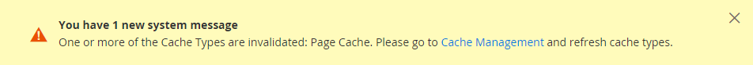

# Ambito sito, archivio e visualizzazione

Ogni installazione di Adobe Commerce e Magento Open Source dispone di una [gerarchia](../stores-purchase/stores.md) di siti Web, store e visualizzazioni dello store. Il termine _ambito_ determina la posizione nella gerarchia in cui viene applicata un&#39;entità di database, ad esempio un prodotto, un attributo o una categoria, un elemento di contenuto o un&#39;impostazione di configurazione. I siti Web, gli archivi e le visualizzazioni dello store hanno relazioni uno-a-molti padre/figlio. Una singola installazione può avere più siti Web e ogni sito Web può avere più store e visualizzazioni dello store.

>[!NOTE]
>
>Per ulteriori informazioni, vedere [Più siti Web o store](https://experienceleague.adobe.com/docs/commerce-operations/configuration-guide/multi-sites/ms-overview.html) nella documentazione per gli sviluppatori [!DNL Commerce].

## Siti Web

Le installazioni iniziano con un singolo [sito Web](../stores-purchase/stores.md#add-websites), denominato _sito Web principale_ per impostazione predefinita. È inoltre possibile impostare più siti Web per una singola installazione, ciascuno con il proprio indirizzo IP e dominio.

## Negozi

Un singolo sito Web può avere più [store](../stores-purchase/stores.md#add-stores), ciascuno con il proprio menu principale. I negozi condividono il catalogo dei prodotti, ma possono avere una selezione diversa di prodotti e design. Tutti gli store nello stesso sito web condividono l’Amministratore e il Checkpoint.

## Visualizzazioni dello store

Ogni archivio disponibile per i clienti viene presentato in base a una _[visualizzazione](../stores-purchase/store-views.md)_ specifica. Inizialmente, un archivio dispone di un&#39;unica vista predefinita. È possibile aggiungere altre visualizzazioni dello store per supportare lingue diverse o per altri scopi. I clienti possono utilizzare il selettore della lingua nell’intestazione per modificare la visualizzazione dello store.

Quando lavori con siti web, store e visualizzazioni dello store, tieni presente quanto segue:

- Le istanze di Commerce dispongono di un modello a catena: sito Web → globale → visualizzazione store →.
- Ogni sito Web dispone di almeno una visualizzazione predefinita per store e store.
- Ogni vista store può avere un URL di base diverso.
- La funzione principale di un sito web è la configurazione della funzione di livello superiore.
- La funzione principale di un archivio è la configurazione della categoria radice.
- La funzione principale di una visualizzazione archivio è costituita dalle informazioni di traduzione e dalla configurazione del simbolo di valuta.

## Impostazioni ambito

Se l&#39;installazione di Adobe Commerce o di Magento Open Source ha una gerarchia di siti Web, store o visualizzazioni, puoi impostare il contesto o l&#39;_ambito_ di un&#39;impostazione di configurazione. È inoltre possibile assegnare al contesto di molte entità di database un ambito specifico per determinarne il modo in cui viene utilizzato nella gerarchia di archiviazione. Per ulteriori informazioni, vedere [Ambito prodotto](../catalog/introduction.md#product-scope) e [Ambito prezzo](../catalog/catalog-price-scope.md).

Alcune impostazioni di configurazione, ad esempio il codice postale, hanno un ambito globale perché lo stesso valore viene utilizzato in tutto il sistema. L&#39;ambito [sito Web](../stores-purchase/stores.md#add-websites) si applica a tutti gli archivi al di sotto di tale livello nella gerarchia, inclusi tutti gli archivi e le relative visualizzazioni. Qualsiasi elemento con ambito [visualizzazione archivio](../stores-purchase/store-views.md) può essere impostato in modo diverso per ogni visualizzazione archivio, che in genere viene utilizzata per supportare più lingue. Per ignorare i valori predefiniti delle impostazioni di configurazione, vedere [Impostare l&#39;ambito](../configuration-reference/scope-change.md#set-the-scope).

A meno che l&#39;archivio non sia in esecuzione in [modalità archivio singolo](#single-store-mode), l&#39;ambito di ogni impostazione di configurazione viene visualizzato in un testo sotto l&#39;etichetta del campo. Se l&#39;installazione include più siti Web, store o visualizzazioni, scegliere la [visualizzazione store](../stores-purchase/store-views.md) in cui applicare le impostazioni prima di apportare modifiche.

{width="550"}

| Ambito | Descrizione |
|--- |--- |
| [!UICONTROL Global] | Impostazioni a livello di sistema e risorse disponibili per l&#39;intera installazione. |
| [!UICONTROL Website] | Impostazioni e risorse limitate al sito Web corrente. Ogni sito web ha un negozio predefinito. |
| [!UICONTROL Store] | Impostazioni e risorse limitate allo store corrente. Ogni archivio dispone di una categoria principale predefinita (menu principale) e di una visualizzazione archivio predefinita. |
| [!UICONTROL Store View] | Impostazioni e risorse limitate alla visualizzazione dello store corrente. |

{style="table-layout:auto"}

## Modalità store singolo

Se nell&#39;installazione di Commerce è disponibile un&#39;unica vista store e store, è possibile semplificare la visualizzazione disattivando tutte le opzioni di visualizzazione store e gli indicatori di ambito. Se [aggiungi altre visualizzazioni dello store](../stores-purchase/store-views.md) in un secondo momento, verrà ignorata la modalità di archiviazione singola.

{width="550"}

1. Nella barra laterale _Admin_, passa a **[!UICONTROL Stores]** > _[!UICONTROL Settings]_>**[!UICONTROL Configuration]**.

1. In **[!UICONTROL General]** scorrere verso il basso fino alla parte inferiore della pagina ed espandere la sezione **[!UICONTROL Single-Store Mode]**.

1. Imposta **[!UICONTROL Enable Single-Store Mode]** su `Yes`.

   {width="400"}

1. Fare clic su **[!UICONTROL Save Config]**.

1. Quando viene richiesto di aggiornare la cache, eseguire le operazioni seguenti:

   - Fare clic sul collegamento **[!UICONTROL Cache Management]** nel messaggio di sistema nella parte superiore della pagina.

     {width="600" zoomable="yes"}

   - Selezionare la casella di controllo **[!UICONTROL Page Cache]**.

   - Con **[!UICONTROL Actions]** impostato su `Refresh`, fare clic su **[!UICONTROL Submit]**
