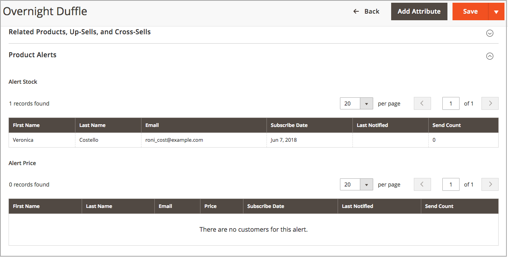

# Avvisi sui prodotti

I clienti possono abbonarsi a due tipi di avvisi tramite e-mail: avvisi di modifica del prezzo e avvisi in-stock. Per ogni tipo di avviso, puoi determinare se i clienti sono in grado di iscriversi, selezionare il modello di e-mail utilizzato e identificare il mittente dell’e-mail.

{width="600" zoomable="yes"}

## Avvisi sulla variazione di prezzo

Quando gli avvisi di modifica del prezzo sono attivati, un collegamento _Notifica quando il prezzo scende_ viene visualizzato in ogni pagina di prodotto. I clienti possono fare clic sul collegamento per iscriversi agli avvisi relativi al prodotto. Agli ospiti viene richiesto di aprire un account con il tuo negozio. Ogni volta che il prezzo cambia o il prodotto diventa speciale, tutti coloro che si sono iscritti all’avviso ricevono un avviso e-mail.

## Avvisi in-stock

L&#39;avviso di magazzino crea un collegamento denominato _Notifica quando il prodotto è disponibile_ per ogni prodotto esaurito. I clienti possono fare clic sul collegamento per iscriversi all’avviso. Quando il prodotto è di nuovo disponibile, i clienti ricevono una notifica via e-mail che indica che il prodotto è disponibile. I prodotti con avvisi dispongono di una scheda _Avvisi prodotto_ nel pannello Informazioni prodotto che elenca i clienti che si sono abbonati a un avviso.

{width="600" zoomable="yes"}

## Configurare gli avvisi sui prodotti

1. Nella barra laterale _Admin_, passa a **[!UICONTROL Stores]** > _[!UICONTROL Settings]_>**[!UICONTROL Configuration]**.

1. Nel pannello a sinistra, espandi **[!UICONTROL Catalog]** e scegli **[!UICONTROL Catalog]** sotto.

1. Fare clic per espandere la sezione _[!UICONTROL Product Alerts]_&#x200B;ed eseguire le operazioni seguenti:

   {width="600" zoomable="yes"}

   - Per offrire avvisi sui cambiamenti di prezzo ai clienti, impostare **[!UICONTROL Allow Alert When Product Price Changes]** su `Yes`.

   - Impostare **[!UICONTROL Price Alert Email Template]** sul modello da utilizzare per le notifiche di avviso prezzi.

   - Per inviare avvisi quando i prodotti esauriti diventano nuovamente disponibili, impostare **[!UICONTROL Allow Alert When Product Comes Back in Stock]** su `Yes`.

     >[!NOTE]
     >
     >Il messaggio _Notify me when this product is in stock_ viene visualizzato solo quando **[!UICONTROL Display Out of Stock Products]** è impostato su `Yes` (in Configuration at [!UICONTROL Catalog] > [!UICONTROL Inventory]).

   - Impostare **[!UICONTROL Stock Alert Email Template]** sul modello che si desidera utilizzare per gli avvisi di stock di prodotto.

   - Impostare **[!UICONTROL Alert Email Sender]** sul [contatto store](../getting-started/store-details.md#store-email-addresses){target="_blank"} che si desidera venga visualizzato come mittente dell&#39;avviso e-mail. Ulteriori informazioni su [indirizzi e-mail store](../configuration-reference/general/store-email-addresses.md){target="_blank"} nella guida utente di base.

1. Al termine, fare clic su **[!UICONTROL Save Config]**.

## Configurare i modelli e-mail per gli avvisi sui prodotti

Quindi, configura, aggiungi o modifica il modello e-mail per l’avviso di prezzo. Puoi modificare le configurazioni dell’avviso di prezzo dopo aver creato modelli aggiuntivi.

Per informazioni più dettagliate sull&#39;utilizzo dei messaggi di posta elettronica, vedere [Modelli di messaggio](../systems/email-template-custom.md#message-templates) nella _Guida ai sistemi di amministrazione_.

1. Nella barra laterale _Admin_, passa a **[!UICONTROL Marketing]** > _[!UICONTROL Communications]_>**[!UICONTROL Email Templates]**.

1. Fare clic su **[!UICONTROL Add New Template]**.

1. In _Carica modello predefinito_, scegliere il **[!UICONTROL Template]** che si desidera personalizzare.

   È possibile scegliere il modello di avviso incluso nel tema. Oppure puoi selezionare i modelli `Price Alert` o `Stock Alert` in _[!UICONTROL Magento_PriceAlert]_.

1. Fare clic su **[!UICONTROL Load Template]**.

1. Immetti **[!UICONTROL Template Name]**.

   È possibile selezionare questo nome nella configurazione _Avvisi prezzo_.

1. Leggi il contenuto esistente e apporta le modifiche necessarie per:

   | Campo | Descrizione |
   | ----- | ----- |
   | [!UICONTROL Template Subject] | Questo testo viene visualizzato nella riga dell’oggetto di un messaggio e-mail. |
   | [!UICONTROL Template Content] | Questo testo viene visualizzato nel contenuto completo dell’e-mail inviata. |

1. Per aggiungere le informazioni generate dai dati di [!DNL Commerce], utilizzare l&#39;opzione **[!UICONTROL Insert Variable]** per utilizzare un elenco di variabili disponibili.

1. Fare clic su **[!UICONTROL Save Template]**.

## Impostazioni di esecuzione degli avvisi sui prodotti

Queste impostazioni consentono di selezionare la frequenza con cui [!DNL Commerce] controlla le modifiche che richiedono l&#39;invio di avvisi. Puoi anche selezionare il destinatario, il mittente e il modello per le e-mail inviate se l’invio degli avvisi non riesce.

{width="600" zoomable="yes"}

1. Nella barra laterale _Admin_, passa a **[!UICONTROL Stores]** > _[!UICONTROL Settings]_>**[!UICONTROL Configuration]**.

1. Nel pannello a sinistra, espandi **[!UICONTROL Catalog]** e scegli **[!UICONTROL Catalog]** sotto.

1. Espandere  nella sezione **[!UICONTROL Product Alerts Run Settings]**.

1. Per determinare la frequenza con cui vengono inviati gli avvisi sui prodotti, impostare **[!UICONTROL Frequency]** su uno dei seguenti valori:

   - `Daily`
   - `Weekly`
   - `Monthly`

1. Per determinare l&#39;ora del giorno in cui vengono inviati gli avvisi sui prodotti, impostare **[!UICONTROL Start Time]** su ora, minuto e secondo.

   >[!NOTE]
   >
   >Gli avvisi sui prodotti vengono inviati dal consumatore &quot;product_alert&quot;.

1. Per **[!UICONTROL Error Email Recipient]**, immettere l&#39;indirizzo e-mail della persona da contattare in caso di errore.

1. Per **[!UICONTROL Error Email Sender]**, selezionare l&#39;identità dell&#39;archivio visualizzata come mittente della notifica di errore.

1. Impostare **[!UICONTROL Error Email Template]** sul modello di e-mail transazionale da utilizzare per la notifica di errore.

1. Al termine, fare clic su **[!UICONTROL Save Config]**.
