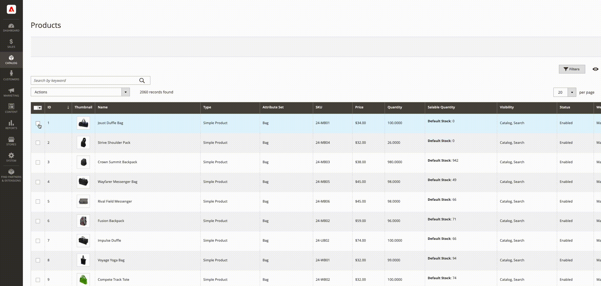

# Assegnazione e annullamento assegnazione origine in blocco

Utilizza lo strumento _Assegna origini_ per aggiungere una o più origini ai prodotti. Lo strumento consente di creare e assegnare origini personalizzate alle scorte predefinite o personalizzate e di preparare nuove ubicazioni e scorte.

Dopo aver aggiunto nuove origini personalizzate, puoi aggiungere [quantità di inventario per prodotto](quantities-assign-per-product.md) o per più prodotti tramite l&#39;amministratore o utilizzando la [funzione di importazione](inventory-import-export.md).

## Assegna origini e quantità

1. Nella barra laterale _Admin_, passa a **[!UICONTROL Catalog]** > **[!UICONTROL Products]**.

1. Selezionare i prodotti per i quali si desidera modificare le origini.

   Sfoglia o cerca i prodotti e seleziona le caselle di controllo.

1. Fai clic sul menu **[!UICONTROL Actions]** nella parte superiore e scegli **[!UICONTROL Assign Inventory Source]**.

1. Fare clic su **[!UICONTROL OK]** nella finestra di conferma.

1. Per tutte le origini che desideri aggiungere ai prodotti, seleziona le caselle di controllo.

1. Fare clic su **[!UICONTROL Assign Sources]**.

   {width="600" zoomable="yes"}

Le origini vengono aggiunte ai prodotti con una quantità di magazzino pari a 0. È possibile aggiungere [quantità di magazzino](quantities-assign-per-product.md) per origine.

## Annullare l&#39;assegnazione di origini e quantità

Quando si annulla l&#39;assegnazione di un&#39;origine a un prodotto, si indica che il prodotto non è più disponibile in tale posizione. Questo processo cancella completamente tutti i dati di inventario per l&#39;origine attualmente assegnata al prodotto. Se si desidera spostare il magazzino esistente in una nuova posizione, è consigliabile utilizzare l&#39;opzione _Trasferisci magazzino_.

{{$include /help/_includes/unassign-source.md}}

Si consiglia vivamente di completare tutti gli ordini e le spedizioni per tali prodotti prima di rimuovere l&#39;origine.

1. Nella barra laterale _Admin_, passa a **[!UICONTROL Catalog]** > **[!UICONTROL Products]**.

1. Seleziona i prodotti per i quali desideri modificare le origini.

   Sfoglia o cerca i prodotti e seleziona le caselle di controllo.

1. Fai clic sul menu **[!UICONTROL Actions]** nella parte superiore e scegli **[!UICONTROL Unassign Inventory Source]**.

1. Fare clic su **[!UICONTROL OK]** nella finestra di conferma.

1. Seleziona l’origine da rimuovere dai prodotti.

   Nella pagina viene visualizzato un avviso per segnalare che la rimozione dell’assegnazione comporta la rimozione di tutti i dati di origine e di quantità specifici dal prodotto.

1. Fare clic su **[!UICONTROL Unassign Sources]**.

   {width="600" zoomable="yes"}
