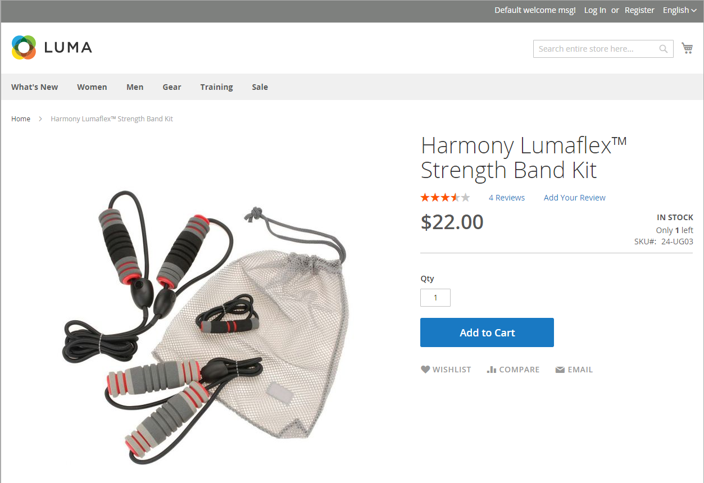

# Configura [!DNL Inventory Management]

Il modulo [!DNL Inventory Management] supporta le impostazioni di configurazione dell&#39;inventario a livello di prodotto e globale e fornisce inoltre impostazioni aggiuntive che influiscono sulla disponibilità dell&#39;origine, sui prodotti della vetrina e sulla spedizione dell&#39;ordine. Le impostazioni di configurazione si applicano a:

- L&#39;intero catalogo: Vai a **[!UICONTROL Stores]** > _[!UICONTROL Settings]_>**[!UICONTROL Configuration]**. Quindi, espandi **[!UICONTROL Catalog]**nel pannello a sinistra e seleziona **[!UICONTROL Inventory]**.

- Prodotti specifici: vai a **[!UICONTROL Catalog]** > **[!UICONTROL Products]**. Quindi, aprire il prodotto in modalità di modifica e fare clic su **[!UICONTROL Advanced Inventory]** nella sezione _[!UICONTROL Sources]_.

Il catalogo può essere configurato per visualizzare i dati di inventario nella vetrina, gestire i carrelli acquisti attivi e altro ancora. Visualizza la disponibilità di ogni elemento come _In magazzino_ o _Esaurito_ e l&#39;inventario disponibile quando le scorte sono basse.

La soglia di scorte esaurite indica quando un prodotto deve essere riordinato, sottrae dalla quantità vendibile per un magazzino e può essere impostata per supportare ordini inevasi abilitati o disabilitati. Consente ordini inevasi per il tuo negozio, impostando una quantità massima di ordini per tutti o prodotti specifici.

Un altro modo per utilizzare la soglia di disponibilità delle scorte consiste nel gestire i prodotti che sono molto richiesti. Se si desidera acquisire nuovi clienti, anziché vendere ad acquirenti in quantità elevata, è possibile impostare una quantità massima per evitare che un singolo acquirente possa prelevare l&#39;intero magazzino.

## Opzioni di configurazione

Gli archivi e i prodotti di [!DNL Commerce] supportano le seguenti configurazioni per la gestione di prodotti, inventario, notifiche e altro ancora. [!DNL Commerce] fornisce impostazioni di configurazione aggiuntive per le azioni in blocco e l&#39;algoritmo Priorità distanza.

| Opzione | Descrizione |
|--|--|
| [!UICONTROL Manage Stock] | Consente a [!DNL Commerce] di gestire tutto l&#39;inventario. Imposta se il controllo dell&#39;inventario è utilizzato per questo prodotto o per tutti i prodotti in [!DNL Commerce]. Visualizza altre opzioni se impostato su `Yes`. |
| [!UICONTROL Only X left Threshold] | Imposta una quantità da notificare quando un importo specifico viene lasciato disponibile per l&#39;acquisto. Questo importo viene registrato a livello di stock. |
| [!UICONTROL Out-of-Stock Threshold] | Scorte di sicurezza, quantità per attivare una notifica di esaurimento scorte e per ridurre il rischio di esaurimento scorte. Questo valore influisce sugli ordini inevasi. Opzioni: **[!UICONTROL No Backorders]**: non accetta ordini inevasi quando il prodotto è esaurito. **[!UICONTROL Allow Qty Below 0]**: accetta ordini inevasi quando la quantità scende al di sotto di zero. **[!UICONTROL Allow Qty Below 0 and Notify Customer]**: accetta ordini inevasi quando la quantità scende al di sotto di zero, ma notifica ai clienti che è ancora possibile effettuare ordini.  **[!UICONTROL Backorders disabled]**: si consiglia di immettere un valore positivo superiore a 0, ad esempio 5 o 25.  **[!UICONTROL Backorders enabled]**: immettere una soglia negativa per la quantità massima di ordini inevasi consentiti, ad esempio -5 o -25. Un valore pari a 0 funge da scorta infinita. Un valore positivo viene ignorato e trattato come 0. |
| [!UICONTROL Minimum Qty Allowed in Shopping Cart] | Imposta la quantità minima del prodotto che può essere acquistato in un singolo ordine. |
| [!UICONTROL Maximum Qty Allowed in Shopping Cart] | Imposta la quantità massima del prodotto che può essere acquistato in un singolo ordine. |
| [!UICONTROL Qty Uses Decimals] | Consente gli importi decimali, invece dei numeri interi, per la quantità di un prodotto. Questa impostazione è utile per i prodotti venduti in base a peso, volume o lunghezza. Specificato a livello di Source, calcolato a livello di Stock in base alle origini assegnate. |
| [!UICONTROL Allow Multiple Boxes for Shipping] | Determina se le parti di un prodotto possono essere spedite separatamente. Questa opzione è visibile quando **[!UICONTROL Qty Uses Decimals]** = `Yes`. |
| [!UICONTROL Backorders] | Indica se gli ordini inevasi sono consentiti. Specificato a livello di Source, calcolato a livello di Stock in base alle origini assegnate. Se abilitato per consentire ordini inevasi, si consiglia di impostare un valore negativo per la soglia esaurita (vedere [Configurazione degli ordini inevasi](backorders.md)). Opzioni: **[!UICONTROL No Backorders]**: non accetta ordini inevasi quando il prodotto è esaurito. **[!UICONTROL Allow Qty Below 0]**: accetta ordini inevasi quando la quantità scende al di sotto di zero. **[!UICONTROL Allow Qty Below 0 and Notify Customer]**: accetta ordini inevasi quando la quantità scende al di sotto di zero, ma notifica ai clienti che è ancora possibile effettuare ordini. |
| [!UICONTROL Notify for Quantity Below] | Imposta la quantità che attiva una notifica Quantità inferiore, avvertenza di scorte in esaurimento. Questo importo viene detratto dalla quantità di vendita e non dalla quantità di magazzino. |
| [!UICONTROL Enable Qty Increments] | Determina se il prodotto può essere venduto in incrementi di quantità. Se questa opzione è abilitata, immettere la quantità di prodotti che devono essere acquistati in un passo incrementale. Gli incrementi impostano il numero di articoli da acquistare come singolo prodotto e come figlio di prodotti configurabili, raggruppati e in bundle. |
| [!UICONTROL Automatically Return Credit Memo Item to Stock] | [!DNL Inventory Management] non utilizza questo valore. Quando si completa una restituzione o una nota di accredito, la quantità del prodotto viene automaticamente restituita alla quantità di origine interessata. Vedere [Configurazione delle opzioni di prodotto](product-options.md). |

## Fallimento della configurazione ed ereditarietà

Le configurazioni sostituiscono o si applicano nel seguente percorso di ereditarietà: la sezione del prodotto _[!UICONTROL Sources]_sostituisce la configurazione dell&#39;archivio_[!UICONTROL Inventory]_ globale del prodotto _[!UICONTROL Advanced Options]_.

Quando [!DNL Commerce] controlla l&#39;applicazione delle impostazioni personalizzate, segue questo ordine:

1. Controlla le impostazioni personalizzate a livello di prodotto nella sezione _[!UICONTROL Sources]_. Sono disponibili alcune impostazioni.

1. Controlla le impostazioni del prodotto _[!UICONTROL Advanced Inventory]_.

1. Se `Use Config Settings` è selezionato per le impostazioni del prodotto, verifica la presenza di un valore dalla pagina di configurazione dell&#39;archivio _Inventario_ globale.

Ad esempio, puoi configurare gli ordini inevasi in modo diverso nel tuo negozio con una configurazione simile alla seguente:

- _Globalmente:_ Abilita gli ordini inevasi per l&#39;archivio. Imposta la soglia esaurita su `-50`

- _Prodotto:_ Disabilita gli ordini inevasi per un prodotto specifico. Impostare la soglia esaurita su `10`
