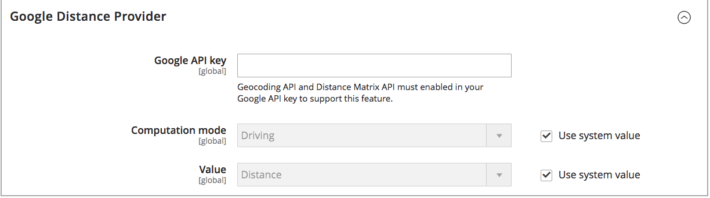

# Configurare l&#39;algoritmo di priorità della distanza

L&#39;algoritmo Distance Priority confronta l&#39;ubicazione dell&#39;indirizzo di destinazione della spedizione con le ubicazioni di origine per determinare l&#39;origine più vicina per evadere le spedizioni. La distanza può essere determinata in base alla distanza fisica o al tempo trascorso in viaggio da un luogo all&#39;altro, utilizzando dati di banca dati o indicazioni stradali, pedonali o ciclabili. Usa questo [Algoritmo di selezione della sorgente](selection-reservations.md) per consigliare l&#39;origine più vicina agli indirizzi di destinazione per la spedizione.

>[!NOTE]
>
>Se si utilizza l&#39;algoritmo di priorità della distanza, immettere l&#39;indirizzo stradale completo e le coordinate GPS per [sorgenti](sources-add.md) è consigliato.

Sono disponibili due opzioni per calcolare la distanza e il tempo necessari per trovare l&#39;origine più vicina per l&#39;evasione della spedizione:

- **GOOGLE MAP** - Utilizzi [Piattaforma Google Maps][1] servizi per calcolare la distanza e l&#39;ora tra l&#39;indirizzo della destinazione di spedizione e le ubicazioni di origine. Questa opzione utilizza la latitudine e la longitudine (coordinate GPS) della sorgente e può utilizzare l’indirizzo stradale a seconda della modalità di calcolo. È necessaria una chiave API Google con [API di geocodifica][2] e [API della matrice di distanza][3] e possono essere addebitati tramite Google.

- **Calcolo offline** - Calcola la distanza utilizzando i dati del codice geografico scaricati e importati utilizzando i codici postali e le coordinate GPS per determinare l&#39;origine più vicina all&#39;indirizzo di destinazione della spedizione. Per configurare questa opzione, potrebbe essere necessario richiedere l&#39;assistenza dello sviluppatore per scaricare e importare inizialmente i geocodici utilizzando le istruzioni della riga di comando.

>[!NOTE]
>
>Per i siti web con più store con diversi paesi, configura [destinazione imposta predefinita](../stores-purchase/tax-class.md#default-tax-destination){target="_blank"} per ciascun paese.

## Utilizzare le mappe di Google

Per iniziare, non è necessario un account Google. Il processo include la creazione di un account Google e di un progetto, se necessario. Questa opzione richiede l’aggiunta di un account di fatturazione e di un metodo di pagamento al tuo account Google per completare le configurazioni e utilizzare l’algoritmo.
Tuttavia, l’algoritmo basato sulla distanza di Google MAP è consigliato in quanto più avanzato e preciso rispetto al calcolo offline.

### Passaggio 1: creare la chiave API di Google

La chiave proviene da [Piattaforma Google Maps][1] e dovrebbero avere [API di geocodifica][2] e [API della matrice di distanza][3] abilitato. Per ulteriori informazioni, consulta [Configurazione dell&#39;algoritmo di priorità della distanza](distance-priority-algorithm.md).

1. Visita [Piattaforma Google Maps][1] e fai clic su **[!UICONTROL Get Started]**.

1. Per abilitare la piattaforma, seleziona **[!UICONTROL Maps, Routes, and Places]** e fai clic su **[!UICONTROL Continue]**.

   {width="350" zoomable="yes"}

1. Accedi con un account Google o crea un account.

1. Configura un progetto:

   - Seleziona un progetto o immetti un nuovo nome per il progetto.

   - Per accettare i termini, seleziona `Yes`.

   - Clic **[!UICONTROL Next]**.

1. Inserire un conto di fatturazione o crearne uno. Puoi saltare e aggiungere un account di fatturazione in un secondo momento.

   Per utilizzare questo servizio è necessario un account di fatturazione.

1. Per aprire e configurare le opzioni della piattaforma Google Cloud, fai clic su **[!UICONTROL Console]**.

   - Apri il progetto.

   - Espandi il menu e fai clic su **[!UICONTROL APIs & Services]** > **[!UICONTROL Library]**.

     {width="350" zoomable="yes"}

   - Cerca [API di geocodifica][2] e [API della matrice di distanza][3]. Seleziona e abilita ciascun servizio.

1. Espandi il menu, fai clic su **[!UICONTROL APIs & Services]** > **[!UICONTROL Credentials]**, e copia la chiave API Google.

   {width="350" zoomable="yes"}

### Passaggio 2: configurare il provider Google MAP

1. Il giorno _Amministratore_ barra laterale, vai a **[!UICONTROL Stores]** > _[!UICONTROL Settings]_>**[!UICONTROL Configuration]**.

1. Nel pannello a sinistra, espandi **[!UICONTROL Catalog]** e scegli **[!UICONTROL Inventory]**.

1. Espandi  il _[!UICONTROL Distance Provider for Distance Based SSA]_sezione e set **[!UICONTROL Provider]**a `Google MAP`.

   {width="350" zoomable="yes"}

1. Espandi  il _[!UICONTROL Google Distance Provider]_e configurare le impostazioni:

   - Per **[!UICONTROL Google API Key]**, immetti la chiave copiata dal tuo account Google.

   - Per **[!UICONTROL Computation mode]**, seleziona una configurazione.

     >[!NOTE]
     >
     >Quando si utilizza questo algoritmo per la spedizione, se le route e i dati non vengono restituiti per la modalità di calcolo selezionata (guida, bicicletta o deambulazione) per una spedizione, il valore predefinito di SSA è l&#39;utilizzo di Priorità origine. Impostazione di [priorità per le fonti per stock](stocks-prioritize-sources.md) è consigliato.

     | Opzione | Descrizione |
     | ----- | ----- |
     | `Driving` | (Impostazione predefinita) Richiede indicazioni stradali standard utilizzando la rete stradale. |
     | `Walking` | Richiede indicazioni stradali utilizzando percorsi pedonali e marciapiedi (se disponibili). |
     | `Bicycling` | Richiede indicazioni per il ciclismo utilizzando piste ciclabili e strade preferite (se disponibili). Il [Servizio matrice distanza][4] è disponibile solo negli Stati Uniti e in alcune città canadesi. |

   - Per **[!UICONTROL Value]**, seleziona un tipo di valore:

     | Opzione | Descrizione |
     | ----- | ----- |
     | `Distance` | (Impostazione predefinita) Restituisce la distanza tra punti nelle metriche (chilometri e metri) o imperiali (miglia e piedi). |
     | `Time to Destination` | Restituisce il tempo necessario per spostarsi dalle posizioni di origine all&#39;indirizzo di spedizione in ore e minuti. |

   {width="350" zoomable="yes"}

1. Al termine, fai clic su **[!UICONTROL Save Config]**.

## Usa calcolo offline

I calcoli offline utilizzano i codici paese per determinare la distanza tra la destinazione di spedizione e gli indirizzi di origine. Per configurare questa opzione potrebbe essere necessaria l’assistenza per gli sviluppatori. Utilizza un [!DNL Inventory Management] Comando CLI per scaricare e importare dati da [geonames.org][5].

>[!NOTE]
>
>Geocodici importati da [geonames.org][5] hanno dei limiti per alcuni paesi, come il Canada e l&#39;Irlanda. Fai riferimento a [File codice postale GeoNames][6] per ulteriori informazioni.

### Passaggio 1: scaricare e importare i geocodici

Completa la configurazione della riga di comando per scaricare e importare i paesi di geocodici da spedire e avere posizioni di origine in. Questo passaggio potrebbe richiedere l&#39;assistenza degli sviluppatori per le attività della riga di comando. Fai riferimento a [Importa geocodici](cli.md#import-geocodes).

Completa questi comandi ogni volta che desideri aggiungere altri geocodici.

### Passaggio 2: impostare il calcolo

1. Il giorno _Amministratore_ barra laterale, vai a **[!UICONTROL Stores]** > _[!UICONTROL Settings]_>**[!UICONTROL Configuration]**.

1. Nel pannello a sinistra, espandi **[!UICONTROL Catalog]** e scegli **[!UICONTROL Inventory]**.

1. Espandi  il _[!UICONTROL Distance Provider for Distance Based SSA]_sezione.

1. Deseleziona il **[!UICONTROL Use system value]** casella di controllo e impostazione **[!UICONTROL Provider]** a `Offline Calculation`.

   {width="350" zoomable="yes"}

1. Al termine, fai clic su **[!UICONTROL Save Config]**.

[1]: https://cloud.google.com/maps-platform/
[2]: https://developers.google.com/maps/documentation/geocoding/start
[3]: https://developers.google.com/maps/documentation/distance-matrix/start
[4]: https://developers.google.com/maps/documentation/javascript/distancematrix#travel_modes
[5]: https://www.geonames.org/
[6]: https://download.geonames.org/export/zip/readme.txt
