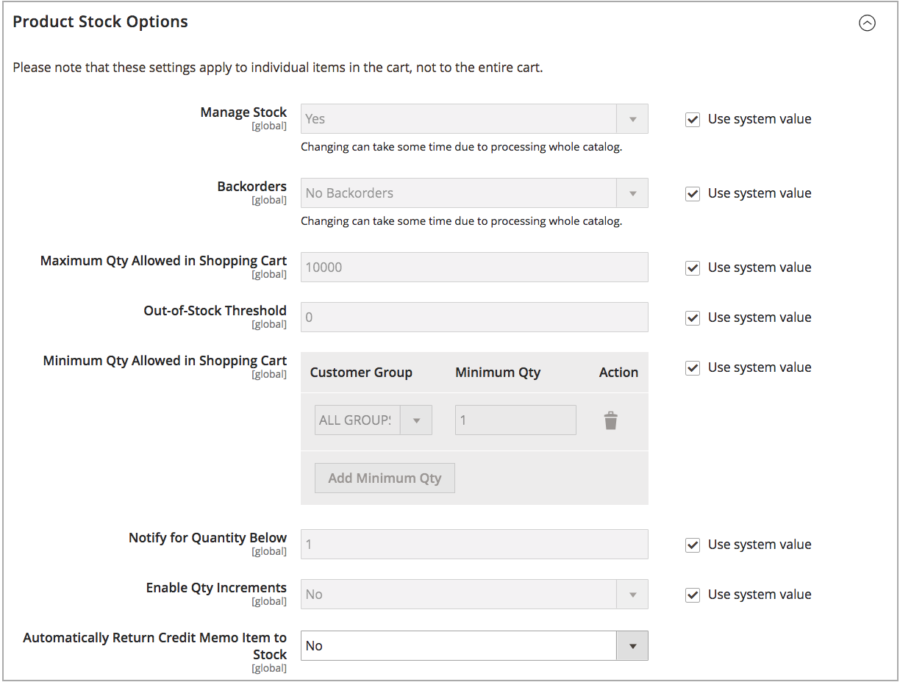

# Abilita [!DNL Inventory Management]

Per gestire l&#39;inventario dei prodotti, abilitare [!DNL Inventory Management] a livello di store globale o di prodotto. Quando l&#39;opzione _Gestisci Stock_ è abilitata, [!DNL Inventory Management] tiene traccia automaticamente delle quantità di prodotti disponibili per il sito tramite scorte e origini configurate. Ogni funzione e opzione inizia il tracciamento e il reporting quando è abilitata, senza configurazioni aggiuntive.

L&#39;azienda esegue e aggiorna l&#39;inventario alla velocità delle vendite. Quando i clienti fanno acquisti, ricevi informazioni esatte e aggiornate sulle scorte disponibili per canale di vendita e sorgente. Le quantità disponibili vendute vengono aggiornate per scorta quando i clienti aggiungono prodotti al carrello e completano gli acquisti e quando e gestisci gli ordini, crea spedizioni ed emetti rimborsi. Arrivi di scorte nuove o trasferite aggiornate alle tue fonti, immediatamente disponibili per le vendite online. Gli ordini inevasi vengono completati fino a soglie specificate senza ordini infiniti o configurazioni aggiuntive. È inoltre possibile inserire e completare le spedizioni parziali o complete in una o più origini con suggerimenti, garantendo così il controllo completo dell&#39;evasione degli ordini e delle scorte disponibili.

>[!NOTE]
>
>Per impostazione predefinita, [!DNL Inventory Management] è abilitato durante l&#39;installazione o l&#39;aggiornamento di [!DNL Commerce]. A seconda delle esigenze aziendali, è possibile abilitare o disabilitare [!DNL Inventory Management] monitorato in [!DNL Commerce].

Funzionamento di questa impostazione negli inventari a origine singola e multipla:

- Per utilizzare [!DNL Inventory Management], abilitare _[!UICONTROL Manage Stock]_.

- Le impostazioni [!UICONTROL Manage Stock] a livello di prodotto sovrascrivono la configurazione dell&#39;archivio.

- Per utilizzare Order Management o servizi di terze parti (come ERP), disabilitare [!UICONTROL Manage Stock].

- Se la configurazione a livello di prodotto utilizza l’impostazione predefinita del sistema, la configurazione dell’archivio viene ignorata.

Con [!DNL Inventory Management] abilitato, vedere quanto segue per configurare tutte le impostazioni:

- [Configurazione delle opzioni globali](global-options.md) - Impostazioni che interessano l&#39;intero catalogo, considerate le impostazioni predefinite di sistema.

- [Configurazione delle opzioni di prodotto](product-options.md) - Impostazioni per un prodotto specifico che sostituiscono le opzioni globali.

## Attiva o disattiva [!DNL Inventory Management]

1. Nella barra laterale _Admin_, passa a **[!UICONTROL Stores]** > _[!UICONTROL Settings]_>**[!UICONTROL Configuration]**.

1. Nel pannello a sinistra, espandi **[!UICONTROL Catalog]** e scegli **[!UICONTROL Inventory]**.

1. Espandi  _Opzioni magazzino prodotto_ e configura:

   {width="600" zoomable="yes"}

   - Per gestire l&#39;inventario e utilizzare tutte le funzionalità di [!DNL Commerce], impostare **[!UICONTROL Manage Stock]** su `Yes` (impostazione predefinita).

   - Per disabilitare [!DNL Inventory Management], deselezionare la casella di controllo **[!UICONTROL Use system value]** e impostare **[!UICONTROL Manage Stock]** su `No`.

1. Al termine, fare clic su **[!UICONTROL Save Config]**.

## Gestire le scorte di un negozio

Consulta [Configurare le opzioni globali](global-options.md).

## Gestire le scorte di un prodotto

Vedere [Configurazione delle opzioni di prodotto](product-options.md).
