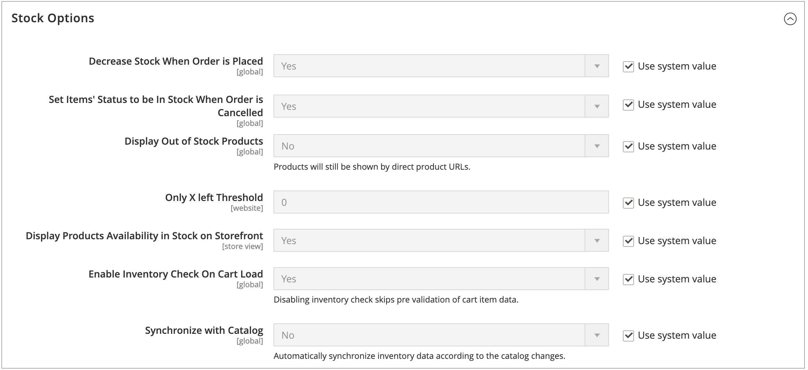

# Configura [!DNL Inventory Management] opzioni globali

Configura le opzioni di configurazione predefinite per prodotto e magazzino per i siti web. Alcune di queste impostazioni possono essere ignorate per prodotto tramite [Configurazione delle opzioni di prodotto](product-options.md). Per configurare le impostazioni di Distance Priority, vedere [Configurazione dell&#39;algoritmo di priorità della distanza](distance-priority-algorithm.md).

## Configurare le opzioni di prodotto e stock a livello globale

1. Il giorno _Amministratore_ barra laterale, vai a **[!UICONTROL Stores]** > _[!UICONTROL Settings]_>**[!UICONTROL Configuration]**.

1. Nel pannello a sinistra, espandi **[!UICONTROL Catalog]** e scegli **[!UICONTROL Inventory]**.

1. Espandi  il **[!UICONTROL Stock Options]** e impostare le opzioni:

   {width="600" zoomable="yes"}

   - Per adeguare la quantità disponibile quando viene effettuato un ordine, impostare **[!UICONTROL Decrease Stock When Order is Placed]** a `Yes`.

   - Per restituire gli articoli alle scorte in caso di annullamento di un ordine, **[!UICONTROL Set Items' Status to be in Stock When Order in Cancelled]** a `Yes`.

   - Per continuare a visualizzare nel catalogo i prodotti che non sono più in magazzino, impostare **[!UICONTROL Display Out of Stock Products]** a `Yes`.

   - Se [avvisi sui prezzi](alert-setup.md) sono abilitati, i clienti possono registrarsi per ricevere una notifica quando il prodotto è di nuovo disponibile.

   - Per impostare l&#39;inizio della visualizzazione dell&#39;ultimo importo rimanente delle scorte nella pagina del prodotto, immettere un importo per **[!UICONTROL Only X left Threshold]**.

     Il messaggio inizia a essere visualizzato quando la quantità in magazzino raggiunge la soglia. Ad esempio, se è impostato su `3`, il messaggio `Only 3 left` viene visualizzato quando la quantità in magazzino raggiunge tre. Il messaggio viene modificato in modo da riflettere la quantità in magazzino, fino a quando la quantità non raggiunge zero.

   - Per visualizzare un messaggio &quot;In magazzino&quot; o &quot;Esaurito&quot; sulla pagina del prodotto, impostare **[!UICONTROL Display Products Availability In Stock on Storefront]** a `Yes`.

   - Per controllare l’inventario durante il caricamento di un prodotto nel carrello, imposta **[!UICONTROL Enable Inventory Check On Cart Load]** a `Yes`. Se questa opzione è disattivata, il controllo dell&#39;inventario viene ignorato. La disattivazione di questa opzione accelera il pagamento, soprattutto se nel carrello sono presenti molti articoli. Tuttavia, se salti la pre-convalida, i clienti potrebbero visualizzare errori &quot;esauriti&quot; in un secondo momento nel processo di pagamento.

   - Per mantenere la coerenza tra inventario e catalogo, impostare **[!UICONTROL Synchronize with Catalog]** a `Yes`. Se questa opzione è abilitata, i dati di inventario vengono regolati in base alle modifiche apportate al catalogo (ad esempio, prodotto rimosso, SKU prodotto modificato e tipo di prodotto modificato).

1. Espandi  il **[!UICONTROL Product Stock Options]** e impostare le opzioni:

   - Per attivare [controllo di inventario](enable.md) per il catalogo, imposta **[!UICONTROL Manage Stock]** a `Yes`.

     {width="600" zoomable="yes"}

   - Imposta **[!UICONTROL Backorders]** a uno dei seguenti elementi:

     | Opzione | Descrizione |
     | ----- | ----- |
     | `No Backorders` | [Ordini arretrati](backorders.md) non sono accettati quando il prodotto è esaurito. |
     | `Allow Qty Below 0` | Gli ordini inevasi vengono accettati quando la quantità scende sotto zero. |
     | `Allow Qty Below 0 and Notify Customer` | Gli ordini arretrati vengono accettati quando la quantità scende al di sotto di zero e il sistema notifica al cliente che l&#39;ordine può ancora essere effettuato. |

   - Inserisci il **[!UICONTROL Maximum Qty Allowed in Shopping Cart]**.

   - Immetti un importo per **[!UICONTROL Out-of-Stock Threshold]**:

     | Valore | Descrizione |
     | ----- |-----|
     | Importo positivo | Se l&#39;opzione Ordini arretrati è disabilitata, immettere un importo positivo. |
     | Zero | Con ordini arretrati abilitati, immettere: `0` consente ordini inevasi infiniti. |
     | Importo negativo | Se l&#39;opzione Ordini arretrati è abilitata, si consiglia di immettere un importo negativo. L&#39;importo viene aggiunto alla quantità di vendita. Ad esempio, immetti `-50` per consentire ordini fino a questo importo. |

   - Inserisci il **[!UICONTROL Minimum Qty Allowed in Shopping Cart]** per il gruppo e gli importi selezionati.

   - Per **[!UICONTROL Notify for Quantity Below]**, immettere il livello di scorte che attiva la notifica che l&#39;articolo è esaurito.

   - Per attivare gli incrementi di quantità per il prodotto, impostare **[!UICONTROL Enable Qty Increments]** a `Yes`. Quindi, per **[!UICONTROL Qty Increments]**, immettere il numero di articoli che devono essere acquistati per soddisfare il fabbisogno.

     Ad esempio, un articolo venduto con incrementi di sei può essere acquistato in quantità di `6`, `12`, `18`e così via.

   - Per [!DNL Inventory Management], **[!UICONTROL Automatically Return Credit Memo Item to Stock]** è impostato su `No`. Quando si sottomette una nota di accredito, è necessario inserire e selezionare questa opzione per restituire le scorte alle origini.

1. Espandi  il **[!UICONTROL Admin bulk operations]** e impostare le opzioni:

   {width="600" zoomable="yes"}

   - Imposta **[!UICONTROL Run asynchronously]** per eseguire operazioni di massa in modo asincrono per azioni di massa sui prodotti

     Queste operazioni includono operazioni in blocco [assegnazione e annullamento dell&#39;assegnazione delle origini](bulk-assignment.md), e [trasferimento del magazzino all&#39;origine](inventory-transfer.md). Raccoglie le azioni in blocco fino alla dimensione del batch asincrono, quindi le esegue. Questa opzione è disabilitata per impostazione predefinita. Si consiglia di rivedere le prestazioni con azioni in blocco prima dell’abilitazione.

     >[!NOTE]
     >
     >Per configurare e supportare _responsabili coda asincroni_, è necessario eseguire un comando utilizzando la riga di comando. Questo passaggio potrebbe richiedere l’assistenza degli sviluppatori. Consulta [Avvia consumer coda messaggi](https://experienceleague.adobe.com/docs/commerce-operations/configuration-guide/cli/start-message-queues.html) nel _Guida alla configurazione_.

   - Se l&#39;opzione è attivata, impostare **[!UICONTROL Asynchronous batch size]**. La dimensione predefinita del batch è 100. Quando i processi in blocco raggiungono questa quantità, il sistema la attiva.

1. Al termine, fai clic su **[!UICONTROL Save Config]**.
