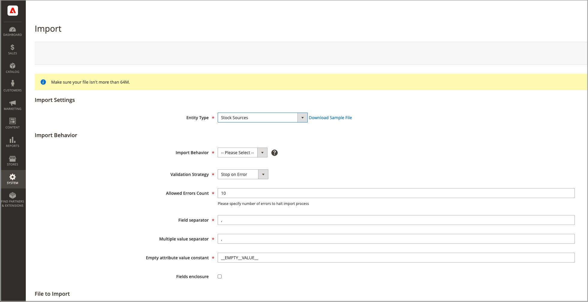

# Importare ed esportare le scorte

Per i cataloghi con molti prodotti, utilizzare le funzioni di importazione ed esportazione native con opzioni [!DNL Inventory Management] espanse per aggiornare origini e quantità in base allo SKU. Con queste opzioni è possibile aggiungere nuove origini e aggiornare le quantità di magazzino per tutte le origini o per una determinata origine. Ad esempio, è possibile esportare i prodotti per un&#39;origine in Germania senza influire sulle informazioni sui prodotti per le origini in Francia, Inghilterra o Stati Uniti.

- [!DNL Commerce] assegna automaticamente il Source predefinito ai tuoi prodotti durante l&#39;aggiornamento di [!DNL Commerce] o l&#39;importazione di nuovi prodotti. Se si importano prodotti con un&#39;origine personalizzata assegnata, il Source predefinito viene comunque aggiunto con una quantità pari a 0. Per aggiornare origini e quantità, utilizzare queste istruzioni di importazione.

- I commercianti con una sola origine utilizzano l’importazione per aggiornare solo le quantità di prodotto. Tutti i prodotti esistenti e aggiunti vengono assegnati al Source predefinito.

- I commercianti multi-sorgente utilizzano l’importazione per aggiungere più origini e quantità per riga per SKU.

Per importare gli aggiornamenti, esporta innanzitutto un file CSV per una sorgente specifica o per tutte le sorgenti. Modifica il file CSV e aggiungi una riga per SKU per ogni origine e quantità. È necessario il codice sorgente quando si aggiunge un&#39;origine e si aggiungono quantità di scorte. Non è possibile aggiungere o aggiornare scorte utilizzando le funzioni di importazione-esportazione.

## Contenuto file CSV

Il file di esportazione-importazione include le seguenti informazioni in base alla sorgente:

- `source_code` - Codice per le origini in [!DNL Commerce]. Esiste una riga per ogni sorgente e SKU.
- `sku` - SKU per il prodotto in [!DNL Commerce]. Lo SKU deve corrispondere a un prodotto nell&#39;archivio per aggiornare correttamente i dati di [!DNL Inventory Management].
- `status` - 0 per esaurito. 1 per In Stock. Il valore deve essere 1 per acquistare le scorte da questa origine.
- `quantity` - Quantità totale di scorte disponibili per questo SKU e origine.

Utilizza un file CSV per aggiornare rapidamente più prodotti e origini assegnate per aggiornare e correggere eventuali imprecisioni nei record di inventario anziché una alla volta tramite l’interfaccia dell’applicazione. Per un file di base, esportate prima e aggiornate secondo necessità.

{width="600" zoomable="yes"}

## Esporta dati prodotto per tutte le origini

1. Nella barra laterale _Admin_, passa a **[!UICONTROL System]** > _[!UICONTROL Data Transfer]_>**[!UICONTROL Export]**.

1. Per **[!UICONTROL Entity Type]**, scegliere `Stock Sources`.

   L’esportazione estrae solo i dati per i prodotti con una SKU.

1. Fare clic su **[!UICONTROL Continue]**.

   Il file viene generato e scaricato per essere aperto e modificato.

Dopo aver aggiornato le quantità di magazzino e i dati di prodotto, importare nuovamente il file in [!DNL Commerce].

{width="350" zoomable="yes"}

## Esporta dati prodotto per un&#39;origine specifica

1. Nella barra laterale _Admin_, passa a **[!UICONTROL System]** > _[!UICONTROL Data Transfer]_>**[!UICONTROL Export]**.

1. Per **[!UICONTROL Entity Type]**, scegliere `Stock Sources`.

   L’esportazione estrae solo i dati per i prodotti con una SKU.

1. Utilizzare **[!UICONTROL Entity Attributes]** per filtrare i prodotti esportati per un&#39;origine specifica.

   Per `source_code`, immettere il codice per l&#39;origine nel campo del filtro.

1. Fare clic su **[!UICONTROL Continue]**.

   Il file viene generato e scaricato per essere aperto e modificato.

Dopo aver aggiornato le quantità di magazzino e i dati di prodotto, importare nuovamente il file in [!DNL Commerce].

## Importare dati prodotto

1. Nella barra laterale _Admin_, passa a **[!UICONTROL System]** > _[!UICONTROL Data Transfer]_>**[!UICONTROL Import]**.

1. Per **[!UICONTROL Entity Type]**, scegliere `Stock Sources`.

   L’esportazione estrae solo i dati per i prodotti con una SKU.

1. Selezionare le configurazioni per **[!UICONTROL Import Behavior]**.

1. Selezionare il file .csv da importare.

1. Fare clic su **[!UICONTROL Check Data]** e completare l&#39;importazione.

{width="600" zoomable="yes"}
