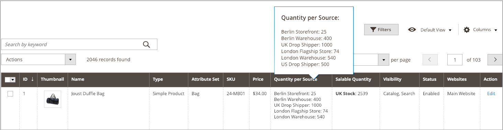

# Assegna quantità per prodotto

Dopo aver aggiunto [sorgenti](sources-assign-per-product.md), aggiorna le quantità di magazzino per il prodotto. Questi valori tengono traccia degli importi delle scorte disponibili.

Per nascondere le scorte di un&#39;origine dalle spedizioni senza rimuovere l&#39;origine, impostare _[!UICONTROL Source Item Status]_&#x200B;su `Out of Stock`. Le opzioni SSA e di spedizione accedono solo alle origini elencate come `In Stock` con quantità di magazzino disponibile.

Tutte le quantità e le origini aggiornate vengono visualizzate nella griglia di prodotto.

## Aggiorna quantità

1. Nella barra laterale _Admin_, passa a **[!UICONTROL Catalog]** > **[!UICONTROL Products]**.

1. Individua e apri un prodotto in modalità di modifica.

1. Espandere  nella sezione **[!UICONTROL Sources]**.

1. Imposta **[!UICONTROL Source Item Status]** su `In Stock`.

1. per aggiornare la quantità per le scorte esistenti, immettere un importo per **[!UICONTROL Qty]**.

1. Per impostare una notifica per le quantità di magazzino, effettuare una delle seguenti operazioni:

   - Quantità notifica personalizzata: deselezionare la casella di controllo **[!UICONTROL Use Default]** e immettere un importo in **[!UICONTROL Notify Qty]**.
   - Quantità di notifica predefinita: selezionare la casella di controllo **[!UICONTROL Use Default]**. [!DNL Commerce] verifica e utilizza l&#39;impostazione in _[!UICONTROL Advanced Inventory]_&#x200B;o nella configurazione dell&#39;archivio globale.

   {width="350" zoomable="yes"}

1. Per salvare, effettuate una delle seguenti operazioni:

   - Fare clic su **[!UICONTROL Save]**.

   - Scegliere **[!UICONTROL Save & Close]** dal menu **[!UICONTROL Save]** ().

La griglia prodotti viene aggiornata con un elenco di tutte le origini e delle quantità correlate. Per i prodotti con più di cinque origini assegnate, passa il cursore del mouse sulla colonna _[!UICONTROL Quantity per Source]_&#x200B;per visualizzare l&#39;elenco completo.

{width="600" zoomable="yes"}
