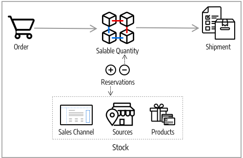

# Algoritmi e prenotazioni di Source

Il cuore di [!DNL Inventory Management] tiene traccia di tutti i prodotti disponibili virtualmente e disponibili nei tuoi magazzini e magazzini. I sistemi Algoritmo di selezione Source e Impegni vengono eseguiti in background, mantenendo aggiornate le quantità di vendita, evitando collisioni, e le opzioni di spedizione consigliate.

>[!NOTE]
>
>Per informazioni sull&#39;utilizzo del sistema [&#x200B; a livello di programmazione, consultare la &#x200B;](https://developer.adobe.com/commerce/php/development/framework/inventory-management/)documentazione per gli sviluppatori[!DNL Inventory Management].

## Algoritmo di selezione Source

L&#39;algoritmo di selezione Source (SSA) analizza e determina la migliore corrispondenza per le origini e la spedizione utilizzando l&#39;ordine di priorità delle origini configurate in un magazzino. Durante la spedizione dell&#39;ordine, l&#39;algoritmo fornisce un elenco consigliato di origini, quantità disponibili e importi da dedurre in base all&#39;algoritmo selezionato. [!DNL Inventory Management] fornisce un algoritmo Priority e supporta le estensioni per le nuove opzioni.

Con più sedi di origine, clienti globali e vettori con varie opzioni di spedizione e spese, conoscere l&#39;inventario effettivamente disponibile e trovare la migliore opzione di spedizione può essere difficile. SSA consente di tenere traccia delle quantità vendibili in magazzino da tutte le origini al calcolo e alla creazione di consigli per le spedizioni.

**Tieni traccia dell&#39;inventario** - Utilizzando le scorte e le origini, l&#39;SSA controlla il canale di vendita delle richieste di prodotti in arrivo e determina l&#39;inventario disponibile:

- Calcola la quantità vendibile virtuale aggregata di tutte le origini assegnate per stock: aggrega Quantità - Soglia esaurita per origine
- Sottrae l&#39;importo della soglia esaurita dalla quantità vendibile per proteggerlo dalle vendite in eccesso
- Riserva le quantità di magazzino all&#39;invio dell&#39;ordine, detraendo dalle scorte in magazzino all&#39;elaborazione e alla spedizione dell&#39;ordine
- Supporta gli ordini inevasi con opzioni avanzate per soglie negative

**Gestione spedizioni** - L&#39;algoritmo consente di elaborare e spedire gli ordini. Puoi eseguire l’algoritmo per ottenere consigli sulle origini migliori per la spedizione del prodotto o per ignorare le selezioni su:

- Spedire spedizioni parziali, inviando solo alcuni prodotti da posizioni specifiche e completando l&#39;ordine completo in un secondo momento
- Spedire l&#39;intero ordine da un&#39;unica origine
- Suddividere le spedizioni tra più origini in quantità diverse, mantenendo un equilibrio tra magazzini e magazzini

SSA è estensibile per il supporto di terze parti e algoritmi personalizzati per la raccomandazione di spedizioni convenienti.

>[!NOTE]
>
>SSA funziona in modo diverso per i prodotti virtuali e scaricabili, che potrebbero non sostenere costi di spedizione. In questi casi, il sistema esegue l&#39;algoritmo implicitamente quando crea le fatture e utilizza sempre i risultati suggeriti. Non è possibile regolare questi risultati per i prodotti virtuali e scaricabili.

### Algoritmo di priorità Source

Le scorte personalizzate includono un elenco assegnato di origini per la vendita e la spedizione dell&#39;inventario dei prodotti disponibile tramite il punto vendita. L&#39;algoritmo Priority di Source utilizza l&#39;ordine delle origini assegnate nelle scorte per consigliare detrazioni del prodotto per origine durante la fatturazione e la spedizione dell&#39;ordine.

Quando viene eseguito, l’algoritmo:

- Funziona in base all&#39;ordine configurato delle origini a livello di magazzino a partire dalla parte superiore
- Consiglia una quantità da spedire e di origine per prodotto in base all&#39;ordine nell&#39;elenco, alla quantità disponibile e alla quantità ordinata
- Continua verso il basso nell&#39;elenco fino al completamento della spedizione dell&#39;ordine
- Ignora le origini disabilitate se presenti nell&#39;elenco

Per configurare, assegnare e ordinare origini a un magazzino personalizzato. Vedi [Assegnazione di priorità alle origini per un Stock](stocks-prioritize-sources.md).

Nell&#39;esempio seguente vengono descritte in dettaglio le origini mappate in ordine, quantità disponibile e origine e importo consigliati da dedurre e spedire. La fonte principale è un corriere espresso nel Regno Unito con una quantità disponibile di 240.

{width="600" zoomable="yes"}

### Algoritmo di priorità della distanza

L&#39;algoritmo Distance Priority confronta l&#39;ubicazione dell&#39;indirizzo di destinazione della spedizione con le ubicazioni di origine per determinare l&#39;origine più vicina per evadere le spedizioni. La distanza può essere determinata in base alla distanza fisica o al tempo impiegato per spostarsi da un luogo all&#39;altro, utilizzando le posizioni di database importate o le indicazioni Google (guida, camminata o bicicletta).

Sono disponibili due opzioni per calcolare la distanza e il tempo necessari per trovare l&#39;origine più vicina per l&#39;evasione della spedizione:

- **Google MAP** - Utilizza i servizi [Google Maps Platform](https://cloud.google.com/maps-platform/) per calcolare la distanza e l&#39;ora tra l&#39;indirizzo di destinazione e le posizioni di origine (indirizzo e coordinate GPS). Questa opzione utilizza i valori di latitudine e longitudine della sorgente. È necessaria una chiave API Google con [API di geocodifica](https://developers.google.com/maps/documentation/geocoding/start) e [API della matrice di distanza](https://developers.google.com/maps/documentation/distance-matrix/start) abilitate. Questa opzione richiede un piano di fatturazione Google e può comportare costi attraverso Google.

- **Calcolo offline** - Calcola la distanza utilizzando i dati del codice geografico scaricati e importati per determinare l&#39;origine più vicina all&#39;indirizzo di destinazione della spedizione. Questa opzione utilizza i codici paese dell&#39;indirizzo di spedizione e dell&#39;origine. Per configurare questa opzione, potrebbe essere necessaria l&#39;assistenza dello sviluppatore per scaricare e importare inizialmente i geocodici tramite riga di comando.

Per configurare, seleziona le configurazioni e completa i passaggi aggiuntivi, ad esempio la chiave API di Google o il download dei dati di spedizione. Vedere [Configurare l&#39;algoritmo di priorità della distanza](distance-priority-algorithm.md).

### Algoritmi personalizzati

[!DNL Commerce] supporta estensioni e sviluppo personalizzati per aggiungere algoritmi alternativi per assegnare priorità alle origini. Ad esempio, puoi avere un algoritmo di priorità basato sulla geografia e un altro sulla spesa delle scorte o su un attributo del cliente. Quando il costo delle scorte cambia, l’implementazione può modificare facilmente gli algoritmi per garantire il costo più basso.

## Prenotazioni

Anziché dedurre o aggiungere immediatamente le quantità di magazzino dei prodotti, gli impegni mantengono gli importi di magazzino fino alla spedizione o all&#39;annullamento degli ordini. Le prenotazioni funzionano interamente nel backend per aggiornare automaticamente la quantità vendibile a livello di scorte.

>[!NOTE]
>
>[!BADGE Solo PaaS]{type=Informative url="https://experienceleague.adobe.com/it/docs/commerce/user-guides/product-solutions" tooltip="Applicabile solo ai progetti Adobe Commerce on Cloud (infrastruttura PaaS gestita da Adobe) e ai progetti on-premise."} La funzionalità di prenotazione richiede l&#39;esecuzione continua del consumer della coda di messaggi `inventory.reservations.updateSalabilityStatus`. Per verificare se è in esecuzione, utilizzare il comando `bin/magento queue:consumers:list`. Se il consumer della coda messaggi non è elencato, avviarlo: `bin/magento queue:consumers:start inventory.reservations.updateSalabilityStatus`.

### Prenotazione ordine

Gli impegni impongono blocchi sulle quantità di magazzino detratte dalla quantità vendibile quando si sottomette un ordine. Gli impegni vengono eseguiti a livello di scorte, conteggiando le quantità fino a quando l&#39;ordine non viene fatturato e spedito, annullato e così via. Durante la spedizione dell&#39;ordine, è possibile utilizzare i consigli SSA o inserire manualmente detrazioni quantità per origine. Al momento della spedizione, gli impegni vengono automaticamente liquidati e la quantità viene detratta. La quantità vendibile viene ricalcolata per le scorte con una quantità aggiornata e gli eventuali importi di impegno rimanenti nel sistema.

Il diagramma seguente consente di definire il processo di impegni durante un ordine e fino alla spedizione.

{width="600" zoomable="yes"}

Un cliente invia un ordine. [!DNL Commerce] controlla la quantità di magazzino corrente vendibile. Se è disponibile una quantità sufficiente di scorte a livello di scorte, un impegno inserisce un blocco temporaneo per lo SKU del prodotto (per tale scorte) e ricalcola la quantità vendibile.

Dopo aver fatturato l&#39;ordine, è possibile determinare gli importi dei prodotti da detrarre e spedire dalle origini. La spedizione viene elaborata e inviata al cliente da una o più origini selezionate. Le quantità vengono detratte automaticamente dalla quantità di magazzino di origine e gli impegni vengono cancellati. Per informazioni ed esempi completi, vedere [Informazioni sullo stato degli ordini e sulle prenotazioni](order-status.md).

## Calcoli prenotazioni

Il sistema crea una prenotazione per ciascun prodotto quando si verificano i seguenti eventi:

- Un cliente o commerciante effettua un ordine.
- Un cliente o commerciante annulla completamente o parzialmente un ordine.
- Il commerciante crea una spedizione per un prodotto fisico.
- L&#39;esercente crea una fattura per un prodotto virtuale o scaricabile.
- Il commerciante emette una nota di credito.

Le prenotazioni sono operazioni di sola aggiunta, simili a un registro di eventi. Alla prenotazione iniziale viene assegnato un valore di quantità negativo. Tutti gli impegni successivi creati durante l’elaborazione dell’ordine sono valori positivi. Al termine dell&#39;ordine, la somma di tutte le prenotazioni per il prodotto è 0.

Prima che il sistema possa emettere una prenotazione in risposta a un nuovo ordine, determina se ci sono abbastanza articoli vendibili per evadere l&#39;ordine. Nel calcolo vengono considerate le seguenti quantità:

- **Quantità StockItem**. La quantità StockItem è la quantità aggregata di scorte provenienti da tutte le origini fisiche per il canale di vendita corrente. Si consideri un esempio in cui la sorgente di Baltimora ha 20 unità di un prodotto, la sorgente di Austin ha 25 unità dello stesso prodotto, e la sorgente di Reno ne ha 10. Quando tutte queste origini sono collegate al magazzino A, il conteggio StockItem per questo prodotto è 55 (20 + 25 + 10). Quando gli articoli vengono spediti, l&#39;indicizzatore magazzino aggiorna le quantità disponibili per ogni origine.

- **Prenotazioni in sospeso**. Il sistema totalizza tutte le prenotazioni iniziali che non sono state compensate. Questo numero è sempre negativo. Se il cliente A ha una prenotazione per dieci articoli e il cliente B ha una prenotazione 5 per articoli, allora prenotazioni in sospeso per il totale del prodotto -15.

Pertanto, il commerciante può evadere un ordine in entrata se il cliente ordina meno di 40 (55 + -15) unità.

Al termine dell&#39;elaborazione di un ordine (Completo, Annullato, Chiuso), tutti gli impegni nell&#39;ambito di tale ordine dovrebbero essere risolti in `0`. In questo modo vengono cancellati tutti i blocchi di quantità vendibili.

>[!NOTE]
>
>Anche gli ordini inevasi (con soglie esaurite) e le impostazioni Notifica per quantità inferiore alla soglia influiscono sul calcolo delle quantità vendibili, ma non rientrano nell&#39;ambito di questo argomento. Per ulteriori informazioni su queste impostazioni, vedere [Configurazione di [!DNL Inventory Management]](./configuration.md).

## Oggetti di prenotazione

Una prenotazione contiene le seguenti informazioni:

| Parametro | Tipo di dati | Descrizione |
| --- | --- | --- |
| `reservation_id` | Intero | Un ID generato dal sistema |
| `stock_id` | Intero | ID dello stock a cui è assegnato il prodotto |
| `sku` | Stringa | SKU del prodotto |
| `quantity` | Mobile | Il numero di articoli in questa prenotazione |
| `metadata` | Stringa | Il tipo di evento, il tipo di oggetto e l’ID dell’oggetto per questa prenotazione. Ad esempio: `{"event_type":"order_placed","object_type":"order",| "object_id":"8"}` |

{style="table-layout:auto"}

I metadati `event_type` possono avere i seguenti valori:

- `order_placed`
- `order_canceled`
- `shipment_created`
- `creditmemo_created`
- `invoice_created`

Attualmente, il tipo di oggetto metadati deve essere `order` e l&#39;ID oggetto è l&#39;ID ordine.

Nelle versioni future, potrebbe essere possibile creare una prenotazione quando un cliente aggiunge un articolo al carrello. Ogni articolo può essere prenotato per un periodo di tempo fisso, ad esempio 15 minuti, consentendo al cliente di prenotare gli articoli mentre continua a fare acquisti. Quando questo tipo di prenotazione è abilitato, i metadati potrebbero contenere ulteriori tipi di informazioni.

## Ciclo di vita prenotazione

L&#39;esempio seguente mostra la sequenza di prenotazioni generate per un ordine semplice.

1. Il cliente effettua un ordine di acquisto per 25 unità del prodotto `SKU-1`. La prenotazione contiene le seguenti informazioni:

   ```text
   reservation_id = 1
   stock_id = 1
   sku = SKU-1
   quantity = -25
   event_type = order_placed
   ```

1. Il cliente invia una fattura per 20 articoli, essenzialmente annullando 5 delle unità ordinate.

   ```text
   reservation_id = 2
   stock_id = 1
   sku = SKU-1
   quantity = 5
   event_type = order_canceled
   ```

1. Il mercante spedisce le 20 unità acquistate.

   ```text
   reservation_id = 3
   stock_id = 1
   sku = `SKU-1`
   quantity = 20
   event_type = shipment_created
   ```

I tre valori `quantity` sommano fino a 0 (-25 + 5 + 20). Il sistema non modifica le prenotazioni esistenti.

## Rimozione delle prenotazioni elaborate

Il processo cron `inventory_cleanup_reservations` esegue query SQL per cancellare la tabella del database delle prenotazioni. Per impostazione predefinita viene eseguito ogni giorno a mezzanotte, ma puoi configurare l’ora e la frequenza. Il processo cron esegue uno script che esegue query sul database per trovare sequenze di prenotazione complete in cui la somma dei valori di quantità è 0. Quando tutte le prenotazioni per un determinato prodotto che hanno avuto origine nello stesso giorno (o in un’altra ora configurata) sono state compensate, il processo cron elimina tutte le prenotazioni contemporaneamente.

Il processo cron `inventory_reservations_cleanup` non corrisponde al consumer della coda di messaggi `inventory.reservations.cleanup`. Il consumatore elimina in modo asincrono le prenotazioni per SKU prodotto dopo la rimozione di un prodotto, mentre il processo cron cancella l’intera tabella delle prenotazioni. Il consumer è obbligatorio quando si abilita l&#39;opzione di magazzino [**Sincronizza con catalogo**](../configuration-reference/catalog/inventory.md) nella configurazione dell&#39;archivio. Vedi [Gestione delle code di messaggi](https://experienceleague.adobe.com/docs/commerce-operations/configuration-guide/message-queues/manage-message-queues.html?lang=it) nella _Guida alla configurazione_.

Spesso, tutte le prenotazioni iniziali prodotte in un singolo giorno non possono essere compensate quello stesso giorno. Questa situazione può verificarsi quando un cliente effettua un ordine poco prima dell’inizio del processo cron o effettua l’acquisto con un metodo di pagamento offline, ad esempio un bonifico bancario. Le sequenze di prenotazione compensate rimangono nel database fino a quando non vengono compensate tutte. Questa procedura non interferisce con i calcoli della prenotazione, poiché il totale di ogni prenotazione è 0.

>[!NOTE]
>
>Sono disponibili comandi CLI che è possibile utilizzare per rilevare e gestire le incoerenze nelle prenotazioni (vedere [[!DNL Inventory Management] CLI Reference](cli.md)).

### Aggiornamenti prenotazione

Quando le modifiche vengono completate negli ordini e negli importi dei prodotti, [!DNL Commerce] inserisce automaticamente le compensazioni delle prenotazioni. Non è necessario immettere compensazioni tramite l&#39;amministratore o il codice per aggiornare o cancellare questi blocchi. Gli impegni sono interessati solo dagli impegni inseriti per bloccare una quantità o per cancellare un importo di blocco (compensando gli impegni).

Ecco come funzionano:

- **Ordine inviato** - Quando un ordine viene inviato per più prodotti, viene inserita una prenotazione per tale importo. Ad esempio, l&#39;ordine di cinque zaini da un sito Web degli Stati Uniti immette una prenotazione di `-5` per tale SKU e azione. La quantità vendibile viene ridotta di 5.

- **Ordine annullato** - Quando un ordine viene annullato (in tutto o in parte), viene inserita una prenotazione di retribuzione per cancellare tale importo. Ad esempio, l’annullamento di tre zaini comporta l’inserimento di una prenotazione +3 per lo SKU e il magazzino in questione, cancellando il blocco. La quantità vendibile viene aumentata di 3.

- **Ordine spedito** - Quando un ordine viene spedito (in tutto o in parte), viene inserita una prenotazione di retribuzione per cancellare tale importo. Ad esempio, la spedizione di due zaini immette una prenotazione +2 per lo SKU e il magazzino, cancellando il blocco. La quantità di prodotto viene direttamente ridotta di 2 per la spedizione. Anche la quantità vendibile calcolata viene aggiornata per l’importo delle scorte ridotto, ma non è più interessata dalla prenotazione.

{width="600" zoomable="yes"}

Tutte le prenotazioni devono essere liquidate tramite compensazioni quando gli ordini vengono completati, i prodotti annullati, le note di credito emesse e così via. Se le compensazioni non cancellano le prenotazioni, potresti avere quantità tenute in stasi (non disponibile per la vendita e non spedire mai).

>[!NOTE]
>
>Per esaminare le prenotazioni, è disponibile una serie di opzioni della riga di comando. È possibile esaminare le prenotazioni solo tramite un&#39;interfaccia della riga di comando. L&#39;utilizzo dei comandi CLI può richiedere l&#39;assistenza dello sviluppatore. Vedere [[!DNL Inventory Management] Riferimento CLI](cli.md).

Se si rimuovono tutte le origini da un prodotto per un magazzino con ordini in sospeso, è possibile che vi siano impegni bloccati.

{{$include /help/_includes/unassign-source.md}}


<!-- Last updated from includes: 2022-08-30 15:36:09 -->
