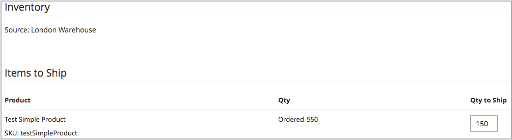

# Creazione di spedizioni multi-source

Con [!DNL Inventory Management], invia una o più spedizioni perché hai scorte. Per generare ulteriori spedizioni in base alle necessità, ripetere queste istruzioni utilizzando le quantità e le origini consigliate o inserite manualmente. Queste istruzioni descrivono in dettaglio il modo in cui i commercianti multi-sorgente inviano le spedizioni. I commercianti con una sola origine inviano le spedizioni senza questi passaggi aggiuntivi (vedi [Creare una spedizione](../stores-purchase/shipments.md#create-a-shipment){target="_blank"} nella guida utente di base).

Durante la creazione delle spedizioni, utilizza l&#39;algoritmo di selezione Source per i consigli calcolati. Segui e utilizza questi consigli o imposta gli importi per origine, generando spedizioni personalizzate. È possibile controllare le scorte in uscita per ogni ordine, impostando gli importi da detrarre, inviando una o più spedizioni e consegnando scorte e ordini inevasi quando le scorte sono disponibili. Per ogni voce dell&#39;ordine, inserire un importo da detrarre dalla quantità di origine.

È possibile inviare spedizioni parziali a:

- Esegui ordini inevasi all&#39;arrivo del magazzino

- Saldo detrazioni magazzino tra origini

Quando si inseriscono le spedizioni, le quantità di scorte disponibili detraggono gli importi inseriti. In effetti, le prenotazioni vengono convertite in detrazioni quantità effettive.

## Creare una spedizione

1. Nella barra laterale _Admin_, passa a **[!UICONTROL Sales]** > **[!UICONTROL Orders]**.

1. Individuare l&#39;ordine e aprirlo in modalità di visualizzazione.

1. Se l&#39;ordine è stato pagato e fatturato ed è pronto per la spedizione, fare clic su **[!UICONTROL Ship]**.

1. Completa la selezione Source per l’invio di prodotti per origine:

   - Per visualizzare i consigli di spedizione, fare clic su **[!UICONTROL Source Selection Algorithm]** e selezionare un algoritmo.

     | Algoritmo | Descrizione |
     |--|--|
     | [Priorità Source](source-priority-algorithm.md) | Consiglia le spedizioni dalle origini in base agli ordini delle origini assegnate alle scorte. |
     | [Priorità distanza](distance-priority-algorithm.md) | Consiglia le spedizioni dalle origini più vicine all&#39;indirizzo di spedizione in base alla distanza fisica o al tempo di consegna più breve. |

     >[!IMPORTANT]
     >
     >Quando si utilizza l&#39;algoritmo Distance Priority (Priorità distanza) per la spedizione e le route e i dati non vengono restituiti per la [modalità di calcolo](distance-priority-algorithm.md) selezionata (guida, bicicletta o deambulazione) per una spedizione, il valore predefinito di SSA è Source Priority. È inoltre consigliabile impostare la priorità [ per le origini per magazzino](stocks-prioritize-sources.md).

   - Per **[!UICONTROL Select a Source to Ship from]**, selezionare un&#39;origine per l&#39;invio di una spedizione.

   - Per ogni riga, mantenere l&#39;importo consigliato o immettere un importo specifico in **[!UICONTROL Qty to Deduct]**. Questo valore specifica l&#39;importo dedotto dal magazzino dell&#39;origine selezionata.

   - Fare clic su **[!UICONTROL Proceed to Shipment]**.

     {width="350" zoomable="yes"}

1. Esaminare la pagina _[!UICONTROL New Shipment]_e immettere eventuali modifiche aggiuntive.

   Nella sezione _[!UICONTROL Inventory]_vengono visualizzati l&#39;origine, la spedizione dei prodotti, la quantità ordinata totale e la quantità da spedire.

   {width="350" zoomable="yes"}

1. Fare clic su **[!UICONTROL Submit Shipment]** per completare.
