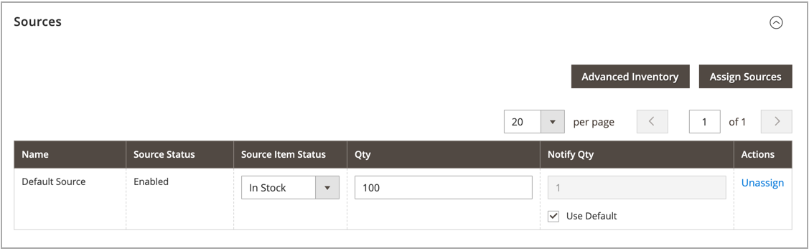

# Assegna origini per prodotto

Prima di modificare quantità e impostazioni, è necessario assegnare [sorgenti](sources-manage.md) ai prodotti.

{{$include /help/_includes/unassign-source.md}}

## Assegnare origini a un prodotto

1. Nella barra laterale _Admin_, passa a **[!UICONTROL Catalog]** > **[!UICONTROL Products]**.

1. Apri un prodotto in modalità _Modifica_.

1. Espandere  nella sezione **[!UICONTROL Sources]**.

   Questa sezione consente di modificare l&#39;origine, aggiornare le quantità di magazzino e altro ancora.

   >[!NOTE]
   >
   >Attualmente, solo i prodotti semplici, configurabili, virtuali, scaricabili e raggruppati supportano più origini. I prodotti bundle possono essere creati e gestiti solo con il Source e Stock predefiniti.

   {width="600" zoomable="yes"}

1. Per aggiungere un&#39;origine, fare clic su **[!UICONTROL Assign Sources]**.

1. Nella pagina _[!UICONTROL Assign Sources]_selezionare la casella di controllo accanto a ogni origine che si desidera assegnare per il prodotto.

   {width="600" zoomable="yes"}

1. Fare clic su **[!UICONTROL Done]** per aggiungere le origini.

1. Per salvare, effettuate una delle seguenti operazioni:

   - Fare clic su **[!UICONTROL Save]**.
   - Scegliere **[!UICONTROL Save & Close]** dal menu _[!UICONTROL Save]_().

Dopo aver assegnato le origini, aggiornare la [quantità di magazzino](quantities-assign-per-product.md) per ogni origine prodotto.

<!-- Last updated from includes: 2022-08-30 15:36:09 -->
