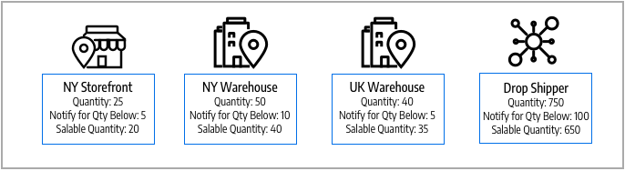

# Gestire le origini

Le origini sono le ubicazioni fisiche in cui l&#39;inventario dei prodotti viene gestito e spedito per l&#39;evasione degli ordini o in cui sono disponibili i servizi. Tali ubicazioni possono includere magazzini, magazzini fisici, centri di distribuzione, punti di prelievo e corrieri. Le quantità di magazzino vengono allocate a queste origini e [!DNL Commerce] aggrega automaticamente il totale dei prodotti vendibili per le scorte. Per le grandi aziende, aggiungi più origini per tutte le posizioni: in diverse posizioni geografiche per paese e continente, posizioni in una città, in base al tipo di inventario, anche in base ai servizi.

Durante la creazione di un’origine, si consiglia di fornire posizioni geografiche fisiche specifiche. Questo consente all&#39;algoritmo di priorità della distanza _1_ di confrontare l&#39;ubicazione dell&#39;indirizzo di destinazione della spedizione con le posizioni di origine disponibili per determinare l&#39;origine più vicina per evadere le spedizioni. È possibile utilizzare Mappe Google o calcoli offline, che utilizzano i geocodici. Per ulteriori informazioni su questo _algoritmo di priorità della distanza_, vedere [Configurare l&#39;algoritmo di priorità della distanza](distance-priority-algorithm.md).

Inizia con un _Source predefinito_ che puoi aggiornare ma non disabilitare. Questa origine viene utilizzata dai commercianti single-source e per la migrazione dei prodotti. È sempre necessaria un&#39;origine predefinita.

- **Informazioni sulla posizione** - Ogni origine include il nome, il paese, l&#39;indirizzo fisico della posizione e un punto di contatto.
- **Abilitazione delle risorse** - È possibile abilitare e disabilitare le origini in base alle esigenze. Abilitare un&#39;origine solo se accetta ed evade ordini e ordini inevasi.
- **Magazzino disponibile** - Assegna e aggiorna le quantità di magazzino per ogni origine tramite la pagina del prodotto. Le quantità di magazzino vengono calcolate, fornite e impegnate tramite il mapping di origine e di scorte.

Il diagramma seguente illustra le fonti per un commerciante di biciclette che vende una mountain bike, disponibili per le scorte e accessibili da SSA per le spedizioni.

{width="600" zoomable="yes"}

Tutti gli archivi iniziano con un Source predefinito che deve rimanere abilitato:

- Tutti i nuovi prodotti importati in [!DNL Commerce] richiedono un&#39;origine e scorte, assegnate automaticamente per l&#39;accesso immediato a [!DNL Inventory Management].
- I commercianti con una sola origine utilizzano il Source predefinito come unico punto di ubicazione del magazzino e di spedizione.

## Modifica origini

È possibile aggiornare il nome, l&#39;indirizzo, la posizione GPS e le informazioni di contatto. Il codice sorgente è un valore protetto che funge da ID univoco associando la sorgente alle quantità e alle scorte dei tuoi prodotti.

Se si modifica il Source predefinito, è possibile modificare tutte le configurazioni ad eccezione del nome e del codice. È consigliabile che i commercianti single-source aggiungano informazioni corrispondenti alla loro posizione.

Nella pagina _[!UICONTROL Manage Sources]_sono elencate tutte le ubicazioni di magazzino e le strutture di evasione disponibili. È possibile aggiungere nuove origini di magazzino e modificare le ubicazioni esistenti.

1. Nella barra laterale _Admin_, passa a **[!UICONTROL Stores]** > _[!UICONTROL Inventory]_>**[!UICONTROL Sources]**.

1. Per aggiungere un percorso di inventario, vedere [Aggiunta di un nuovo Source](sources-add.md).

1. Trova l&#39;origine inventario e aprila in modalità _Modifica_.

1. Aggiorna le informazioni e salva le modifiche.

   {width="600" zoomable="yes"}

## Barra dei pulsanti

| Pulsante | Descrizione |
|--|--|
| [!UICONTROL Add New Source] | Apre il modulo Nuovo Source utilizzato per inserire una nuova origine magazzino, una struttura di evasione o una nuova ubicazione. |

## Gestire le descrizioni delle colonne delle origini

| Colonna | Descrizione |
|--|--|
| [!UICONTROL Code] | Codice alfanumerico univoco utilizzato dal sistema per identificare l&#39;origine dell&#39;inventario. |
| [!UICONTROL Name] | Un nome univoco che identifica l’origine dell’inventario per gli utenti amministratori. |
| [!UICONTROL Is Enabled] | Indica se l&#39;origine inventario è attiva e disponibile per l&#39;uso. |
| [!UICONTROL Pickup Location] | Indica se l&#39;origine è attiva come percorso di prelievo per [consegna in-store](../stores-purchase/shipping-in-store-delivery.md). |
| [!UICONTROL Action] | Se si fa clic su **[!UICONTROL Edit]**, il record di origine dell&#39;inventario viene aperto in modalità di modifica. |

## Altre colonne

| Colonna | Descrizione |
|--- |--- |
| [!UICONTROL Latitude] | Specifica la coordinata di latitudine dell&#39;origine inventario per GPS. Immetti il valore come numero, preceduto dal segno più o meno, a seconda delle necessità. Il simbolo di grado e le lettere non sono consentiti. Esempio: `32.7555` |
| [!UICONTROL State/Province] | Stato o provincia in cui si trova l&#39;origine. |
| [!UICONTROL Postcode] | Il codice postale o ZIP dell’origine. |
| [!UICONTROL Email] | Indirizzo e-mail del contatto principale. |
| [!UICONTROL Longitude] | Specifica la coordinata della longitudine dell&#39;origine di inventario per il GPS. Immetti il valore come numero, preceduto dal segno più o meno, a seconda delle necessità. Il simbolo di grado e le lettere non sono consentiti. Ad esempio: Longitudine -97,3308 |
| [!UICONTROL City] | La città in cui si trova la sorgente. |
| [!UICONTROL Phone] | Numero di telefono del contatto primario. |
| [!UICONTROL Country] | Il paese in cui si trova la sorgente. |
| [!UICONTROL Street] | Indirizzo della sorgente. |
| [!UICONTROL Fax] | L&#39;indicativo di località e il numero di fax del contatto principale. |
