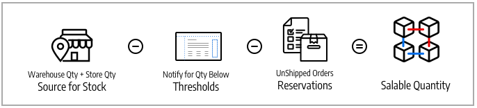

# Scorte e fonti

Gestione dell&#39;inventario indipendentemente dall&#39;ubicazione del magazzino, dal tipo di prodotto o servizio o dal canale di vendita. evadere ordini e spedire prodotti da più magazzini, magazzini fisici, centri di distribuzione e spedizione diretta per completare gli ordini con particolare attenzione a scorte equilibrate, costi di spedizione e altro ancora.

Queste descrizioni includono prodotti, fonti e scorte per una società di biciclette con più sedi di spedizione e siti web negli Stati Uniti e in Europa.

## Sorgenti

[Sorgenti](sources-manage.md) sono le ubicazioni fisiche in cui l&#39;inventario dei prodotti viene gestito e spedito per l&#39;evasione degli ordini o in cui sono disponibili i servizi. Queste sedi possono includere magazzini, negozi fisici, centri di distribuzione e corrieri diretti. [!DNL Commerce] utilizza le quantità e le quantità vendibili per magazzino e gestisce automaticamente le quantità di magazzino per i prodotti e gli ordini gestiti. Se si dispone di una fonte, si viene considerati in _fonte singola_ modalità. Se disponi di più sorgenti, puoi essere considerato _multi-source_ modalità.

Un&#39;origine può avere la priorità nell&#39;ambito delle scorte in un magazzino, ma non necessariamente in tutti i magazzini, poiché l&#39;origine può essere riutilizzata in scorte diverse. Il numero di scorte e di origini aumenta la complessità per determinare il magazzino o il negozio migliore per evadere un ordine. È possibile, ad esempio, che un numero limitato di prodotti sia disponibile presso le sedi principali con un ampio inventario nei magazzini e nei servizi in sedi chiave con disponibilità limitata.

In questo esempio, il commerciante ha una mountain bike disponibile per la spedizione da negozi, magazzini e un corriere espresso.

{width="600" zoomable="yes"}

## Scorte

[Scorte](stocks-manage.md) rappresenta un inventario virtuale e aggregato dei prodotti disponibili per la vendita ai canali di vendita (siti Web). Ogni azione mappa i canali di vendita con le origini delle scorte disponibili e delle quantità vendibili. A seconda della configurazione del sito, le scorte possono essere assegnate a uno o più canali e fonti di vendita.

I Sales Channel rappresentano le entità che vendono il proprio inventario, inclusi i siti web, le visualizzazioni dei negozi, i gruppi di clienti B2B e così via. I canali di vendita possono essere associati a un solo magazzino. A ciascun canale di vendita può essere assegnato un solo magazzino e un singolo magazzino può essere assegnato a più siti web. Attraverso le scorte, è possibile modificare la definizione delle priorità delle origini utilizzate per gli ordini di spedizione e da [Algoritmo di selezione della sorgente](selection-reservations.md).

Inizia con un Stock predefinito assegnato con l’Origine predefinita e il tuo sito web, che può essere utilizzato al meglio dai commercianti single-source. Solo l&#39;origine di default può essere assegnata a questo materiale. Se necessario, i commercianti multi-sorgente creano scorte personalizzate per origini e siti web personalizzati.

{width="600" zoomable="yes"}

## Quantità di prodotti

Quantità è il numero di prodotti nel magazzino attivo disponibili per l&#39;acquisto. La quantità di prodotti aumenta e diminuisce quando si completano le spedizioni o si adegua il magazzino. L’aggiunta di prodotti a un carrello non influisce su questa quantità. La Quantità vendibile tiene traccia della disponibilità del prodotto per un canale di vendita e utilizza questo valore anche per determinare le scorte disponibili per l&#39;acquisto. A seconda del numero di origini, è possibile visualizzare e gestire la quantità di prodotto per uno dei seguenti elementi:

- **Quantità** - Per i commercianti single-source, _[!UICONTROL Quantity]_colonna e valore tiene traccia della quantità di scorte disponibili.
- **Quantità per origine** - Per i commercianti multi-sorgente, _[!UICONTROL Quantity per Source]_colonna e valori tiene traccia delle scorte disponibili in base all&#39;ubicazione. Se si aggiungono più origini, questo valore sostituisce la Quantità ed elenca tutte le origini e le quantità assegnate.

Le prenotazioni tengono traccia delle richieste di scorte per l&#39;intero processo di acquisto, aggiungendo prodotti al carrello, completando il pagamento e gestendo i rimborsi. Per le scorte e le scorte disponibili, gli impegni riservano gli importi delle scorte per ordine tramite il processo di pagamento, sottratti dalla quantità vendibile. Gli impegni vengono convertiti in detrazioni quantità durante la fatturazione e la spedizione dei prodotti.

Quantità vendibile calcola l&#39;inventario virtuale dei prodotti (o della disponibilità), utilizzando soglie configurate, importi prenotati o venduti e quantità per origine. Per ogni stock: [!DNL Commerce] accede a tutte le origini assegnate e aggrega le quantità di prodotto associate. Con questo valore di base, sottrae tutti gli importi di prenotazione e _[!UICONTROL Notify for Quantity Below]_soglia.

{width="600" zoomable="yes"}

## Configurazioni inventario

Ogni prodotto, origine e magazzino include diverse opzioni da configurare per il negozio a livello globale, di origine, di magazzino e di prodotto. Per un elenco completo di queste opzioni, fare riferimento a [Configurazione di Inventory management](configuration.md).

Di seguito sono riportate alcune opzioni importanti da considerare per [!DNL Inventory Management]:

- **[!UICONTROL Out-of-Stock Threshold]** - Imposta un importo da sottrarre dalla quantità di vendita. Se si abilita Ordini inevasi, questo valore non viene detratto dalla quantità vendibile.
- **[!UICONTROL Backorders]** - Determina se i prodotti possono essere venduti oltre lo zero scorte, risparmiando gli ordini fino alla ricostituzione delle scorte. Quando gli ordini inevasi sono abilitati, la configurazione [!UICONTROL Out-of-Stock Threshold] è consigliato.

>[!NOTE]
>
>Il valore Soglia scorte esaurite supporta gli importi negativi e positivi. Se abiliti gli ordini in inevaso, imposta questo valore su un importo negativo per il numero massimo di prodotti che possono essere messi in inevaso prima che il prodotto sia considerato esaurito.

## Demo di Inventory management

Guarda questo video per scoprire le origini e le scorte di Inventory management:

>[!VIDEO](https://video.tv.adobe.com/v/343748?quality=12)
