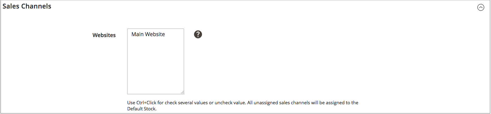

# Aggiungi un titolo

Le scorte associano le fonti ai canali di vendita (o ai siti Web), fornendo un collegamento diretto alle quantità vendibili e agli inventari dei prodotti.

Quando crei un magazzino personalizzato, assegni siti web e sorgenti. Le origini possono includere origini abilitate e disabilitate. Ad esempio, è possibile aggiungere una warehouse alle scorte, preparando l&#39;apertura dell&#39;ubicazione per la gestione delle scorte e il completamento delle spedizioni.

Dopo aver aggiunto le origini, devi assegnare la priorità all’ordine delle origini, dall’alto (primo) al basso (ultimo). Questo ordine influisce sui consigli durante la spedizione dell&#39;ordine.

{width="600" zoomable="yes"}

## Aggiungere le scorte di magazzino

1. Nella barra laterale _Admin_, passa a **[!UICONTROL Stores]** > _[!UICONTROL Inventory]_>**[!UICONTROL Stock]**.

1. Fare clic su **[!UICONTROL Add New Stock]**.

1. Espandere  nella sezione **[!UICONTROL General]** e immettere un **[!UICONTROL Name]** univoco per identificare il nuovo titolo.

   {width="350" zoomable="yes"}

1. Espandere  nella sezione **[!UICONTROL Sales Channels]** e selezionare **[!UICONTROL Websites]** in cui è disponibile questa azione.

   Per eseguire un&#39;installazione multisito, tenere premuto il tasto Ctrl (PC) o il tasto Comando (Mac) e fare clic su ciascun sito Web.

   >[!NOTE]
   >
   >Se si seleziona un sito Web o un canale di vendita assegnato a un altro titolo, l&#39;assegnazione verrà annullata. Tutti i Sales Channel non assegnati a un magazzino personalizzato vengono assegnati al magazzino predefinito.

   Opzioni {width="350" zoomable="yes"}

1. Espandere  nella sezione **[!UICONTROL Sources]** ed eseguire le operazioni seguenti per qualsiasi azione diversa da quella predefinita:

   - Fare clic su **[!UICONTROL Assign Sources]**.

   {width="350" zoomable="yes"}

   - Selezionare le caselle di controllo per tutte le origini che si desidera assegnare al materiale.

   >[!IMPORTANT]
   >
   >Se si assegna la stessa origine a più scorte, si potrebbero verificare vendite in eccesso dei prodotti assegnati a tale origine.

   - Fare clic su **[!UICONTROL Done]**.

     Le origini aggiunte vengono visualizzate in Origini assegnate.

     {width="600" zoomable="yes"}

1. Utilizza  per trascinare e rilasciare le origini in una priorità dall&#39;alto (primo) al basso (ultimo).

   L&#39;ordine di origine è importante per gli ordini di spedizione.

   {width="600" zoomable="yes"}

1. Scegliere **[!UICONTROL Save & Close]** dal menu _[!UICONTROL Save]_().

## Descrizioni dei campi

| Campo | Descrizione |
|--|--|
| **[!UICONTROL General]** | |
| [!UICONTROL Name] | Nome del titolo. Esempio: `UK Stock`, `US Stock` |
| **[!UICONTROL Sales Channels]** | |
| [!UICONTROL Websites] | Definisce l&#39;[ambito](../getting-started/websites-stores-views.md#scope-settings) del titolo assegnando il titolo a siti Web specifici come _canali di vendita_. Selezionare uno o più siti Web per azione. Ogni sito web può essere assegnato a un solo stock. |
| **[!UICONTROL Sources]** | |
| [!UICONTROL Assign Sources] | Assegna le origini magazzino a questo magazzino. Le origini personalizzate non possono essere assegnate al magazzino predefinito. |
| [!UICONTROL Assigned Sources] | Elenco delle origini assegnate. Trascina e rilascia le origini utilizzando  in un ordine prioritario per l&#39;evasione e la spedizione degli ordini.  **[!UICONTROL Code]**- ID di codice univoco per l&#39;origine. **[!UICONTROL Name]** - Descrizione del nome per l&#39;origine. **[!UICONTROL Unassign]**- Rimuovi l&#39;origine assegnata dal titolo utilizzando . |
