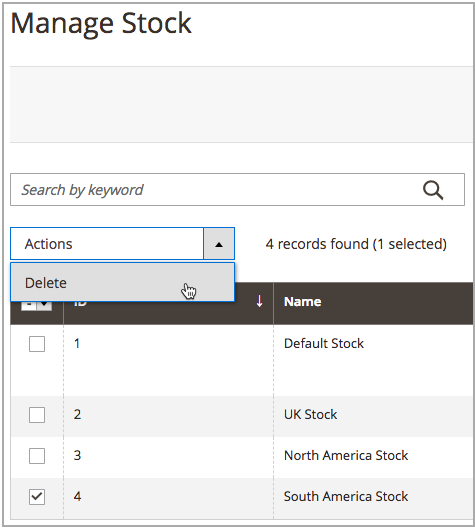

# Elimina scorte

Quando si elimina il materiale, tutti i siti Web assegnati vengono assegnati al materiale predefinito. Si consiglia di riassegnare i siti web ad altri stock prima di eliminarli.

>[!IMPORTANT]
>
>L&#39;eliminazione di un [magazzino](stocks-manage.md) può influire sulle quantità vendibili e sugli ordini non elaborati per un canale di vendita. Se si continua a utilizzare un canale di vendita, aggiungere il canale di vendita a un altro titolo esistente o nuovo.

1. Nella barra laterale _Admin_, passa a **[!UICONTROL Stores]** > _[!UICONTROL Inventory]_>**[!UICONTROL Stocks]**.

1. Seleziona uno o più stock da eliminare.

   Sfoglia o cerca e seleziona le caselle di controllo per i titoli che desideri eliminare.

1. Dal menu **[!UICONTROL Actions]**, selezionare **[!UICONTROL Delete]**.

   {width="350" zoomable="yes"}

1. Nella finestra di dialogo di conferma, fare clic su **[!UICONTROL OK]**.

   Le scorte vengono eliminate e tutti i canali di vendita assegnati non vengono mappati.

   {width="350" zoomable="yes"}
