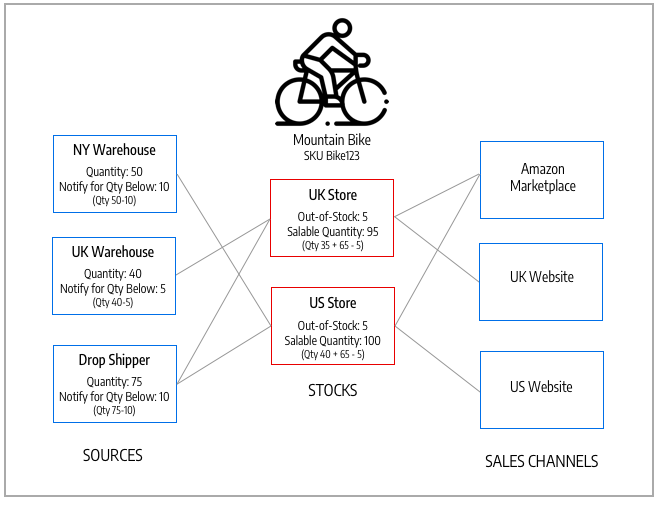

# Gestisci azioni

Le scorte rappresentano un inventario virtuale e aggregato dei prodotti per le origini dei canali di vendita (siti Web). A seconda della configurazione del sito, le scorte possono essere assegnate a uno o più canali di vendita. A ciascun canale di vendita può essere assegnato un solo magazzino e un singolo magazzino può essere assegnato a più canali di vendita. Attraverso le scorte, è possibile modificare la definizione delle priorità delle origini utilizzate quando gli ordini vengono inoltrati tramite un canale di vendita.

Si inizia con un Stock predefinito che non può essere rimosso o disabilitato. È possibile aggiungere ulteriori canali di vendita solo alle scorte. L&#39;unica origine assegnata è Default Source. Questo stock viene utilizzato da commercianti single-source, integrazioni di terze parti e prodotti importati.

I Sales Channel rappresentano le entità che vendono il proprio inventario. Per impostazione predefinita, [!DNL Commerce] fornisce i siti Web dei tuoi negozi come canali di vendita. I canali di vendita possono essere estesi per supportare canali aggiuntivi, come gruppi di clienti B2B e visualizzazioni dei punti vendita. Ogni canale di vendita può essere associato a un solo Stock.

- **Supporto Sales Channel** - I canali di vendita includono attualmente siti Web preconfigurati. Puoi estendere i canali di vendita per includere opzioni personalizzate, come gruppi di clienti B2B e visualizzazioni del negozio. A ciascun canale di vendita può essere assegnato un solo stock. Un singolo stock può essere assegnato a più canali di vendita.
- **Mappa su origini** - A ogni stock possono essere assegnate una o più origini abilitate o disabilitate, calcolando l&#39;inventario aggregato virtuale per prodotto.
- **Evasione ordine prioritario** - L&#39;algoritmo di priorità predefinito per l&#39;algoritmo di selezione Source utilizza l&#39;elenco di origine delle scorte dall&#39;alto verso il basso per l&#39;esecuzione degli ordini.

Il diagramma seguente consente di definire il funzionamento di un magazzino in relazione a origini e Sales Channel per un commerciante di un negozio di biciclette.

{width="600" zoomable="yes"}

## Esempi di scorte per mountain bike e store

Tutti i negozi iniziano con un Magazzino predefinito. Deve rimanere `Enabled` per i seguenti motivi:

- Viene utilizzato durante l&#39;importazione di nuovi prodotti, assegnando automaticamente i prodotti all&#39;origine e al magazzino predefiniti per l&#39;accesso immediato a [!DNL Inventory Management].
- Non è possibile aggiungere altre origini oltre al Source predefinito a questo stock.
- È richiesto e utilizzato da commercianti single-source, prodotti bundle e prodotti raggruppati.

Per i commercianti multi-sorgente, crea e configura le scorte in modo che si adattino al meglio ai tuoi negozi e all’evasione degli ordini. Quando si assegnano nuove scorte a un canale di vendita, tutte le scorte preesistenti in tale canale di vendita vengono annullate.

Per un&#39;installazione in più store, il magazzino predefinito viene inizialmente assegnato al [sito Web principale](../stores-purchase/stores.md#add-websites){target="_blank"} e all&#39;archivio predefinito. Le scorte e le quantità corrette vengono visualizzate per i prodotti abilitati e disabilitati nella visualizzazione griglia **[!UICONTROL Products]**.

{width="600" zoomable="yes"}

## Barra dei pulsanti

| Pulsante | Descrizione |
|--|--|
| [!UICONTROL Add New Stock] | Apre il modulo _[!UICONTROL New Stock]_utilizzato per immettere una nuova scorta di magazzino per la mappatura del magazzino al canale di vendita. |

## Descrizioni delle colonne Gestisci scorte

| Colonna | Descrizione |
|--|--|
| [!UICONTROL ID] | ID numerico univoco generato per l&#39;entrata di magazzino. |
| [!UICONTROL Name] | Nome univoco che identifica le scorte di magazzino. |
| [!UICONTROL Sales Channels] | Definisce l&#39;ambito del titolo assegnando il titolo a siti Web specifici come _canali di vendita_. |
| [!UICONTROL Assigned sources] | Origini assegnate alle scorte che forniscono tutte le quantità di prodotto. |
| [!UICONTROL Action] | **[!UICONTROL Edit]** - Apre il record delle scorte di magazzino in modalità di modifica. |
