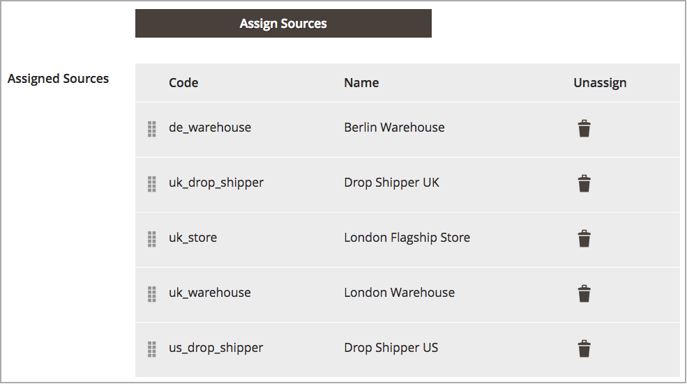

# Assegnazione di priorità alle origini per un magazzino

Dopo aver aggiunto [sorgenti](sources-manage.md) al [magazzino](stocks-manage.md), disponi tali sorgenti dall&#39;alto verso il basso in priorità per l&#39;esecuzione degli ordini. L&#39;algoritmo di selezione Source (SSA) fornisce un algoritmo Priorità che utilizza questo ordine per determinare le detrazioni di spedizione e di magazzino.

La priorità di origine sulle scorte non influenza le origini assegnate durante la modifica degli inventari dei prodotti.

In questo esempio, le origini di UK Stock vengono assegnate fuori servizio a un negozio, a due magazzini a Londra e a un magazzino a Berlino.

{width="350" zoomable="yes"}

Il mercante preferisce avere spedizioni prioritarie dal più grande magazzino di Berlino, poi il magazzino di Londra, la posizione di traboccamento di Londra e infine la vetrina a Londra. Per modificare l&#39;ordine, le voci vengono trascinate nell&#39;ordine desiderato.

1. Nella barra laterale _Admin_, passa a **[!UICONTROL Stores]** > _[!UICONTROL Inventory]_>**[!UICONTROL Stocks]**.

1. Apri il titolo in modalità _Modifica_.

1. Espandere la scheda _[!UICONTROL Sources]_, se necessario.

1. Utilizza  per trascinare e rilasciare le origini in una priorità dall&#39;alto (primo) al basso (ultimo).

   Questo ordine è importante per gli ordini di spedizione. SSA consiglia spedizioni in base all&#39;ordine delle origini

1. Fare clic su **[!UICONTROL Save & Continue]** per salvare le modifiche.

{width="350" zoomable="yes"}
