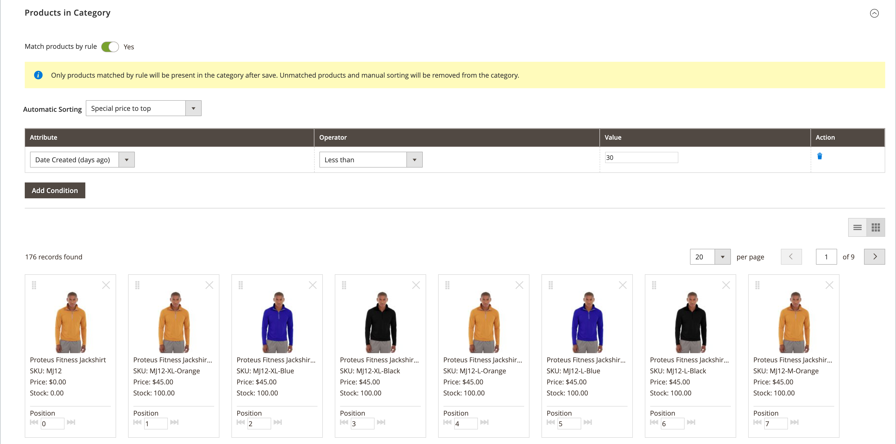

# Regole di categoria per merchandising

{{ee-feature}}

Le regole di categoria modificano dinamicamente la selezione del prodotto in base a una serie di condizioni. Ogni categoria può avere una sola regola di categoria, anche se la singola regola può avere più condizioni. Ad esempio, puoi creare una regola di categoria per un marchio specifico. I prodotti dello stesso marchio vengono aggiunti automaticamente all’elenco, anche se non sono assegnati alla stessa categoria. Puoi aggiungere all’espressione tutte le condizioni necessarie per descrivere i prodotti che desideri includere.

>[!TIP]
>
>Durante la configurazione della regola di categoria, i prodotti sono _ordinati_, _corrispondenti_, _assegnati_ e _non assegnati_ in base a tale regola **_solo_** quando la categoria viene salvata. Ad esempio, se si aggiunge un prodotto al catalogo e si desidera assegnarlo in base alla regola, è **necessario salvare nuovamente ogni categoria** impostata in modo che corrisponda ai prodotti per regola. Inoltre, se lo stato delle scorte dei prodotti viene modificato in `In Stock` o `Out of Stock` e i prodotti della categoria devono essere _ordinati_ in base alla regola **[!UICONTROL Automatic Sorting]**, è necessario fare clic su **[!UICONTROL Save Category]**.

Ogni condizione è costituita da un attributo, un valore e un operatore logico. Solo gli attributi con la proprietà _[[!UICONTROL Use in Product Listing]](../catalog/attribute-product-create.md)_impostata su `Yes` possono essere utilizzati nelle regole di categoria. È necessario impostare questa proprietà per l&#39;attributo se si desidera utilizzare un attributo non incluso negli elenchi di prodotti. Sebbene gli attributi di data non siano supportati, è possibile utilizzare gli attributi Data di creazione o Data di modifica per definire una data o un intervallo di date. Ad esempio, per includere solo i prodotti creati nell&#39;ultima settimana, impostare &quot;Date Created&quot; (Data di creazione) su un valore di `<7`.

>[!NOTE]
>
>Assicurati di configurare ogni attributo utilizzato nella regola come attributo [_smart_](smart-attributes-configure.md).

{width="600" zoomable="yes"}

Le regole per prodotti di categoria possono accelerare il processo di assegnazione di prodotti specifici alle categorie, in base alle condizioni che determinano quali prodotti vengono visualizzati nella categoria. Gli attributi &quot;avanzati&quot; che possono essere utilizzati con le regole dei prodotti di categoria sono specificati nella configurazione [Visual Merchandiser](visual-merchandiser.md).

>[!NOTE]
>
>Presta attenzione quando applichi una regola di prodotto per categoria, in quanto tutti i prodotti che non soddisfano la condizione vengono rimossi dalla categoria. Ad esempio, se si crea una regola che include solo i piani dei serbatoi viola, tutti gli altri vengono rimossi dalla categoria.

## Passaggio 1: configurare gli attributi _smart_

1. Per ogni attributo da utilizzare nella regola, assicurarsi che la proprietà storefront [[!UICONTROL Use in Product Listing]](../catalog/product-attributes.md) sia impostata su `Yes`.

   >[!NOTE]
   >
   >Verificare che l&#39;attributo selezionato NON sia un elemento _[!UICONTROL Input Type]_a selezione multipla.

1. Completare la [configurazione](smart-attributes-configure.md) per identificare ogni attributo _smart_ da utilizzare con Visual Merchandiser.

## Passaggio 2: creare la regola della categoria

1. Nell&#39;albero delle categorie aprire la categoria da modificare.

1. Nella sezione **[!UICONTROL Products in Category]**, impostare **[!UICONTROL Match products by rule]** su `Yes`.

   Vengono visualizzate le opzioni di ordinamento e condizione automatiche.

1. Fare clic su **[!UICONTROL Add Condition]**.

1. Scegliere **[!UICONTROL Attribute]** che è la base della condizione.

1. Imposta **[!UICONTROL Operator]** su uno dei seguenti:

   - `Equal`
   - `Not equal`
   - `Greater than`
   - `Greater than or equal to`
   - `Less than`
   - `Less than or equal to`
   - `Contains`

1. Immettere il **[!UICONTROL Value]** a cui deve corrispondere la corrispondenza.

   {width="500"}

1. Ripetere questo processo per ogni attributo necessario per descrivere le condizioni da soddisfare.

   Ad esempio, per trovare i prodotti creati tra sette e 30 giorni fa, effettua le seguenti operazioni:

   - Imposta **[!UICONTROL Date Created]** su `Less than 30`.

   - Imposta **[!UICONTROL Logic]** su `AND`.

     >[!NOTE]
     >
     >Quando scegli `AND`, la regola si applica ai prodotti in cui sono soddisfatte tutte le condizioni. Quando si sceglie `OR`, viene applicato ai prodotti in cui è soddisfatta almeno una condizione.

   - Imposta **[!UICONTROL Date Modified]** su `Greater than 7`.

1. Per applicare automaticamente un ordinamento all&#39;elenco di prodotti generato in modo dinamico, impostare **[!UICONTROL Automatic Sorting]**.

   {width="600" zoomable="yes"}

   Le opzioni di ordinamento vengono definite a livello globale e applicate in base alle condizioni correnti. Non è possibile impostare un ordinamento diverso per il livello di visualizzazione del sito Web, dello store o dello store.

   | Opzione di ordinamento | Descrizione |
   |-----------| -----------|
   | [!UICONTROL Stock quantity] | Ordina in base al magazzino, dall&#39;alto o dal basso: `Move low stock to top` o `Move out of stock to bottom` |
   | [!UICONTROL Special price] | Ordina in base al prezzo, dall&#39;alto o dal basso: `Special price to top` o `Special price to bottom` |
   | [!UICONTROL New Products] | Elenca prodotti più recenti: `Newest products first` |
   | [!UICONTROL Color] | Ordina alfabeticamente per colore: `Sort by color` |
   | [!UICONTROL Product Names] | Ordina per nome in ordine crescente o decrescente: `Name A - Z` o `Name Z -A` |
   | [!UICONTROL SKU] | Ordina per SKU in ordine crescente o decrescente: `SKU: Ascending` o `SKU: Descending` |
   | [!UICONTROL Price] | Ordina per prezzo in ordine crescente o decrescente: `Price: High to low` o `Price: Low to high` |

   {style="table-layout:auto"}

1. Al termine, fare clic su **[!UICONTROL Save Category]**.

>[!NOTE]
>
>Quando si imposta una regola di categoria, i prodotti vengono associati e assegnati alla regola al momento del salvataggio della categoria. Se si aggiunge un prodotto al catalogo e si desidera includerlo nella regola, è necessario salvare nuovamente ogni categoria impostata in modo che corrisponda ai prodotti per regola. In questo modo il nuovo prodotto sarà incluso.

### Opzioni del menu

- **[!UICONTROL Match products by rule]** - Determina se l&#39;elenco dei prodotti nella categoria viene generato in modo dinamico da una regola di categoria. Opzioni: `Yes` / `No`

- **[!UICONTROL Automatic Sorting]** - Applica automaticamente un ordinamento all&#39;elenco dei prodotti della categoria. Opzioni: `None`, `Move low stock to top`, `Move low stock to bottom`, `Special price to top`, `Special price to bottom`, `Newest products first`, `Sort by color`, `Name: A - Z`, `Name: Z - A`, `SKU: Ascending`, `SKU: Descending`, `Price: High to Low` e `Price: Low to High`

  >[!NOTE]
  >
  >Se si dispone di un prodotto configurabile con prodotti secondari, il magazzino del prodotto principale viene calcolato in base al totale combinato dei magazzini dei prodotti secondari. Prendi in considerazione un esempio in cui hai configurato il prodotto _Proteus Fitness Shirt_ con prodotti secondari arancioni, rossi e gialli con diverse quantità di scorte di ciascuno. Il magazzino del prodotto principale viene calcolato in base al totale combinato dei prodotti secondari arancioni, rossi e gialli. Con l&#39;opzione `Move low stock to top`, viene calcolata la scorta di prodotti padre combinando tutte le scorte di prodotti figlio vendibili e ordinandole di conseguenza.

- **[!UICONTROL Add Condition]** - Aggiunge un&#39;altra condizione alla regola.

- **[!UICONTROL Attribute]** - Determina l&#39;attributo utilizzato come base della condizione. Opzioni:

  | Opzione | Descrizione |
  | ------ | ----------- |
  | `Clone Category ID(s)` | Duplica in modo dinamico i prodotti, senza ordinamento e ordine, da più categorie in base all’ID categoria. |
  | `Color` | Include prodotti in base al colore. |
  | `Date Created (days ago)` | Include i prodotti in base al numero di giorni da quando i prodotti sono stati aggiunti al catalogo. |
  | `Date Modified (days ago)` | Include i prodotti in base al numero di giorni dall’ultima modifica dei prodotti. |
  | `Name` | Include prodotti in base al nome del prodotto. |
  | `Price` | Include prodotti in base al prezzo. Questo attributo non è applicabile per i prodotti configurabili perché non hanno un proprio prezzo. |
  | `Quantity` | Include i prodotti in base alla quantità in magazzino. |
  | `SKU` | Include prodotti basati su SKU. |

  {style="table-layout:auto"}

  >[!NOTE]
  >
  >La quantità di un prodotto configurabile con opzioni figlio viene calcolata combinando tutte le quantità di prodotti figlio vendibili. Prendi in considerazione un esempio in cui si dispone di un prodotto configurabile _Basic Fitness Tank_ con opzioni di colore viola, rosso e giallo e diverse quantità di ciascuno. In questo caso, la quantità del prodotto principale (Canotta fitness di base) è la quantità vendibile combinata dei prodotti secondari di colore viola, rosso e giallo.

- **[!UICONTROL Operator]** - Specifica l&#39;operatore applicato al valore dell&#39;attributo per soddisfare la condizione. A meno che non sia specificato un operatore, viene utilizzato `Equal` come valore predefinito. Opzioni: `Equal`, `Not equal`, `Greater than`, `Greater than or equal to`, `Less than`, `Less than or equal to` e `Contains`

- **[!UICONTROL Value]** - Specifica il valore che l&#39;attributo deve soddisfare la condizione.

- **[!UICONTROL Logic]** - La colonna Logica viene utilizzata per definire più condizioni e viene visualizzata solo quando viene aggiunta un&#39;altra condizione. Gli operatori seguono le regole di precedenza per [operatori booleani](https://dev.mysql.com/doc/refman/8.0/en/operator-precedence.html) MySQL. Opzioni: `AND` / `OR`
