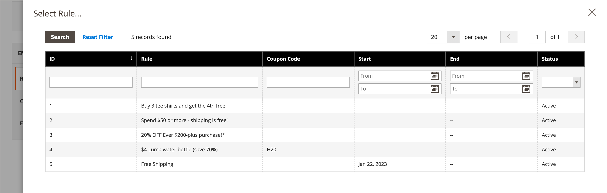
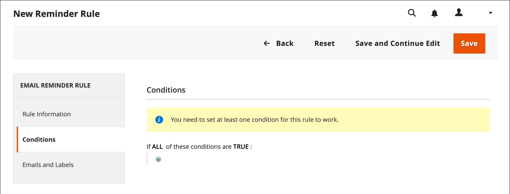
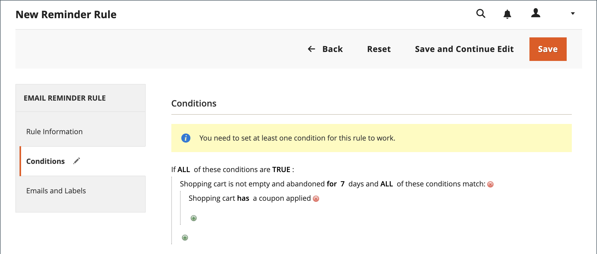
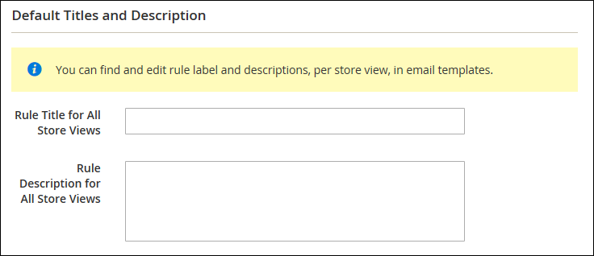

# Creare promemoria e-mail

Prima di impostare una regola di promemoria e-mail, devi prima [impostare una regola del prezzo del carrello](price-rules-cart-create.md) per definire la promozione offerta. Le condizioni delle regole che attivano un promemoria e-mail possono essere basate sulle proprietà del carrello, sulla lista dei desideri o su entrambe.

>[!NOTE]
>
>I promemoria e-mail possono promuovere una regola di prezzo del carrello con o senza un coupon. Una regola di prezzo del carrello che definisce un coupon generato automaticamente genera un codice coupon casuale per ciascun cliente.

1. Nella barra laterale _Admin_, passa a **[!UICONTROL Marketing]** > _[!UICONTROL Communications]_>**[!UICONTROL Email Reminder Rules]**.

1. Nell&#39;angolo superiore destro fare clic su **[!UICONTROL Add New Rule]**.

1. Completa _[!UICONTROL Rule Information]_&#x200B;come segue:

   {width="700" zoomable="yes"}

   - Immettere **[!UICONTROL Rule Name]** per identificare la regola internamente.

   - Immettere un breve **[!UICONTROL Description]** della regola.

   - Per scegliere la promozione **[!UICONTROL Cart Price Rule]** che questo promemoria deve annunciare, fare clic su **[!UICONTROL Select Rule…]** e selezionare la regola.

     {width="600" zoomable="yes"}

   - Se si desidera che la regola venga applicata immediatamente, impostare **[!UICONTROL Status]** su `Active`.

   - Per impostare un intervallo di date per l&#39;attivazione della regola, immettere le date **[!UICONTROL From]** e **[!UICONTROL To]**.

     È inoltre possibile scegliere la data dal Calendario (  ).

   - Per inviare il promemoria più di una volta, immettere il numero di giorni prima dell&#39;esplosione dell&#39;e-mail successiva nel campo **[!UICONTROL Repeat Schedule]**.

1. Nel pannello a sinistra, scegli **[!UICONTROL Conditions]**.

   È necessario definire almeno una condizione per la regola. Il processo è simile alla creazione di una regola del prezzo di catalogo [.](price-rules-catalog.md)

   {width="600" zoomable="yes"}

   Fai clic su _Aggiungi_ ( ) per visualizzare l&#39;elenco delle opzioni, quindi scegli una delle seguenti condizioni:

   - Lista dei desideri
   - Carrello

   >[!NOTE]
   >
   >Se un cliente ha più di un carrello abbandonato, una lista dei desideri o una combinazione di entrambi, il promemoria e-mail viene attivato una sola volta per quel cliente. Per attivare nuovamente lo stesso promemoria e-mail, utilizzare il campo _[!UICONTROL Repeat Schedule]_&#x200B;per impostare il numero di giorni tra le e-mail.  
   >
   >Lo stesso promemoria e-mail è **_non riattivato_** per lo stesso cliente per **_nuovi_** carrelli abbandonati ed elenchi di desideri **_dopo_** il periodo _[!UICONTROL Repeat Schedule]_&#x200B;è terminato.
   >
   >Adobe Commerce as a Cloud Service dispone di una funzione sperimentale che consente di applicare più volte una singola regola. Per ulteriori informazioni, consulta [Ripetibilità regola](#rule-repeatability).

   Completa la condizione per descrivere lo scenario che attiva il promemoria e-mail.

   {width="600" zoomable="yes"}

1. Nel pannello a sinistra, scegli **[!UICONTROL Emails and Labels]**.

   {width="600" zoomable="yes"}

1. Nella sezione **[!UICONTROL Email Templates]**, scegli il modello di e-mail da utilizzare per ogni sito Web e visualizzazione store nella [gerarchia store](../getting-started/websites-stores-views.md).

   Se non desideri inviare l&#39;e-mail di promemoria ai clienti di una visualizzazione archivio, lascia il valore `Not Selected`.

1. Nella sezione _Titoli e descrizione predefiniti_ eseguire le operazioni seguenti:

   - Immettere **[!UICONTROL Rule Title for All Store Views]**.

     >[!NOTE]
     >
     >Questo valore può essere incorporato nei modelli e-mail utilizzando la variabile `promotion_name`.

   - Immettere **[!UICONTROL Rule Description for All Store Views]**.

     {width="500" zoomable="yes"}

   - Nella sezione _[!UICONTROL Titles and Descriptions Per Store View]_, immettere **[!UICONTROL Rule Title]**&#x200B;e **[!UICONTROL Description]**&#x200B;per la_ Visualizzazione archivio predefinita _. Per più visualizzazioni dello store, immetti il titolo e la descrizione appropriati per ciascuna di esse.

     >[!NOTE]
     >
     >La descrizione può essere incorporata nei modelli e-mail utilizzando la variabile promotion_description.

     {width="500" zoomable="yes"}

1. [!BADGE Solo SaaS]{type=Positive url="https://experienceleague.adobe.com/en/docs/commerce/user-guides/product-solutions" tooltip="Applicabile solo ai progetti Adobe Commerce as a Cloud Service e Adobe Commerce Optimizer (infrastruttura SaaS gestita da Adobe)."} Se utilizzi [!DNL Adobe Commerce as a Cloud Service], puoi abilitare la [ripetibilità della regola](#rule-repeatability) selezionando la casella di controllo [!UICONTROL Rule Repeatability].

   >[!IMPORTANT]
   >
   >L&#39;opzione di ripetibilità della regola è una funzione sperimentale disattivata per impostazione predefinita.  Per informazioni dettagliate sull&#39;abilitazione dell&#39;opzione, vedere [Ripetibilità delle regole](#rule-repeatabilty).

1. Al termine, fare clic su **[!UICONTROL Save]**.

## Ripetibilità delle regole

[!BADGE Solo SaaS]{type=Positive url="https://experienceleague.adobe.com/en/docs/commerce/user-guides/product-solutions" tooltip="Applicabile solo ai progetti Adobe Commerce as a Cloud Service e Adobe Commerce Optimizer (infrastruttura SaaS gestita da Adobe)."}

>[!IMPORTANT]
>
>Questa è una feature sperimentale e non è attivata per impostazione predefinita. Per abilitarlo, contatta il tuo Customer Success Manager Adobe Commerce o crea un ticket di supporto. Sarà reso disponibile a tutti i clienti Adobe Commerce as a Cloud Service in una versione futura.

La ripetibilità delle regole consente di riutilizzare una singola regola per più promemoria e-mail. Questa opzione è utile quando desideri che la regola venga applicata allo stesso cliente in un secondo momento. Senza la ripetibilità delle regole, la regola non si applica più dopo che un cliente ha cancellato il carrello o completato un acquisto.

Se si seleziona la casella di controllo **[!UICONTROL Rule Repeatability]** nella scheda **[!UICONTROL General Information]**, la regola potrà essere nuovamente applicata agli utenti dopo che l&#39;attivazione della regola originale non sarà più applicabile.

{width="600" zoomable="yes"}

>[!BEGINSHADEBOX]

Prendi in considerazione l’esempio seguente:

Hai una regola del carrello abbandonata che viene attivata dopo 1 giorno e si riattiva 3 e 5 giorni dopo. Un utente abbandona un carrello e 1 giorno dopo riceve un promemoria e-mail del carrello abbandonato. Dopo 2 giorni, l’utente decide di completare l’acquisto. Il carrello non viene più abbandonato. 10 giorni dopo, l’utente abbandona un nuovo carrello con articoli diversi.

- Se **[!UICONTROL Rule Repeatability]** è abilitato, l&#39;utente riceve un nuovo promemoria e-mail del carrello abbandonato.
- Se **[!UICONTROL Rule Repeatability]** è disabilitato, l&#39;utente **non** riceve altri promemoria e-mail del carrello abbandonato.

>[!ENDSHADEBOX]

## Condizioni di attivazione

| Source | Trigger |
|--- |--- |
| [!UICONTROL Wish List] | [!UICONTROL Conditions Combination] [!UICONTROL Sharing] [!UICONTROL Number of Items] [!UICONTROL Items Sub selection] |
| [!UICONTROL Shopping Cart] | [!UICONTROL Conditions Combination] [!UICONTROL Coupon Code] [!UICONTROL Cart Line Items] [!UICONTROL Items Quantity] [!UICONTROL Virtual Only] [!UICONTROL Total Amount] [!UICONTROL Items Subselection] |

{style="table-layout:auto"}

## Descrizioni dei campi

| Campo | Descrizione |
|--- |--- |
| [!UICONTROL Rule Name] | Il nome della regola di promemoria automatico identifica la regola internamente. |
| [!UICONTROL Description] | Descrizione della regola per riferimento interno. |
| [!UICONTROL Shopping Cart Price Rule] | La regola del carrello associata a questo promemoria e-mail. Le e-mail di promemoria possono promuovere una regola di prezzo del carrello con o senza coupon. Se una regola del prezzo del carrello include un coupon generato automaticamente, la regola di promemoria genera un codice coupon casuale e univoco per ciascun cliente. |
| [!UICONTROL Assigned to Website] | I siti Web che ricevono e-mail di promemoria automatico in base a questa regola. |
| [!UICONTROL Status] | Attiva la regola. Se lo stato è inattivo, tutte le altre impostazioni vengono ignorate e la regola non viene attivata. Opzioni: `Active` / `Inactive` |
| [!UICONTROL From Date] | Data di inizio per questa regola di promemoria automatico. Se non viene specificata alcuna data, la regola diventa immediatamente attiva. |
| [!UICONTROL To Date] | Data di fine per questa regola di promemoria automatico. Se non viene specificata alcuna data, la regola diventa attiva a tempo indeterminato. |
| [!UICONTROL Repeat Schedule] | Il numero di giorni prima dell’attivazione della regola e dell’e-mail di promemoria inviata nuovamente, purché siano soddisfatte le condizioni. Per attivare la regola più di una volta, immetti il numero di giorni precedenti all’esplosione dell’e-mail successiva, separati da una virgola. Ad esempio, immettere `7` per attivare nuovamente la regola sette giorni dopo; immettere `7,14` per attivare la regola tra sette giorni e di nuovo 14 giorni dopo. |
| [!UICONTROL Email Templates] | Determina il modello e-mail da utilizzare per ogni visualizzazione store. |
| [!UICONTROL Rule Title for All Store Views] | Determina il titolo della regola per ogni visualizzazione store. |
| [!UICONTROL Rule Description for All Store Views] | Determina la descrizione della regola per ogni visualizzazione store. |

{style="table-layout:auto"}
