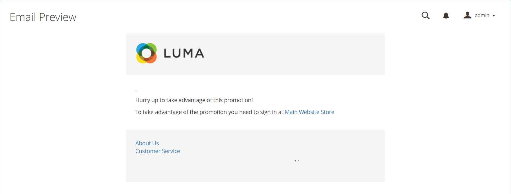

# Promemoria e-mail

{{ee-feature}}

Lo scopo di un promemoria e-mail è quello di incoraggiare le persone che hanno visitato il tuo negozio ad approfittare di una promozione e fare un acquisto. I promemoria e-mail possono essere inviati automaticamente ai clienti quando viene soddisfatta una specifica serie di condizioni. Ad esempio, puoi inviare un promemoria ai clienti che hanno aggiunto qualcosa al carrello o alla lista dei desideri, ma che non hanno ancora effettuato un acquisto. Puoi utilizzare i promemoria e-mail per incoraggiare i clienti a tornare al tuo store e includere un [codice coupon](price-rules-cart-coupon.md) come incentivo. I codici coupon possono essere generati automaticamente per ogni batch di promemoria e-mail, per darti il controllo sulle offerte associate a ogni batch.

I promemoria e-mail possono essere attivati dopo un numero specifico di giorni dall’abbandono di un carrello o per qualsiasi altra condizione che desideri definire. Le condizioni comuni includono il valore totale del carrello, la quantità, gli articoli nel carrello e così via.

>[!NOTE]
>
>Se un cliente ha più di un carrello abbandonato, una lista dei desideri o una combinazione di entrambi, il promemoria e-mail viene attivato una sola volta per quel cliente. Per attivare nuovamente lo stesso promemoria e-mail, utilizzare il campo _[!UICONTROL Repeat Schedule]_per impostare il numero di giorni tra le e-mail.

{width="700" zoomable="yes"}

## Configurare i promemoria e-mail

Le regole dei promemoria e-mail possono essere inviate a intervalli regolari al minuto, all’ora o al giorno. La configurazione determina il numero di e-mail inviate in un batch e l’identità dell’archivio visualizzata come mittente del messaggio.

1. Nella barra laterale _Admin_, passa a **[!UICONTROL Stores]** > _[!UICONTROL Settings]_>**[!UICONTROL Configuration]**.

1. Nel pannello a sinistra, espandi **[!UICONTROL Customers]** e scegli **[!UICONTROL Promotions]**.

1. Espandere  nella sezione **[!UICONTROL Automated Email Reminder Rules]** ed effettuare le seguenti operazioni:

   {width="600" zoomable="yes"}

   - Imposta **[!UICONTROL Enable Reminder Emails]** su `Yes`.

   - Per impostare la frequenza di esecuzione degli assegni per i nuovi clienti che qualificano i promemoria e-mail automatizzati, impostare **[!UICONTROL Frequency]** su uno dei seguenti valori:

      - `Minute Intervals`
      - `Hourly`
      - `Daily`

   - Impostare **[!UICONTROL Interval]** appropriato in base all&#39;impostazione _[!UICONTROL Frequency]_.

   - Impostare **[!UICONTROL Start Time]** sull&#39;ora, il minuto e il secondo di invio dell&#39;e-mail, in base a un orologio di 24 ore.

   - Per limitare il numero di e-mail che possono essere inviate in un batch, immettere il numero nel campo **[!UICONTROL Maximum Emails per One Run]**.

   - Per evitare tentativi ripetuti di invio di e-mail non riuscite, immettere il numero massimo di tentativi nel campo **[!UICONTROL Email Send Failure Threshold]**.

   - Imposta **[!UICONTROL Reminder Email Sender]** sul [contatto archivio](../getting-started/store-details.md#store-email-addresses) che viene visualizzato come mittente dell&#39;e-mail di promemoria.

   Per un elenco dettagliato di queste opzioni, vedere [Regole promemoria e-mail automatizzati](../configuration-reference/customers/promotions.md#automated-email-reminder-rules) nel _Riferimento configurazione_.

1. Al termine, fare clic su **[!UICONTROL Save Config]**.

## Modelli di promemoria e-mail

Puoi personalizzare il modello di promemoria e-mail predefinito e creare modelli aggiuntivi per diverse promozioni. I promemoria e-mail dispongono di una selezione di variabili specifiche che possono essere incorporate nel messaggio. Le informazioni in queste variabili sono determinate dalla regola di promemoria e-mail che hai impostato e dalla regola di prezzo del carrello associata al coupon. Il pulsante Inserisci variabile può essere utilizzato per inserire il tag di markup con la variabile nel modello. Per ulteriori informazioni, consulta [E-mail](../systems/email-templates.md).

{width="600" zoomable="yes"}

### Personalizzare un modello di promemoria e-mail

1. Nella barra laterale _Admin_, passa a **[!UICONTROL Marketing]** > _[!UICONTROL Communications]_>**[!UICONTROL Email Templates]**.

1. Fare clic su **[!UICONTROL Add New Template]**.

1. Nell&#39;elenco **[!UICONTROL Template]** in `Magento_Reminder`, scegliere il modello **[!UICONTROL Promotion Notification/Reminder]**.

1. Fare clic su **[!UICONTROL Load Template]**.

Segui le [istruzioni](../systems/email-template-custom.md) standard per personalizzare il modello.

### Variabili promemoria e-mail

#### Codice coupon

```
{{var coupon.getCode()|escape}}
```

#### Limite utilizzo coupon

```
{{var coupon.usage_limit|escape}}
```

#### Utilizzo coupon per cliente

```
{{var coupon.usage_per_customer|escape}}
```

#### URL account cliente

```
{{var this.getUrl($store,'customer/account/',[_nosid:1])}}
```

#### Nome cliente

```
{{var customer_data.name|escape}}
```

#### Modello piè di pagina e-mail

```
{{template config_path="design/email/footer_template"}}
```

#### Modello intestazione e-mail

```
{{template config_path="design/email/header_template"}}
```

#### Alt immagine logo e-mail

```
{{var logo_alt}}
```

#### URL immagine logo e-mail

```
{{var logo_url}}
```

#### Descrizione della promozione

```
{{var promotion_description|escape|nl2br}}
```

#### Nome promozione

```
{{var promotion_name|escape}}
```

#### Nome store

```
{{var store.frontend_name}}
```

#### URL store

```
{{store url=""}}
```
