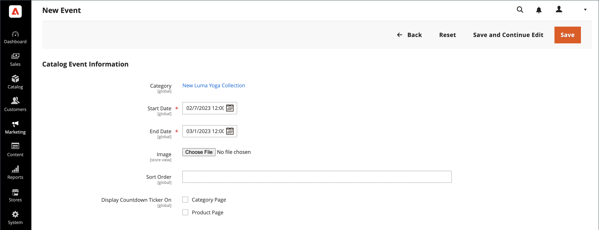

# Creare e aggiornare gli eventi

{{ee-feature}}

Ogni evento è associato a una categoria del catalogo e a una determinata categoria può essere associato un solo evento alla volta. Per visualizzare un elenco dei prossimi eventi nel tuo store, devi anche impostare un widget [Catalogo eventi carosello](../content-design/widget-event-carousel.md).

{width="700" zoomable="yes"}

## Creare un evento

1. Nella barra laterale _Admin_, passa a **[!UICONTROL Marketing]** > _[!UICONTROL Private Sales]_>**[!UICONTROL Events]**.

1. Nell&#39;angolo superiore destro fare clic su **[!UICONTROL Add Catalog Event]**.

1. Nell&#39;albero delle categorie scegliere la categoria che si desidera associare all&#39;evento.

   Poiché ogni categoria può avere un solo evento alla volta, tutte le categorie che hanno già un evento vengono disabilitate.

   {width="500" zoomable="yes"}

1. Definisci **[!UICONTROL Catalog Event Information]**:

   {width="700" zoomable="yes"}

   - Per il **[!UICONTROL Start Date]** dell&#39;evento, utilizzare il calendario () per scegliere la data. Utilizzare i cursori **[!UICONTROL Hour]** e **[!UICONTROL Minute]** per impostare l&#39;ora di inizio dell&#39;evento.

   - Per il **[!UICONTROL End Date]** dell&#39;evento, utilizzare il calendario () per scegliere la data. Utilizzare i cursori **[!UICONTROL Hour]** e **[!UICONTROL Minute]** per impostare l&#39;ora di fine dell&#39;evento.

   - Per caricare un **[!UICONTROL Image]** per il widget eventi, fare clic su **[!UICONTROL Choose File]** e selezionare il file di immagine dalla directory.

   - Nel campo **[!UICONTROL Sort Order]** immettere un numero per indicare la sequenza in cui viene visualizzato l&#39;evento quando è elencato con altri eventi.

   - Selezionare la casella di controllo di ogni tipo di pagina in cui si desidera visualizzare il ticker del conto alla rovescia.

1. Al termine, fare clic su **[!UICONTROL Save]**.

## Aggiornare gli eventi

Gli eventi possono essere modificati dalla pagina Eventi o dalla categoria associata all’evento. Quando a una categoria è associato un evento, nell’angolo in alto a destra viene visualizzato il pulsante Modifica evento.

### Metodo 1: modificare un evento dalla pagina Eventi

1. Nella barra laterale _Admin_, passa a **[!UICONTROL Marketing]** > _[!UICONTROL Private Sales]_>**[!UICONTROL Events]**.

1. Trovare l&#39;evento nell&#39;elenco e aprirlo in modalità di modifica.

1. Apporta le modifiche necessarie all&#39;evento.

1. Al termine, fare clic su **[!UICONTROL Save]**.

### Metodo 2: modificare un evento da una categoria

1. Nella barra laterale _Admin_, passa a **[!UICONTROL Catalog]** > **[!UICONTROL Categories]**.

1. Nell&#39;albero delle categorie a sinistra, selezionare la categoria associata all&#39;evento.

1. Nell&#39;angolo superiore destro fare clic su **[!UICONTROL Edit Even]t**.

1. Apporta le modifiche necessarie all&#39;evento.

1. Al termine, fare clic su **[!UICONTROL Save]**.

## Eliminare un evento

1. Nella barra laterale _Admin_, passa a **[!UICONTROL Marketing]** > _[!UICONTROL Private Sales]_>**[!UICONTROL Events]**.

1. Trova l’evento nell’elenco e aprilo in modalità di modifica.

1. Nell&#39;angolo superiore destro fare clic su **[!UICONTROL Delete]**.

1. Per confermare l&#39;azione, fare clic su **[!UICONTROL OK]**.

## Descrizioni dei campi

| Campo | [Ambito](../getting-started/websites-stores-views.md#scope-settings) | Descrizione |
|--- |--- |--- |
| [!UICONTROL Category] | Globale | Durante la creazione di un evento, questo campo si collega alla struttura ad albero delle categorie. Durante la modifica di un evento, si collega alla pagina della categoria relativa all’evento. |
| [!UICONTROL Start Date] | Globale | Data e ora di inizio dell&#39;evento nel formato `MMDDYYYY HH;MM`. Fai clic sull’icona del calendario per selezionare la data. |
| [!DNL End Date] | Globale | Data e ora di fine dell&#39;evento nel formato `MMDDYYYY HH;MM`. Fai clic sull’icona del calendario per selezionare la data. |
| [!UICONTROL Image] | Visualizzazione store | Carica un&#39;immagine che appare nel widget [Carosello eventi catalogo](../content-design/widget-event-carousel.md). |
| [!UICONTROL Sort Order] | Globale | Determina la sequenza in cui l&#39;evento viene visualizzato quando è elencato con altri eventi. |
| [!UICONTROL Display Countdown Ticker On] | Globale | Visualizza il ticker del conto alla rovescia nell&#39;intestazione di ogni pagina specificata. Opzioni: `Category Page` / `Product Page` |
| [!UICONTROL Status] | Globale | Indica lo stato dell’evento in base all’intervallo di date di inizio e di fine. Stato è un valore di sola lettura. Valori: `Open` / `Closed` / `Upcoming` |

{style="table-layout:auto"}

## Barra dei pulsanti

| Pulsante | Descrizione |
|--- |--- |
| **[!UICONTROL Back]** | Torna alla pagina Eventi senza salvare il nuovo evento o le modifiche apportate a un evento esistente. |
| **[!UICONTROL Delete]** | Elimina l’evento. |
| **[!UICONTROL Reset]** | Cancella la forma di eventuali modifiche non salvate e ripristina le informazioni originali dell&#39;evento. |
| **[!UICONTROL Save and Continue Edit]** | Salva tutte le modifiche e mantiene la maschera aperta in modalità di modifica. |
| **[!UICONTROL Save]** | Salva le modifiche, chiude il modulo e torna alla pagina Eventi. |

{style="table-layout:auto"}
