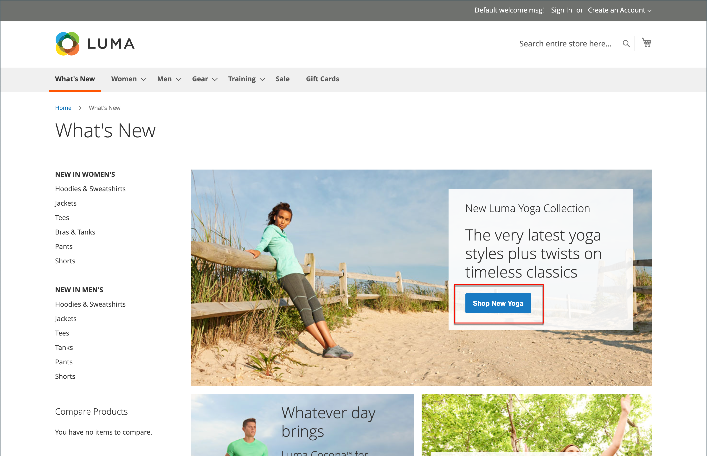

# Vendite ed eventi privati

{{ee-feature}}

Le vendite private e altri eventi di catalogo sono un ottimo modo per utilizzare la base clienti esistente per generare nuovi clienti potenziali e potenziali clienti o per scaricare le scorte in eccesso. Puoi creare vendite a tempo limitato, limitare le vendite a membri specifici o creare una pagina di vendita privata autonoma. Puoi anche definire inviti e dettagli dell’evento. Aumenta la brand loyalty e genera entusiasmo offrendo ai tuoi clienti migliori il trattamento per l’VIP. Offri accesso esclusivo alle vendite dei soli membri o alle vendite private per aumentare la brand loyalty. È inoltre possibile utilizzare queste vendite per liquidare le merci in eccesso. I gruppi di clienti sono utili per impostare solo questi tipi di membri e le vendite VIP.

{width="700" zoomable="yes"}

## Componenti per la gestione degli eventi

- **Categorie** - Ogni evento è associato a una [categoria](../catalog/category-create.md) del catalogo.

- **Eventi** - Le vendite degli eventi si basano su una data di inizio e una data di fine. Puoi utilizzare un [ticker conto alla rovescia](#event-ticker) per visualizzare il tempo rimanente.

- **Carosello eventi catalogo** - Quando il [widget eventi catalogo](../content-design/widget-event-carousel.md) è abilitato nella configurazione, può essere inserito nelle pagine di archivio come elenco di eventi aperti e futuri, ordinati in base alla data di fine. Se due o più eventi hanno la stessa data di fine, gli eventi vengono ordinati in base all’ordine specificato nella configurazione.

- **[!UICONTROL Websites]** - Le autorizzazioni per le categorie si basano principalmente su [gruppi di clienti](../customers/customer-groups.md).

- **Autorizzazioni categoria** - [Autorizzazioni categoria](../catalog/category-permissions.md) offre il controllo completo sulle attività specifiche che possono essere eseguite in una determinata categoria.

- **Limitazioni di accesso** - Impedisce l&#39;[accesso](event-configure.md#restrict-access) pubblico al sito reindirizzandolo a una pagina di destinazione, di accesso o di registrazione.

- **Inviti** - I messaggi e-mail vengono inviati con un collegamento per creare un account nell&#39;archivio. Puoi limitare la possibilità di creare un account solo a coloro che ricevono un [invito](invitations.md).

- **Report vendite private** - I [Report vendite private](../getting-started/private-sales-reports.md) forniscono informazioni sugli inviti inviati, sui clienti invitati e sulle conversioni.

## ticker di evento

Il blocco ticker visualizza un ticker del conto alla rovescia per gli eventi aperti, con la data di inizio e la data di fine per i prossimi eventi. Se un evento è stato chiuso, il ticker mostra le date di inizio e fine.

{width="700" zoomable="yes"}

Se il ticker della pagina della categoria è abilitato per un evento, il blocco del ticker viene visualizzato nella parte superiore dell’elenco delle categorie. Se il ticker della pagina del prodotto è abilitato, il blocco del ticker viene visualizzato anche nella parte superiore della pagina del prodotto di qualsiasi prodotto associato alla categoria.

Il ticker dell&#39;evento può essere attivato quando [crei eventi](event-create.md).

{width="700" zoomable="yes"}
