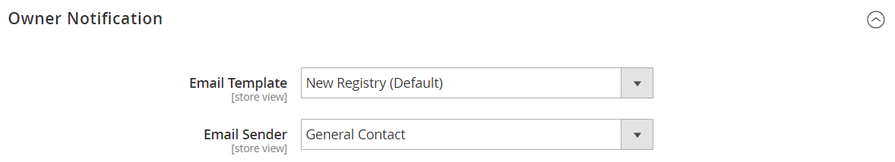

# Configurare i registri dei regali

{{ee-feature}}

Prima di poter offrire registri regali ai clienti, devi abilitare i registri regali e configurare le relative notifiche e-mail. Adobe Commerce invia le seguenti notifiche e-mail in risposta agli eventi nel flusso di lavoro del registro dei regali.

- Quando viene creato un nuovo registro regali, viene inviata un&#39;e-mail al proprietario con un collegamento al registro che può essere condiviso.
- Facoltativamente, il negozio può inviare una notifica con un collegamento al registro regali agli amici e ai familiari del proprietario del registro regali.
- Il proprietario riceve una notifica quando gli articoli vengono acquistati dal registro regali, ma non indica l&#39;acquirente.

Adobe Commerce dispone di modelli predefiniti per ciascuno di questi messaggi e-mail che possono essere personalizzati per il tuo marchio.

## Passaggio 1: Abilita registri regali

1. Il giorno _Amministratore_ barra laterale, vai a **[!UICONTROL Stores]** > _[!UICONTROL Settings]_>**[!UICONTROL Configuration]**.

1. Nel pannello a sinistra, espandi **[!UICONTROL Customers]** e scegli **[!UICONTROL Gift Registry]**

1. Espandi  il **[!UICONTROL General Options]** ed effettuare le seguenti operazioni:

   {width="600" zoomable="yes"}

   - Il Registro regali è attivato per impostazione predefinita. Se necessario, impostare **[!UICONTROL Enable Gift Registry]** a `Yes`.

   - Per **[!UICONTROL Maximum Registrants]**, immettere il numero massimo di persone che possono essere invitate a partecipare a un evento del registro dei regali.

## Passaggio 2: Configurare le notifiche e-mail

1. Espandi  il **[!UICONTROL Owner Notification]** ed effettuare le seguenti operazioni:

   {width="600" zoomable="yes"}

   - Scegli la **[!UICONTROL Email Template]** che avvisa i proprietari del registro regali quando vengono creati i registri.

   - Scegli la [contatto store](../getting-started/store-details.md#store-email-addresses) che viene visualizzato come **[!UICONTROL Email Sender]** del messaggio.

1. Espandi  il **[!UICONTROL Gift Registry Sharing]** ed effettuare le seguenti operazioni:

   {width="600" zoomable="yes"}

   - Scegli la **[!UICONTROL Email Template]** che avvisa i destinatari del registro regali quando un registro viene condiviso con loro.

   - Scegli l&#39;identificatore store visualizzato come **[!UICONTROL Email Sender]** del messaggio.

   - Per **[!UICONTROL Maximum Sent Emails Threshold]**, inserisci il numero massimo di e-mail che possono essere inviate contemporaneamente.

1. Espandi  il **[!UICONTROL Gift Registry Update]** ed effettuare le seguenti operazioni:

   {width="600" zoomable="yes"}

   - Scegli la **[!UICONTROL Email Template]** notifica ai proprietari del registro delle donazioni le modifiche apportate al registro.

   - Scegli l&#39;identificatore store visualizzato come **[!UICONTROL Email Sender]** del messaggio.

1. Al termine, fai clic su **[!UICONTROL Save Config]**.

1. Quando richiesto, aggiorna la cache.

   Dopo l&#39;aggiornamento della cache, Registro regali viene visualizzato nel menu Archivi in Altre impostazioni e diventa disponibile negli account dei clienti.
