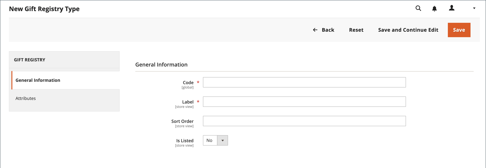
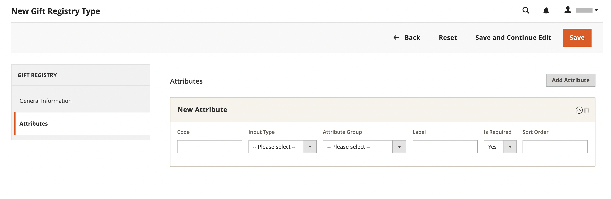

# Impostazione registro regali

{{ee-feature}}

È possibile creare un registro regali per qualsiasi tipo di evento, ad esempio un matrimonio, un compleanno, un anniversario, un nuovo bambino o qualsiasi altra occasione speciale. Per impostazione predefinita, Adobe Commerce include i seguenti eventi speciali:

- Bambino
- Compleanno
- Matrimonio

Quando si crea un Registro di sistema, questo diventa un&#39;opzione nell&#39;elenco dei tipi di Registro doni nell&#39;account del cliente.

È possibile utilizzare uno dei tre registri regali preparati oppure creare un registro personalizzato. Ogni tipo di registro di articoli regalo include diversi attributi, ovvero i campi di immissione dati completati da un cliente per creare un registro di articoli regalo. Gli attributi forniscono informazioni aggiuntive sull&#39;evento, l&#39;ora e la posizione o qualsiasi altra informazione necessaria. A seconda del tipo di input, alcuni attributi dispongono di più opzioni. Ad esempio, il `Wedding` il tipo di registro regalo ha l&#39;attributo `Role`, con `Bride`, `Groom`, e `Partner` opzioni. Per ulteriori informazioni sugli attributi e sui tipi di input, consulta [Attributi](../customers/attribute-properties.md).

{width="700" zoomable="yes"}

## Utilizza un registro regali preparato

1. Il giorno _Amministratore_ barra laterale, vai a **[!UICONTROL Stores]** > _[!UICONTROL Other Settings]_>**[!UICONTROL Gift Registry]**.

   I registri di compleanno, matrimonio e bambino sono pronti per i clienti da utilizzare dai loro account.

1. Assicurati di completare la sezione [configurazione del modello e-mail](../systems/email-templates.md#configure-email-templates)quindi riflettono il tuo marchio.

## Creazione di un registro regali personalizzato

1. Nella barra laterale Amministratore, vai a **[!UICONTROL Stores]** > _[!UICONTROL Other Settings]_>**[!UICONTROL Gift Registry]**.

1. Nell’angolo superiore destro, fai clic su **[!UICONTROL Add Gift Registry Type]**.

1. Sotto **[!UICONTROL General Information]**, completa quanto segue:

   - Inserisci un valore univoco **[!UICONTROL Code]** per identificare internamente il registro doni.

     Il codice deve iniziare con una lettera minuscola. Il resto del codice può essere costituito da qualsiasi combinazione di lettere minuscole (a-z), numeri (0-9) e caratteri di sottolineatura (`_`).

   - Per **[!UICONTROL Label]** Immettere un nome per il registro regali, come si desidera che venga visualizzato nell&#39;archivio.

     Questa etichetta è un&#39;opzione nell&#39;elenco dei tipi di registro regali disponibili per il cliente.

   - Per **[!UICONTROL Sort Order]**, immettere un numero per determinare l&#39;ordine di visualizzazione del registro regali quando viene elencato con altri tipi.

   - Per attivare il registro regali, impostare **[!UICONTROL Is Listed]** a `Yes`.

     {width="600" zoomable="yes"}

1. Esamina ogni sezione del Registro regali per determinare il tipo di informazioni che desideri includere.

1. Nel pannello a sinistra, scegli **[!UICONTROL Attributes]** e fai clic su **[!UICONTROL Add Attribute]**.

   {width="600" zoomable="yes"}

1. Per ogni attributo, eseguire le operazioni seguenti:

   - Assegna un univoco **[!UICONTROL Code]** per identificare l&#39;attributo internamente. Il codice può contenere fino a 15 caratteri e deve iniziare con una lettera minuscola. Il resto del codice può includere lettere minuscole (`a`-`z`), numeri (`0`-`9`) e il carattere di sottolineatura (`_`) in parole separate.

   - Scegli la **[!UICONTROL Input Type]** da utilizzare per l&#39;immissione dei dati. Puoi utilizzare uno dei tipi personalizzati o statici.

   - Se il tipo di input dispone di più opzioni, fare clic su **[!UICONTROL Add New Option]** e completare le informazioni per ciascuna opzione.

     Alcuni tipi di input hanno proprietà aggiuntive. Ad esempio, il Percorso evento dispone di proprietà aggiuntive per rendere l&#39;evento ricercabile e incluso nell&#39;elenco pubblico dei registri delle donazioni del tuo Negozio.

      - Imposta **[!UICONTROL Attribute Group]** nella sezione del registro dei doni in cui si desidera visualizzare l&#39;attributo.

      - Per **[!UICONTROL Label]**, immettere un nome per identificare il campo di immissione dati nel Registro di sistema.

      - Se il cliente deve effettuare una selezione o inserire un valore nel campo, impostare **[!UICONTROL Is Required]** a `Yes`.

      - Per **[!UICONTROL Sort Order]**, immettere un numero per determinare la sequenza in cui viene visualizzato il registro regali elencato con altri registri regali che potrebbero essere disponibili nel negozio.

1. Per aggiungere un’altra opzione, fai clic su **Aggiungi nuova opzione**.

   Ogni nuova opzione aggiunta viene visualizzata in una nuova sezione nella parte superiore. Ripetere questo processo per il nuovo attributo.

1. Al termine, fai clic su **[!UICONTROL Save]**.

## Descrizioni dei campi

### [!UICONTROL General Information]

| Campo | Descrizione |
|--- |--- |
| [!UICONTROL Code] | Nome univoco per identificare internamente il tipo di registro doni. Il primo carattere deve essere una lettera minuscola. Il resto del codice può essere costituito da qualsiasi combinazione di lettere minuscole (a-z), numeri (0-9) e il carattere di sottolineatura (`_`). |
| [!UICONTROL Label] | Il nome del tipo di registro dei doni visualizzato nell&#39;archivio. |
| [!UICONTROL Sort Order] | Determina la sequenza in cui viene visualizzato il tipo di registro dei doni quando viene elencato con altri tipi. |
| [!UICONTROL Is Listed] | Determina se il tipo di registro regali è disponibile per i clienti nello store. Opzioni: `Yes` / `No`. |

{style="table-layout:auto"}

### [!UICONTROL Attributes]

| Campo | Descrizione |
|--- |--- |
| [!UICONTROL Code] | Un nome univoco per identificare l’attributo internamente. Il codice può includere qualsiasi combinazione di lettere minuscole (a-z), numeri (0-9) e il carattere di sottolineatura (`_`). |
| [!UICONTROL Input Type] | Determina il tipo di dati e il controllo di input associati all&#39;attributo, in base al tipo. |
| [!UICONTROL Attribute Group] | Selezionare il gruppo in cui l&#39;attributo è elencato nel Registro di sistema per i regali. |
| [!UICONTROL Label] | Il nome che identifica l’attributo nel dashboard dell’account del cliente. |
| [!UICONTROL Is Required] | Indica se l&#39;attributo è una voce obbligatoria. Impossibile salvare il registro regali fino al completamento di tutti gli attributi richiesti. Opzioni: `Yes` / `No`. |
| [!UICONTROL Sort Order] | Determina la sequenza in cui viene visualizzato l&#39;attributo elencato con altri attributi. |

{style="table-layout:auto"}

#### [!UICONTROL Input Type Options]

Selezionare il tipo di dati e il controllo di input associati all&#39;attributo.

**_[!UICONTROL Custom Types]_**

| Campo | Descrizione |
|--- |--- |
| [!UICONTROL Text] | Visualizza l&#39;attributo come campo di testo. |
| [!UICONTROL Select] | Visualizza l&#39;attributo come elenco a discesa. Clic **[!UICONTROL Add New Option]** per aggiungere altre condizioni all’elenco a discesa: **[!UICONTROL Code]**- Un nome univoco per identificare l&#39;attributo internamente. **[!UICONTROL Label]** : nome che identifica l’attributo nel dashboard dell’account del cliente. **[!UICONTROL Is Default]**- Impostare questo interruttore per selezionare la condizione predefinita. **[!UICONTROL Delete Option]** - Fare clic per eliminare l&#39;opzione. |
| [!UICONTROL Date] | Visualizza l&#39;attributo come campo data. Opzioni: `Short (3/23/2014)` / `Medium (Mar 23, 1914)` / `Long (March 23, 1914)` / `Full (Sunday, March 23, 2014)` |
| [!UICONTROL Country] | Visualizza l&#39;attributo come elenco a discesa di paesi. Imposta **[!UICONTROL Show Region]** a: `Yes` / `No`. |

{style="table-layout:auto"}

**_[!UICONTROL Static Types]_**

| Campo | Descrizione |
|--- |--- |
| [!UICONTROL Event Date] | Determina la modalità di utilizzo dell&#39;attributo date nell&#39;archivio. Opzioni:  **[!UICONTROL Searchable]**- Determina se l&#39;attributo è disponibile per la ricerca avanzata. Opzioni: `Yes` / `No`. **[!UICONTROL Is Listed]** - Determina se l’evento è incluso nell’elenco degli eventi disponibili nell’archivio. Opzioni: `Yes` / `No`.  **[!UICONTROL Date Format]**- Determina il formato della data dell&#39;evento. Opzioni: `Short (3/23/2014)` / `Medium (Mar 23, 1914)` / `Long (March 23, 1914)` / `Full (Sunday, March 23, 2014)` |
| [!UICONTROL Event Country] | Visualizza l&#39;attributo come elenco di paesi. Opzioni:  **[!UICONTROL Searchable]**- Determina se l&#39;attributo è disponibile per la ricerca avanzata. Opzioni: `Yes` / `No`. **[!UICONTROL Is Listed]** - Determina se l’evento è incluso nell’elenco degli eventi disponibili nell’archivio. Opzioni: `Yes` / `No`.  **[!UICONTROL Show Region]**- Determina l&#39;area dell&#39;evento. |
| [!UICONTROL Event Location] | La posizione dell&#39;evento correlato al registro dei doni.  Imposta **[!UICONTROL Is Searcheable]** a: `Yes` / `No`  Imposta **[!UICONTROL Is Listed]** a: `Yes` / `No` |
| [!UICONTROL Role] | Ruolo che identifica il destinatario del regalo. Ad esempio: `Bride`, `Groom`, o `Partner`. **[!UICONTROL Is Searcheable]**- Imposta su `Yes`/ `No` **&#x200B;È elencato **- Imposta su `Yes` / `No` **[!UICONTROL Add New Option]** - Fai clic su per aggiungere altre condizioni al menu a discesa: **Codice** - Un nome univoco per identificare l&#39;attributo internamente. **[!UICONTROL Label]**: nome che identifica l’attributo nel dashboard dell’account del cliente. **[!UICONTROL Is Default]** - Impostare questo interruttore per selezionare la condizione predefinita. **[!UICONTROL Delete Option]**- Fare clic per eliminare l&#39;opzione. |

{style="table-layout:auto"}

#### [!UICONTROL Attribute Group Options]

Selezionare il gruppo in cui l&#39;attributo è elencato nel Registro di sistema per i regali.

| Campo | Descrizione |
|--- |--- |
| [!UICONTROL Event Information] | Raggruppa tutti gli attributi del Registro di sistema per i regali che aggiungono informazioni sull&#39;evento del Registro di sistema per i regali, la data, il luogo e così via. |
| [!UICONTROL Gift Registry Properties] | Combina tutti gli attributi che aggiungono informazioni direttamente sul registro dei regali. |
| [!UICONTROL Privacy Settings] | Elenca gli attributi che aggiungono informazioni sulla privacy dell&#39;evento del Registro regali. |
| [!UICONTROL Recipients Information] | Raggruppa gli attributi che forniscono informazioni sulla persona che crea un registro di articoli regalo. |
| [!UICONTROL Shipping Address] | Combina gli attributi che aggiungono informazioni sull&#39;indirizzo di spedizione dell&#39;evento del Registro di sistema relativo ai regali. |

{style="table-layout:auto"}
