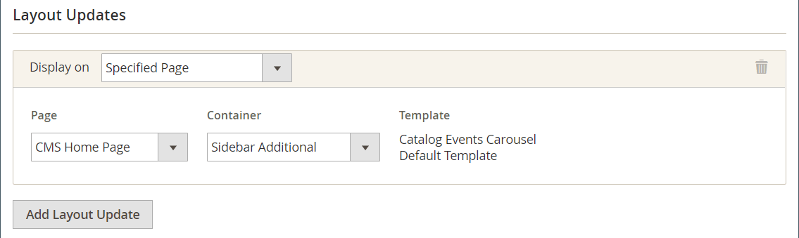

# Aggiungi ricerca registro regali

{{ee-feature}}

Lo strumento [Widget](../content-design/widgets.md) può essere utilizzato per inserire una casella di ricerca del Registro regali in qualsiasi punto dell&#39;archivio. È possibile specificare le opzioni di ricerca disponibili per i clienti, ad esempio nome, indirizzo e-mail e ID registro regali. Quando il cliente fa clic sul pulsante Cerca, i risultati vengono visualizzati nella pagina Ricerca registro regali. Se la ricerca non restituisce alcun risultato, il cliente può riprovare con altri parametri.

{width="700" zoomable="yes"}

## Configurare la ricerca nel Registro di sistema per i regali

1. Nella barra laterale _Admin_, passa a **[!UICONTROL Content]** > _[!UICONTROL Elements]_>**[!UICONTROL Widgets]**.

1. Nell&#39;angolo superiore destro fare clic su **[!UICONTROL Add Widget]**.

1. Scegliere la scheda **[!UICONTROL Settings]** ed effettuare le seguenti operazioni:

   - Imposta **[!UICONTROL Type]** su `Gift Registry Search`.

   - Impostare **[!UICONTROL Design Theme]** sul tema utilizzato dall&#39;archivio.

   - Fare clic su **[!UICONTROL Continue]**.

   {width="700" zoomable="yes"}

1. Nella sezione _[!UICONTROL Storefront Properties]_&#x200B;eseguire le operazioni seguenti:

   - Immettere **[!UICONTROL Widget Title]** come riferimento interno.

   - Impostare **[!UICONTROL Assign to Store Views]** sulle visualizzazioni dello store in cui sarà disponibile la ricerca nel Registro regali.

   - Impostare **[!UICONTROL Sort Order]** per determinare l&#39;ordine di visualizzazione del blocco di ricerca del Registro regali quando sono presenti altri blocchi assegnati alla stessa posizione sulla pagina.

   {width="700" zoomable="yes"}

1. Nella sezione **[!UICONTROL Layout Updates]**, fare clic su **[!UICONTROL Add Layout Update]**.

1. Per determinare la posizione in cui viene visualizzata la ricerca nel Registro regali, eseguire le operazioni seguenti:

   - Imposta **[!UICONTROL Display On]** sulle pagine del tuo archivio in cui vuoi che appaia il blocco di ricerca del Registro dei regali.

   - Se applicabile, scegliere **[!UICONTROL Categories]** nel punto in cui si desidera visualizzarlo.

   - Impostare **[!UICONTROL Container]** sulla posizione nella pagina per inserire il blocco di ricerca del Registro regali.

   {width="500" zoomable="yes"}

1. Nel pannello a sinistra, scegli **[!UICONTROL Widget Options]**.

1. Per determinare in che modo i visitatori del sito possono cercare i registri delle donazioni, selezionare tutte le opzioni seguenti:

   - [!UICONTROL All Forms]
   - [!UICONTROL Registrant Name Search]
   - [!UICONTROL Registrant Email Search]
   - [!UICONTROL Gift Registry ID Search]

   {width="700" zoomable="yes"}

1. Al termine, fare clic su **[!UICONTROL Save]**.

1. Quando viene richiesto di aggiornare la cache delle pagine, fai clic sul collegamento nel messaggio nella parte superiore dell’area di lavoro e segui le istruzioni.

## Descrizioni dei campi

### [!UICONTROL Settings]

| Campo | Descrizione |
|--- |--- |
| [!UICONTROL Type] | Identifica `Gift Registry Search` come tipo di widget. |
| [!UICONTROL Design Theme] | Tema utilizzato dall&#39;archivio in cui verrà visualizzata la ricerca nel Registro regali. |

{style="table-layout:auto"}

### [!UICONTROL Storefront Properties]

| Campo | Descrizione |
|--- |--- |
| [!UICONTROL Widget Title] | Nome per riferimento interno. |
| [!UICONTROL Assign to Store Views] | Identifica le visualizzazioni dello store in cui sarà disponibile la Ricerca nel Registro regali. |
| [!UICONTROL Sort Order] | Indica l’ordine di visualizzazione del blocco di ricerca del Registro dei regali se nella stessa posizione sono presenti altri blocchi assegnati. |

{style="table-layout:auto"}

### [!UICONTROL Layout Updates]

| Campo | Descrizione |
|--- |--- |
| [!UICONTROL Display On] | Indica le pagine o i tipi di pagine specifici in cui viene visualizzato il blocco Ricerca registro regali. |
| [!UICONTROL Categories] | Se applicabile, identifica le pagine della categoria in cui viene visualizzata la Ricerca nel registro regali. |
| [!UICONTROL Container] | Indica il blocco di layout della pagina in cui viene inserita la ricerca nel Registro regali. Le opzioni variano in base al modello e al tema. |

{style="table-layout:auto"}

### [!UICONTROL Widget Options]

| Campo | Descrizione |
|--- |--- |
| [!UICONTROL Quick Search Form Types] | Determina i tipi di ricerche che possono essere eseguite con la Ricerca nel Registro regali. Opzioni: `All Forms` / `Registrant Name Search` /` Registrant Email Search` / `Gift Registry ID Search` |

{style="table-layout:auto"}
