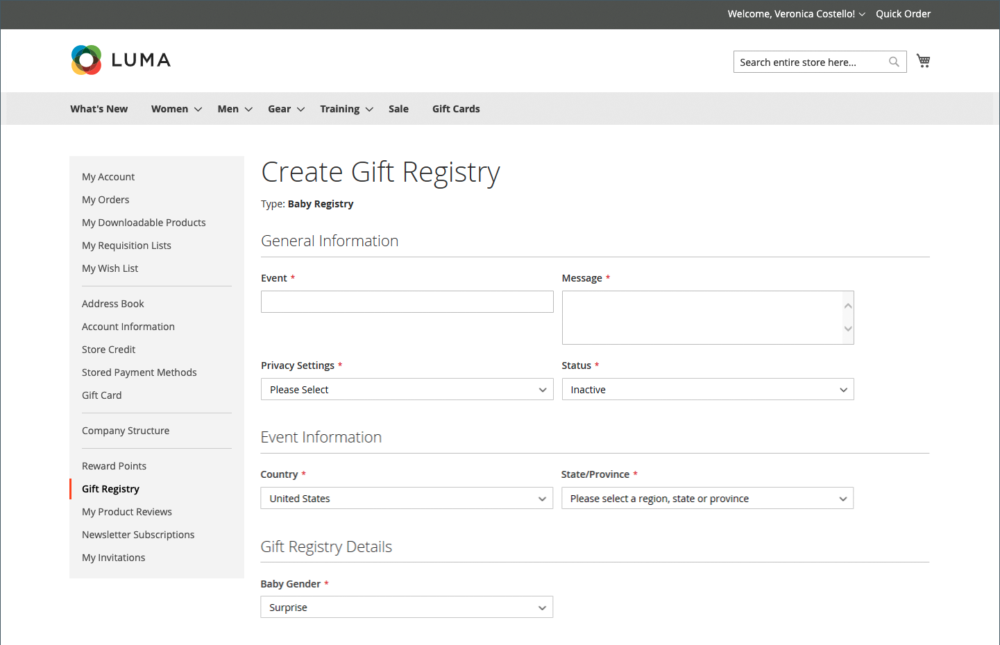

# Esperienza di vetrina del registro dei regali

{{ee-feature}}

Nella sezione [Registro regali](gift-registries.md) dell&#39;account del cliente sono elencati i registri regali correnti del cliente e l&#39;evento associato. I clienti possono gestire i registri correnti e aggiungerne di nuovi.

{width="700" zoomable="yes"}

## Informazioni registro regali

I clienti possono creare e gestire i registri delle donazioni dai loro account. Tutte le informazioni associate a ciascun tipo di registro sono disponibili nell&#39;account del cliente.

{width="700" zoomable="yes"}

| Sezione | Descrizione |
|--- |--- |
| [!UICONTROL General Information] | Questa sezione in genere include il nome dell’evento, un messaggio o una descrizione dell’evento, le impostazioni di privacy e lo stato dell’evento. |
| [!UICONTROL Event Information] | Questa sezione include la posizione e la data dell’evento. Per un matrimonio, potrebbe anche includere il numero di ospiti che ogni persona può portare. |
| [!UICONTROL Gift Registry Details] | Questo potrebbe includere informazioni aggiuntive specifiche per l’occasione. |
| [!UICONTROL Registrant Information] | In questa sezione sono inclusi il nome e le informazioni di contatto di ogni persona che deve ricevere la notifica del registro. Per un registro matrimoni, il campo Ruolo potrebbe essere incluso per associare il registrante come amico della sposa o dello sposo. |
| [!UICONTROL Shipping Address] | Questa sezione mostra dove devono essere inviati i regali e include le informazioni di cui un vettore ha bisogno per consegnare il pacchetto. |

{style="table-layout:auto"}

>[!NOTE]
>
>Quando un registro regali non è attivo, la ricerca e il collegamento non funzionano per il registro. Se il Registro di sistema viene successivamente riattivato, i collegamenti rimangono interrotti.

## Creare un registro regali

1. Il cliente seleziona **[!UICONTROL Gift Registry]** nel proprio dashboard account.

1. Nella pagina _Registro regali_, fa clic su **[!UICONTROL Add New]**.

1. Scegli un **[!UICONTROL Gift Registry Type]**, ad esempio:

   - Compleanno

   - Registro dei neonati

   - Matrimonio

1. Clic su **[!UICONTROL Next]**.

1. Immette le informazioni richieste e fa clic su **[!UICONTROL Save]**.

## Aggiungere un prodotto a un Registro di sistema

1. Il cliente apre il prodotto che desidera aggiungere all&#39;evento del registro dei doni.

1. Clic su **[!UICONTROL Add to Cart]**.

1. Fa clic su **[!UICONTROL View and Edit Cart]** nel mini carrello.

1. Nella pagina Carrello, seleziona l&#39;evento desiderato e fa clic/tocca **[!UICONTROL Add All To Gift Registry]**.

   Gli elementi vengono aggiunti al registro degli oggetti regalo dell&#39;evento selezionato.

## Condivisione di un registro regali

1. Dal dashboard dell&#39;account, il cliente accede a **[!UICONTROL Gift Registry]**.

1. Trova l&#39;evento del Registro di sistema che si desidera gestire e fa clic su **[!UICONTROL Share]**.

1. Immette le informazioni richieste e fa clic su **[!UICONTROL Share Gift Registry]**.

## Modificare un registro regali

1. Dal dashboard dell&#39;account, il cliente accede a **[!UICONTROL Gift Registry]**.

1. Trova l&#39;evento del Registro di sistema che si desidera gestire e fa clic su **[!UICONTROL Edit]**.

1. Modifica le opzioni in base alle esigenze.

1. Modifica le opzioni richieste e fa clic su **[!UICONTROL Save]**.

## Gestire gli elementi del Registro di sistema per i regali

1. Dal dashboard dell&#39;account, il cliente accede a **[!UICONTROL Gift Registry]**.

   {width="700" zoomable="yes"}

1. Trova l&#39;evento del Registro di sistema, seleziona gli elementi da gestire e fa clic su **[!DNL Manage Items]**.

1. Modifica le opzioni richieste, ad esempio **[!UICONTROL Note]** e **[!UICONTROL Qty]**.

1. Se necessario, rimuove un elemento dal Registro regali selezionando la casella di controllo e facendo clic su **[!UICONTROL Delete]**.

1. Fai clic su **[!UICONTROL Update Gift Registry]** per salvare le modifiche.

## Eliminare un registro regali

1. Dal dashboard dell&#39;account, il cliente accede a **[!UICONTROL Gift Registry]**.

1. Trova l&#39;evento del Registro di sistema che si desidera gestire e fa clic su **[!UICONTROL Delete]**.

1. Fai clic su **[!UICONTROL OK]** per confermare.
