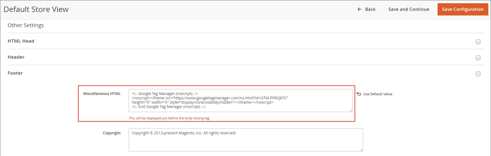

# [!DNL Google Tag Manager]

{{ee-feature}}

[!DNL Google Tag Manager] consente di gestire i numerosi tag (snippet di codice) correlati agli eventi della campagna di marketing. [!DNL Google Tag Manager] consente di aggiungere tag di tracciamento al sito per misurare il pubblico o per personalizzare, effettuare il retargeting o condurre iniziative di marketing basate su motori di ricerca.

[!DNL Google Tag Manager] trasferisce direttamente dati ed eventi a [!DNL Google Analytics], e-commerce avanzato e altre soluzioni di analisi di terze parti per ottenere un quadro chiaro delle prestazioni del sito, dei prodotti e delle promozioni.

Dovresti avere un [!DNL Google Analytics] e [!DNL Tag Manager] per continuare questo processo. Le seguenti istruzioni ti guidano attraverso il processo di configurazione degli account Google, la configurazione dell’archivio Commerce e la creazione di un tag.

>[!NOTE]
>
>Se la tua azienda è soggetta a normative sulla privacy come [Regolamento generale sulla protezione dei dati](../getting-started/compliance-gdpr.md) e/o [California Consumer Privacy Act](../getting-started/compliance-ccpa.md), vedi [Impostazioni privacy Google](google-tools.md#google-privacy-settings).

## Passaggio 1: Configurare [!DNL Google Analytics] account

Consulta [Configura ricerca sito](https://support.google.com/analytics/answer/1012264) nella Guida di Google per le nozioni di base necessarie per iniziare. Consulta anche le guide di Google per [Google Analytics](https://support.google.com/analytics/answer/9304153) e [Gestione tag Google](https://support.google.com/tagmanager/answer/6102821).

1. Accedi al tuo [!DNL Google Analytics] account.

1. Per abilitare **[!UICONTROL Internal Site Search Tracking]**, eseguire le operazioni seguenti:

   - Accedi a **[!UICONTROL Select View]** > **[!UICONTROL View Settings]**.

   - Imposta **[!UICONTROL Site Search Tracking]** a `On`.

   - Imposta **[!UICONTROL Query]** parametro a `q`.

   - Una volta completato, **[!UICONTROL Save]** le impostazioni.

1. Per attivare le funzioni di visualizzazione, effettuare le seguenti operazioni:

   - Scegli **[!UICONTROL Property Settings]**.

   - Sotto _[!UICONTROL Advertising Features]_, impostato **[!UICONTROL Enable Demographics and Interest Reports]**a `On`.

   - **[!UICONTROL Save]** le impostazioni.

1. Per abilitare il tracciamento di e-commerce, effettuare le seguenti operazioni:

   - Accedi a **[!UICONTROL Select View]** > **[!UICONTROL Ecommerce Settings]**.

   - Imposta **[!UICONTROL Enable Ecommerce]** a `On`.

   - Imposta **[!UICONTROL Enable Enhanced Ecommerce Reporting]** a `On`.

   - **[!UICONTROL Save]** le impostazioni.

1. Ricarica la pagina e verifica che tutte le impostazioni rimangano `On`.

   >[!NOTE]
   >
   >Se non tutte le impostazioni sono `On`, ripeti i passaggi precedenti, salva e ricarica la pagina. Ripeti questa procedura finché tutte le impostazioni non sono impostate su `On`.

## Passaggio 2: Configurare [!DNL Google Tag Manager] account

Le istruzioni seguenti mostrano come configurare un nuovo contenitore con le impostazioni di base. Un esempio [Compositore](https://developer.adobe.com/commerce/php/development/composer/) Il file di configurazione (.json) viene utilizzato per semplificare il processo, importando per generare un tag in un nuovo contenitore. In questo esempio, si consiglia di creare un contenitore, anziché modificare un contenitore esistente.

>[!NOTE]
>
>Per ulteriori informazioni, consulta la documentazione di Google [Esportazione e importazione contenitore](https://support.google.com/tagmanager/answer/6106997). Queste istruzioni forniscono una procedura dettagliata per importare un JSON di esempio in un nuovo contenitore.

1. Scarica il file collegato [GTM_M2_Config_json.txt](./assets/GTM_M2_Config_json.txt), apri il file in un editor e salvalo con nome `GTM_M2_Config.json`.

   Il file json viene caricato direttamente in [!DNL Google Tag Manager].

1. Accedi a **[!UICONTROL Admin]** > **[!UICONTROL Container]** > **[!UICONTROL Import Container]**.

1. Clic **[!UICONTROL Choose container file]** e seleziona il file json.

1. Sotto **[!UICONTROL Choose workspace]**, fai clic su **[!UICONTROL New]**.

1. Inserisci un titolo e una descrizione, quindi fai clic su **[!UICONTROL Save]**.

1. Per importare il file, selezionate una delle seguenti azioni:

   - Il **[!UICONTROL Overwrite]** deve essere selezionata per un nuovo contenitore.

   - Il **[!UICONTROL Merge]** deve essere selezionata se utilizzi un contenitore esistente.

1. Clic **[!UICONTROL Preview]** per rivedere tag, trigger e variabili.

1. Per modificare **[!UICONTROL Google Analytics ID]** a cui si fa riferimento nelle variabili, effettua le seguenti operazioni:

   - Accedi a **[!UICONTROL Variables]** > **[!UICONTROL User-Defined Variables]**.

   - Scegli **[!UICONTROL Google Analytics]** e aggiorna il segnaposto (`UA-xxxxxx-x`) con il tuo **[!UICONTROL GA ID]**.

1. Segui le istruzioni di Google per aggiungere tag, trigger e variabili al nuovo contenitore.

   Se disponi di impostazioni in un altro contenitore che desideri utilizzare, puoi spostarle nel nuovo contenitore.

1. Clic **[!UICONTROL Confirm]** al termine.

1. Segui le istruzioni di Google per la pubblicazione del nuovo contenitore.

## Passaggio 3: Configurare lo store

{{gtag-api-note}}

1. Accedi all’amministratore del tuo archivio Commerce.

1. Il giorno _Amministratore_ barra laterale, vai a **[!UICONTROL Stores]** > _[!UICONTROL Settings]_>**[!UICONTROL Configuration]**.

1. Nel pannello a sinistra, espandi **[!UICONTROL Sales]** e scegli **[!UICONTROL Google API]**.

1. Espandi  il **[!UICONTROL Google Analytics]** e configura quanto segue:

   {width="600" zoomable="yes"}

   - Imposta **[!UICONTROL Enable]** a `Yes`.

   - Imposta **[!UICONTROL Account type]** a `Google Tag Manager`.

   - In **[!UICONTROL Container ID]** , immetti l&#39;ID GTM (`GTM-xxxxxx`).

   - Se utilizzi anche Google Analytics agli esperimenti sui contenuti, imposta **Abilita esperimenti sui contenuti** a `Yes`.

   - Utilizzare i valori predefiniti per i campi rimanenti.

1. Al termine, fai clic su **[!UICONTROL Save Config]**.

1. Verifica [!DNL Google Tag Manager] e verificare che tutto funzioni correttamente.

>[!NOTE]
>
>Ogni contenitore è associato a un sito web e serve un solo contenitore per account. Se disponi di un’istanza Commerce multisito, sono necessari contenitori separati.

## Passaggio 4: Aggiungi il codice GTM al tuo store di Adobe Commerce

1. Per copiare il codice GTM, vai a **[!UICONTROL Admin]** > **[!UICONTROL Install Google Tag Manager]**.

   È possibile aggiungere due snippet di codice GTM al sito Commerce: il primo per `<head>` e il secondo per il `<body>` tag.

1. Nell’amministrazione di Commerce, vai a **[!UICONTROL Content]** > _[!UICONTROL Design]_>**[!UICONTROL Configuration]**e aprire la visualizzazione store in modalità modifica.

1. Sotto _[!UICONTROL Other Settings]_, espandi **[!UICONTROL HTML Head]**e incolla il codice copiato da GTM per `<head>` tag in **[!UICONTROL Scripts and Style Sheets]**campo.

   {width="600" zoomable="yes"}

1. Espandi **[!UICONTROL Footer]** e incolla il codice GTM per `<body>` nel **[!UICONTROL Miscellaneous HTML]** campo.

   {width="600" zoomable="yes"}

1. Al termine, fai clic su **[!UICONTROL Save Configuration]**.

## Descrizioni dei campi

| Campo | Ambito | Descrizione |
|--- |--- |--- |
| [!UICONTROL Enable] | Visualizzazione store | Determina se è possibile utilizzare l’e-commerce Google Analytics avanzato per analizzare l’attività nel tuo store. Opzioni: `Yes` / `No` |
| [!UICONTROL Account type] | Visualizzazione store | Determina il codice di tracciamento di Google utilizzato per monitorare l&#39;attività e il traffico dell&#39;archivio. Opzioni: `Google Analytics` / `Google Tag Manager` |
| [!UICONTROL Anonymize IP] | Visualizzazione store | Determina se le informazioni di identificazione vengono rimosse dagli indirizzi IP visualizzati nei risultati delle Google Analytics. |
| [!UICONTROL Enable Content Experiments] | Visualizzazione store | Attiva Google Content Experiments, che può essere utilizzato per testare fino a dieci versioni diverse della stessa pagina. Opzioni: `Yes` / `No` |
| [!UICONTROL Container Id] | Visualizzazione store | Se [!DNL Google Tag Manager] è già installato e configurato per lo store, l’ID contenitore viene visualizzato automaticamente in questo campo. |
| [!UICONTROL List property for the catalog page] | Visualizzazione store | Identifica la proprietà Tag Manager associata alla pagina del catalogo. Valore predefinito: `Catalog Page` |
| [!UICONTROL List property for the cross-sell block] | Visualizzazione store | Identifica la proprietà Tag Manager associata al blocco di cross-selling. Valore predefinito: `Cross-sell` |
| [!UICONTROL List property for the up-sell block] | Visualizzazione store | Identifica la proprietà Tag Manager associata al blocco di up-sell. Valore predefinito: `Up-sell` |
| [!UICONTROL List property for the related products block] | Visualizzazione store | Identifica la proprietà Tag Manager associata al blocco di prodotti correlati. Valore predefinito: `Related Products` |
| [!UICONTROL List property for the search results page] | Visualizzazione store | Identifica la proprietà Tag Manager associata alla pagina dei risultati della ricerca. Valore predefinito: `Search Results` |
| [!UICONTROL "Internal Promotions" for promotions field "Label"] | Visualizzazione store | Identifica la proprietà Tag Manager associata alle etichette per le promozioni interne. Valore predefinito: `Label` |

{style="table-layout:auto"}

## Creare un tag per tracciare le conversioni

Se disponi di un account Google AdWords, puoi creare un tag che tiene traccia delle conversioni. L’esempio seguente mostra come utilizzare entrambi [!DNL Google Tag Manager] e [!DNL Google Analytics] per creare un tag che viene attivato sulla conversione del tuo negozio _Completato_ pagina.

### Passaggio 1: Creare un tag

1. Accedi al tuo [!DNL Google Tag Manager] e fai clic sul collegamento per il contenitore creato per il tuo archivio.

1. In **[!UICONTROL New Tag]** , fare clic su **[!UICONTROL Add a new tag]**.

1. Ottieni le seguenti informazioni dal tuo account AdWords:

   - ID conversione
   - Etichetta di conversione

   Se hai bisogno di assistenza, visita il sito Google [sito di supporto](https://support.google.com/tagmanager/answer/6105160).

1. Dalla sezione [!DNL Google Tag Manager] dashboard, fai clic su **[!UICONTROL Google AdWords]** ed effettuare le seguenti operazioni:

   - Fare clic sul segnaposto del titolo e immettere un nome per il nuovo tag.

   - Sotto **[!UICONTROL Choose Product]**, seleziona **[!UICONTROL Google AdWords]**.

   - Sotto _[!UICONTROL Choose a Tag Type]_, seleziona **[!UICONTROL AdWords Conversion Tracking]**e fai clic su **[!UICONTROL Continue]**.

1. Inserisci il **[!UICONTROL Conversion ID]** e **[!UICONTROL Conversion Label]** dal tuo account AdWords e fai clic su **[!UICONTROL Continue]**.

### Passaggio 2: Creare una regola

Continuando da [!DNL Google Tag Manager] , il passaggio successivo consiste nel creare una regola che attivi il tag nella pagina di conversione.

1. Sotto **[!UICONTROL Fire On]**, fai clic su **[!UICONTROL Some Pages]**.

1. In _[!UICONTROL Choose Pages]_, completa le impostazioni seguenti:

   - **[!UICONTROL Name]** - Immettere un nome per la descrizione della pagina.

   - **[!UICONTROL Variable]** `url`

   - **Operazione** - `matches RegEx`

     Per ulteriori informazioni, consulta [Operatori selettori Regex e CSS](https://support.google.com/tagmanager/answer/7679109) nella Guida di Google Tag Manager.

   - **[!UICONTROL Value]** - `checkout/success.*`

1. Seleziona la casella di controllo verde e fai clic su **[!UICONTROL Save]**.

   Il trigger impostato viene visualizzato come pulsante blu nella sezione Attivato.

1. Al termine, fai clic su **[!UICONTROL Save Tag]**.

### Passaggio 3: Anteprima e pubblicazione

Il passaggio successivo nel processo consiste nell’visualizzare in anteprima il tag. Ogni volta che il tag viene visualizzato in anteprima, viene salvata un’istantanea della versione. Quando si è soddisfatti dei risultati, passare alla versione che si desidera utilizzare e fare clic su **[!UICONTROL Publish]**.
