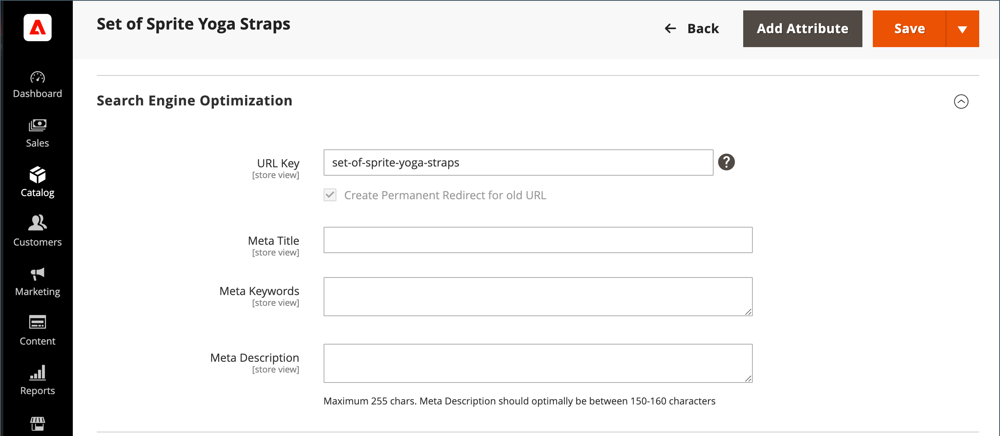
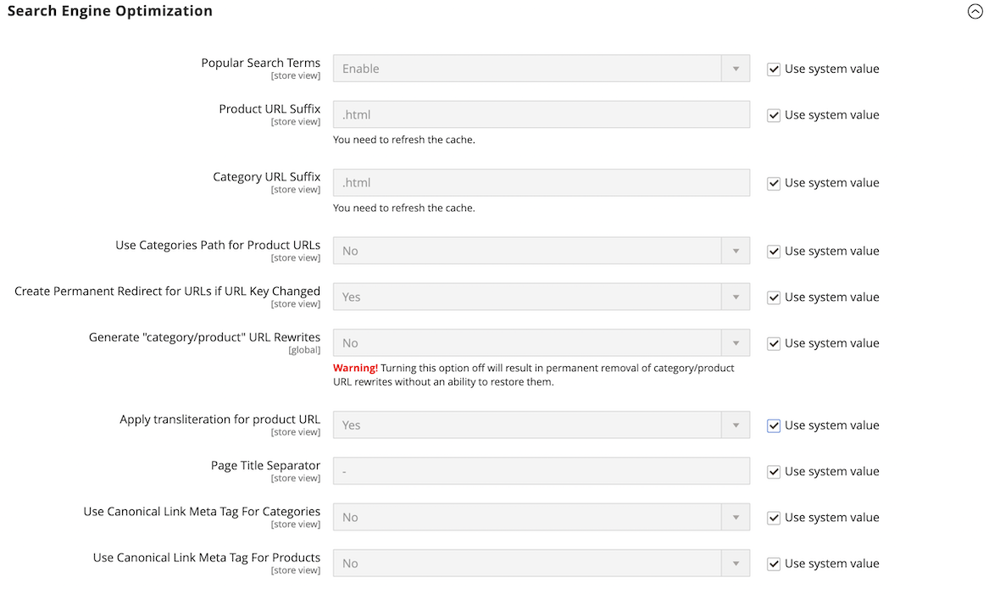

# Dati Meta

>[!TIP]
>
>Per Adobe Commerce as a Cloud Service, consulta le [linee guida sui metadati](https://experienceleague.adobe.com/developer/commerce/storefront/setup/seo/metadata/?lang=it) nella documentazione di Commerce Storefront

Il tuo archivio è caricato di luoghi in cui puoi immettere metadati ricchi di parole chiave per migliorare il modo in cui i motori di ricerca indicizzano il sito. Durante la configurazione del negozio, è possibile immettere metadati preliminari, con l&#39;intenzione di completarli in un secondo momento. Nel tempo, puoi perfezionare i metadati per adattarli ai modelli di acquisto e alle preferenze dei clienti.

{width="700" zoomable="yes"}

## Titolo Meta

Il metatitolo viene visualizzato nella barra del titolo e nella scheda del browser e nell’elenco dei risultati della ricerca. Il metatitolo deve essere univoco per la pagina e contenere meno di 70 caratteri.

{width="600"}

## Parole chiave di Meta

Anche se alcuni motori di ricerca ignorano le parole chiave meta, altri continuano a utilizzarle. La best practice corrente consiste nell’incorporare parole chiave di alto valore nel metatitolo e nella descrizione.

{width="500"}

## Descrizione di Meta

Le descrizioni di Meta forniscono una breve panoramica della pagina per l’elenco dei risultati della ricerca. Idealmente, una metadescrizione dovrebbe avere una lunghezza compresa tra 150 e 160 caratteri, anche se il campo accetta fino a 255 caratteri.

## Frammenti avanzati

I frammenti avanzati forniscono informazioni dettagliate per l&#39;elenco dei risultati di ricerca e altre applicazioni. Per impostazione predefinita, al modello di prodotto dell&#39;archivio viene aggiunto il markup di dati strutturati basato sullo standard [schema.org](https://schema.org/). Di conseguenza, sono disponibili ulteriori informazioni per i motori di ricerca da includere come _frammenti avanzati_ negli elenchi di prodotti.

## Tag meta canonico

Alcuni motori di ricerca penalizzano i siti web che hanno più URL che puntano allo stesso contenuto. Il metatag canonico indica ai motori di ricerca la pagina da indicizzare quando più URL hanno contenuto identico o simile. L’utilizzo del tag meta canonico può migliorare la classificazione del sito e le visualizzazioni di pagina aggregate. Il metatag canonico si trova nel blocco `<head>` di una pagina di prodotto o categoria. Fornisce un collegamento all’URL preferito, quindi i motori di ricerca gli attribuiscono un peso maggiore.

### Esempio 1: il percorso della categoria crea URL duplicati

Ad esempio, se il catalogo è configurato per includere il percorso della categoria negli URL del prodotto, lo store genera più URL che puntano alla stessa pagina del prodotto.

    http://mystore.com/gear/bags/driven-backpack.html
    http://mystore.com/driven-backpack.html

### Esempio 2: URL completo pagina categoria

Quando i metatag canonici per le categorie sono abilitati, la pagina delle categorie del tuo store include un URL canonico per l’URL completo della categoria:

    http://mystore.com/gear/bags/

### Esempio 3: URL completo della pagina di prodotto

Quando i metatag canonici per i prodotti sono abilitati, la pagina del prodotto include un URL canonico per nome di dominio/product-url-key, perché i codici URL del prodotto sono globalmente univoci.

    http://mystore.com/driven-backpack.html

Se includi anche il percorso della categoria negli URL del prodotto, l’URL canonico rimane nome di dominio/codice Product-url-key. Tuttavia, è possibile accedere al prodotto anche utilizzando il relativo URL completo, che include la categoria. Ad esempio, se il codice URL del prodotto è `driven-backpack` e viene assegnato alla categoria Ingranaggio > Bagagli, è possibile accedere al prodotto utilizzando uno di questi URL.

Puoi evitare di essere penalizzato dai motori di ricerca omettendo la categoria dall’URL o utilizzando il metatag canonico per indirizzare i motori di ricerca all’indicizzazione per prodotto o categoria. Come best practice, si consiglia di abilitare i metatag canonici sia per le categorie che per i prodotti.

### Abilita il tag meta canonico

1. Nella barra laterale _Admin_, passa a **[!UICONTROL Stores]** > _[!UICONTROL Settings]_>**[!UICONTROL Configuration]**.

1. Nel pannello a sinistra, espandi **[!UICONTROL Catalog]** e scegli **[!UICONTROL Catalog]** sotto.

1. Espandere  nella sezione **Ottimizzazione motore di ricerca**.

   Per modificare i valori dei campi, è necessario deselezionare la casella di controllo **Usa valore di sistema** dopo ogni campo.

   {width="600" zoomable="yes"}

1. Se si desidera che i motori di ricerca indicizzino solo le pagine delle categorie utilizzando il percorso completo delle categorie, eseguire le operazioni seguenti:

   - Imposta **Usa tag Meta collegamento canonico per le categorie** su `Yes`.

   - Imposta **Usa tag Meta collegamento canonico per i prodotti** su `No`.

1. Se si desidera che i motori di ricerca indicizzino le pagine di prodotti utilizzando solo il formato nome di dominio/prodotto-url-chiave, eseguire le operazioni seguenti:

   - Imposta **Usa tag Meta collegamento canonico per i prodotti** su `Yes`.

   - Imposta **Usa tag Meta collegamento canonico per le categorie** su `No`.

1. Al termine, fare clic su **[!UICONTROL Save Config]**.

## Demo sui dati di Meta

Guarda questo video per scoprire come gestire i metadati SEO (Search Engine Optimization):

>[!VIDEO](https://video.tv.adobe.com/v/343750?quality=12&learn=on)
