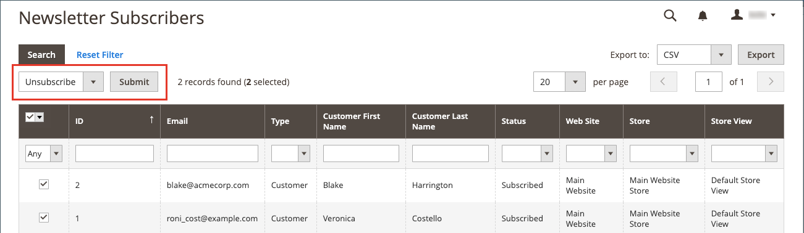

# Gestire gli abbonati alle newsletter

Come best practice, devi gestire regolarmente l’elenco degli abbonamenti e assicurarti di elaborare tutte le richieste di annullamento dell’abbonamento. In alcune giurisdizioni, la legge impone che le richieste di annullamento dell’abbonamento siano elaborate entro un determinato periodo di tempo.

Puoi gestire facilmente i tuoi abbonati utilizzando un semplice elenco di abbonamenti attivi. Quando un cliente invia una richiesta di annullamento dell&#39;abbonamento, puoi semplicemente applicare un&#39;azione _Annulla abbonamento_ a una o più sottoscrizioni selezionate.

Nelle configurazioni per un singolo sito con più visualizzazioni dello store, un abbonamento a un account cliente può essere associato a una visualizzazione dello store specifica.

Nelle impostazioni multisito e multisito con un [ambito account cliente](../customers/customer-account-scope.md) globale, è possibile sottoscrivere un account cliente alle newsletter per più siti/store. In questo caso, può essere utile modificare l&#39;account del cliente per gestire un gruppo di abbonamenti o annullare un abbonamento per un sito o un negozio specifico per soddisfare una richiesta.

Se si desidera utilizzare un servizio di terze parti per l&#39;invio di newsletter, è possibile esportare l&#39;elenco di iscrizioni come file CSV o XML.

## Gestire gli abbonamenti per un cliente

1. Nella barra laterale _Admin_, passa a **[!UICONTROL Customers]** > **[!UICONTROL All Customers]**.

1. Trovare il cliente nella griglia e fare clic su **[!UICONTROL Edit]** nella colonna _[!UICONTROL Action]_.

1. Fai clic su **[!UICONTROL Newsletter]** nel pannello a sinistra.

1. Modifica gli abbonamenti per il cliente in base alla configurazione del tuo sito o negozio.

   Per la configurazione di un singolo sito/singolo archivio, è sufficiente selezionare o deselezionare la casella di controllo **[!UICONTROL Subscribed to Newsletter]**.

   {width="500" zoomable="yes"}

   Per la configurazione di un singolo sito/più store, è possibile selezionare o deselezionare la casella di controllo **[!UICONTROL Subscribed to Newsletter]** e impostare **[!UICONTROL Subscribed on Store View]** sulla visualizzazione archivio corretta per la sottoscrizione.

   {width="500" zoomable="yes"}

   Per una configurazione multisito/multischermo con un ambito account cliente globale, la pagina visualizza lo stato di abbonamento per tutti i siti. È possibile selezionare o deselezionare la casella di controllo **[!UICONTROL Subscribed]** e/o modificare **[!UICONTROL Store View]** per la sottoscrizione.

   {width="500" zoomable="yes"}

1. Fare clic su **[!UICONTROL Save Customer]**.

## Annullare un abbonamento dall’elenco degli abbonati

1. Nella barra laterale _Admin_, passa a **[!UICONTROL Marketing]** > _[!UICONTROL Communications]_>**[!UICONTROL Newsletter Subscribers]**.

   Per una configurazione multisito in cui alcuni clienti dispongono di sottoscrizioni per più siti, ogni sottoscrizione viene visualizzata come una riga nella griglia.

1. Individuare il sottoscrittore nella griglia e selezionare la casella di controllo nella prima colonna.

   >[!NOTE]
   >
   >Per annullare un abbonamento in blocco, seleziona la casella di controllo di ciascun abbonato che desideri annullare.

1. Impostare il controllo _[!UICONTROL Action]_&#x200B;su **[!UICONTROL Unsubscribe]**&#x200B;e fare clic su **[!UICONTROL Submit]**.

   {width="600" zoomable="yes"}

   Lo stato del record cambia in `Unsubscribed`.

## Esporta l’elenco degli abbonati

1. Dall&#39;elenco _[!UICONTROL Newsletter Subscribers]_, utilizzare i controlli filtro per includere solo i record con_ Status _di `Subscribed` e per la visualizzazione sito Web, archivio o archivio appropriata.

1. Impostare il controllo **[!UICONTROL Export to]** su uno dei seguenti valori:

   - `CSV`
   - `XML`

1. Fare clic su **[!UICONTROL Export]**, cercare il prompt nella parte inferiore della schermata e salvare il file.

   {width="600" zoomable="yes"}

## Eliminare un sottoscrittore dall&#39;elenco sottoscrittori

1. Nella barra laterale _Admin_, passa a **[!UICONTROL Marketing]** > _[!UICONTROL Communications]_>**[!UICONTROL Newsletter Subscribers]**.

1. Individuare il sottoscrittore nella griglia e selezionare la casella di controllo nella prima colonna.

1. Impostare il controllo _[!UICONTROL Action]_&#x200B;su **[!UICONTROL Delete]**&#x200B;e fare clic su **[!UICONTROL Submit]**.

1. Quando viene richiesto di confermare, fare clic su **[!UICONTROL OK]**.
